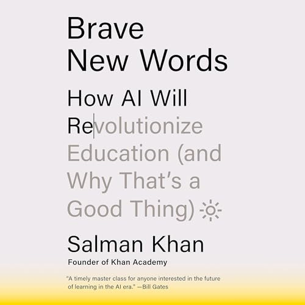

# (Audio) Brave New Words, by Khan

> “... a teacher has to be adjusted to fit the mind of each boy and
> girl it teaches ... each kid has to be taught differently.” (Asimov,
> [The Fun They Had][], 1951)

[The Fun They Had]: https://www.bartlettschools.org/pdf/TheFunTheyHad.pdf

The title of this book refers to LLM text generation and Khan's call
for “educated bravery” in meeting new technologies, but it also refers
to Brave New World, a distopia. In his introduction, Khan mentions
[Diamond Age][], Ender's Game, and [The Fun They Had][] as fiction
that “has gone on to inspire very real innovation.” In
[Diamond Age][], three “AI” books are really humans behind the scenes,
and the actual AI books train a child army. In Ender's Game, the
educational technology serves the goal of genocide. And in Asimov's
[The Fun They Had][], the joke is that AI education would make
children long for the current world of schooling. I'm fascinated by
the same fiction as Khan. I also think of the Star Trek post-scarcity
world ([1][], [2][]) as an inspiration. I think Khan is right that
LLMs present opportunities, but they also face persistent challenges
of education.

[Diamond Age]: https://planspace.org/20210422-the_diamond_age_by_stephenson/ "The Diamond Age, by Stephenson"
[1]: /20201109-economics_of_star_trek_by_webb/ "The Economics of Star Trek, by Webb"
[2]: /20210401-trekonomics_by_saadia/ "Trekonomics, by Saadia"

There is a kind of “AI exceptionalism” that imagines generative AI as
immune to problems faced elsewhere. For example, Khan criticizes
Google for having ads. But will commercial LLMs remain disinterested?
Khan Academy doesn't offer its Khanmigo AI tutor for free to students
because of the cost of AI inference, and it's hard to imagine that
LLMs are permanently immune to the attentions of advertisers. And
while Khan speaks glowingly of Khanmigo, there is already at least one
[example][] of a failed AI ed-bot effort.

[example]: https://www.nytimes.com/2024/07/01/us/ai-chatbot-los-angeles-schools.html "A.I. ‘Friend’ for Public School Students Falls Flat"

More generally, Khan would have education and LLMs as somehow beyond
having a point of view, absolutely impartial. Researchers have worked
hard on “alignment” that creates this illusion, and certainly a
Socratic approach can have value in education. But fundamentally there
_is no_ impartial view of the world, and the effect in aiming for one
is to allow the inane while preventing progress.

Khan wants to engage students by “incorporating their interests” in
ways that are superficial and misleading. One way to fail in this is
to imagine content as irredeemably rigid, and try to apply a false
veneer. Another way is to imagine there is no content in particular
worth focusing on.

Khan gives one example of imagining a soccer coach modeling goals
scored with a polynomial, and then asking for the degree of this
polynomial and the leading coefficient. This is a weak trick at best,
and doesn't at all get to _why_ anyone would care about the question.
Applications can be motivating, but this one is so artificial that it
seems more likely to damage credibility.

Later Khan imagines restructuring a class's study of World War 2
through a focus on baseball, in a way that seems to suggest that
baseball was just as important an aspect of World War 2 as anything
else. I could see a research project on this narrow subject for an
interested student, but I also think that the bigger features of WW2
should not be deprioritized in order to pander to interests.

One theme here is that part of education is learning what's
interesting about things you weren't previously interested in. You
shouldn't come out of a class with only the same interests that you
went in with.

On history specifically, there's probably a lot more to discuss. Khan
offers that “it is impossible to engage in calculus if you don’t know
Algebra 2 well, but one can imagine engaging in college-level history
even without a strong foundation in history from high school.” I don't
know whether all history teachers would agree. To me, to the extent
that this is true, it suggests a problem with history as a discipline
at least as it is taught. I think we should ask more of history, make
more connections, draw more conclusions, have more of a sense of both
the theory and application of history. I think Khan is imagining
history as if, were it math, in high school students would learn one
table of equations and then in college learn a second table of
equations, never learning what they mean or how to use them. Perhaps
because lessons learned from history can have a political
interpretation, history is kept in schools with its hands tied? And so
we repeat the errors of the past.

In attempting to be impartial, existing curricula can become dogma.
Khan is so focused on how to teach everyone Pre-Algebra, Algebra 1,
and Algebra 2, that there doesn't seem to be room for re-thinking our
choices in what we teach. The “how” of education is important, but I
think the “what” and “why” are keystones, and at least as in need of
attention in light of technological advancement.

One pet peeve of mine is titles that are not conceptually coherent.
This is the case for Pre-Algebra, Algebra 1, and Algebra 2. These are
not good titles for courses. They reflect a bulk-frozen structure that
we should be embarrassed to offer students. Imagine if a student
submitted an outline so lousy, where the top-level bullets were "first
stuff," "second chunk," and "last bits." We should expect more clarity
of thought. No student should be given a grab bag of things to learn
without better organizing concepts and rationale, and that starts at
the level of course titles.

I suspect much of what is taught in schools could be improved
(dropped, modified, added to). This is not necessarily easy to do
([New Math][]?) but there have been improvements over time and I
expect they can be extended. It has become rare for students to
memorize and recite [Against Idleness and Mischief][], for example,
while calculus, which used to be exclusively a university topic, is
now encountered by many in high school. Improving _what_ is taught
should get more attention.

[New Math]: https://en.wikipedia.org/wiki/New_Math "Wikipedia: New Math"
[Against Idleness and Mischief]: https://allpoetry.com/Against-Idleness-and-Mischief

It seems like AI may move some classroom setups in directions that
feel old-fashioned: More in-person writing and tests, more focus on
spoken communication. Perhaps it will seem more obvious that teachers
are a specific type of manager, which has always been the case though
not always widely acknowledged. The toolkit expands.

