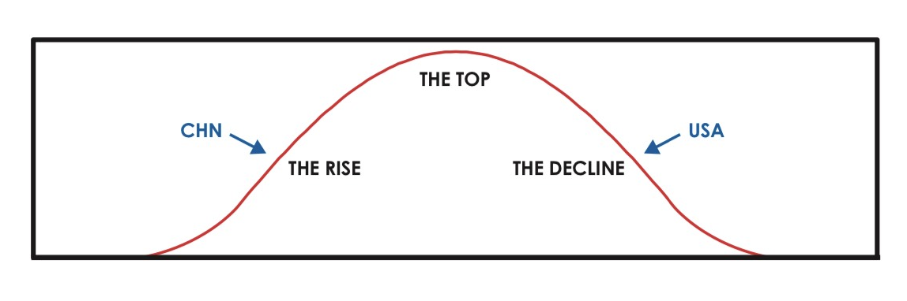
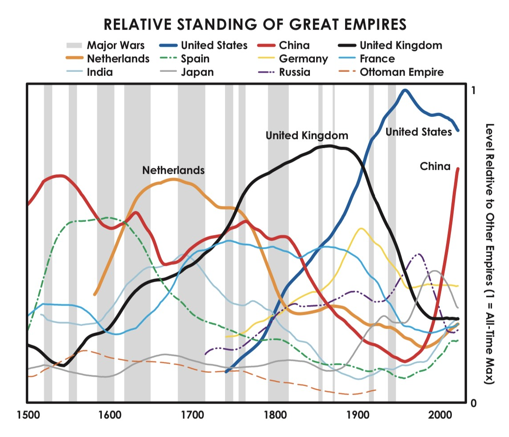
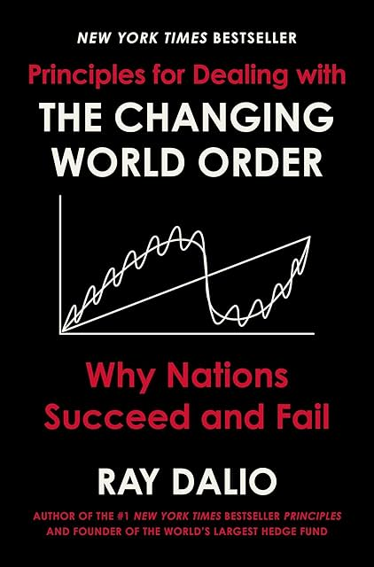

# (Audio) Principles for dealing with the changing world order, by Dalio

[Ray Dalio][] likes gold, doesn't like when [money printer go brrr][],
and does like China. He also likes [Kissinger][] and [Genghis Khan][].
Dalio says some reasonable and some interesting things, but it isn't
clear he [practices][] what he preaches, or that he's right.

[Ray Dalio]: https://en.wikipedia.org/wiki/Ray_Dalio
[money printer go brrr]: https://knowyourmeme.com/memes/money-printer-go-brrr
[Kissinger]: https://en.wikipedia.org/wiki/Henry_Kissinger
[Genghis Khan]: https://en.wikipedia.org/wiki/Genghis_Khan
[practices]: https://www.nytimes.com/2023/11/01/business/how-does-the-worlds-largest-hedge-fund-really-make-its-money.html "How Does the World’s Largest Hedge Fund Really Make Its Money?"

Dalio has a bunch of signals and a framework of big cycles organizing
history. It's a little bit [psychohistory][] and a little bit
[cycle-finding][]. For Dalio, the biggest cycle is the debt cycle,
followed by cycles of internal disorder and external disorder. He
describes money as starting from metal, then notes exchangeable for
metal, then fiat money.

[psychohistory]: /20200714-foundation_trilogy/ "Asimov's Foundation trilogy"
[cycle-finding]: /20200728-technological_revolutions_and_financial_capital/ "Technological Revolutions and Financial Capital, by Perez"

For Dalio, the step after fiat money is collapse. He cares a lot about
whether a currency is The Reserve Currency. Combining his signals, he
gets charts that show the rise and fall of the [Dutch guilder][], the
[British pound][], and (soon) the [US dollar][]. China is ascendant,
never mind that their currency has been fiat longer than the dollar.

[Dutch guilder]: https://en.wikipedia.org/wiki/Dutch_guilder
[British pound]: https://en.wikipedia.org/wiki/Pound_sterling
[US dollar]: https://en.wikipedia.org/wiki/United_States_dollar

Dalio says he's identifying timeless principles of cause and effect.
Is he right? Historical causality is hard to test, but there are at
least a few problems with Dalio's claims.

For most of history, the idea of a reserve currency hasn't really made
sense. The modern monetary system is in this light novel, not
timeless. Dalio has a narrow understanding of money compared to the
anthroplogical view in [Debt: The First 5,000 Years][], for example.

[Debt: The First 5,000 Years]: https://en.wikipedia.org/wiki/Debt:_The_First_5,000_Years

It's hard to find falsifiable predictions in Dalio's science. He
admits to not having good tools for predicting _when_ any given thing
might happen. In this sense, his whole system is basically noticing
that things have fallen apart in the past and concluding that things
could fall apart in the future. It isn't even wrong.

Looking at the charts, I'm reminded of a common tension in data work:
Is data leading to theory, or is theory leading to data? Data can be
found to support most theories; what was the process here? It's rather
easy to imagine that Dalio's employees are skilled in finding what he
thinks is there.

Not that Dalio hasn't looked at history and so on. The
[Patriot movement][] in the Netherlands does kind of feel like it
rhymes with [MAGA][] energy. He knows about
[triangular debt in China][]. He's even concerned about inequality,
though mostly because it can lead to wealth-destroying crises.

[Patriot movement]: https://en.wikipedia.org/wiki/Patriottentijd
[MAGA]: https://en.wikipedia.org/wiki/Make_America_Great_Again
[triangular debt in China]: https://deloitte.wsj.com/riskandcompliance/china-spotlight-triangular-debt-considerations-1413864154

Does Dalio have the courage of his convictions? Perhaps not. He
frequently comes off as defensive, and digresses substantially into
his concerns about public scrutiny of the prominent. The historical
theory he seems to hold most instinctively is a great man theory in
which he and the people he talks to are great; he sounds like Trump
talking about how he knows the best people.

If you think your ideas are timeless, you may be right about what
happens next, but you probably won't predict things that have never
happened before. So Dalio is limited to predicting rearrangements of
the world order, not substantially new things. If Marx thought much
change was inevitable, Dalio thinks real change is fundamentally
impossible, that recurrence is the nature of society.

So Dalio picks China as the new king of the hill.

I'm curious about many of the things Dalio talks about. What causes
what in the world? How do we operate in reality? What lessons can we
learn from history? I have to think Dalio believes he's sincere about
his program. At the same time, [reporting][] suggests his ability to
follow his own advice is as constrained as his ability to imagine a
better world. For all the lip service to evolution, Dalio doesn't seem
to be its exemplar.

[reporting]: https://www.nytimes.com/2023/11/01/business/how-does-the-worlds-largest-hedge-fund-really-make-its-money.html "How Does the World’s Largest Hedge Fund Really Make Its Money?"

