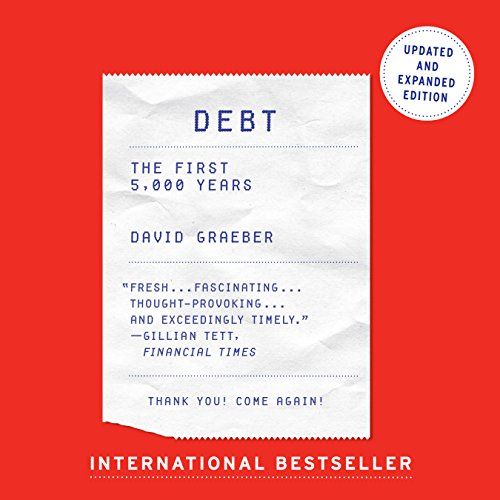

# (Audio) Debt: The first 5,000 years, by Graeber

[Graeber][] doesn't like debt, in the modern quantified, financial
sense. Also he thinks people are wrong about the history of money, and
that we should listen to anthropologists more. Graeber's equation is
something like "obligation + measurement + violence = debt."

[Graeber]: https://en.wikipedia.org/wiki/David_Graeber

A smattering of his ideas as I remember them:

 * The standard economics story of money (as arising because barter is
   too hard) is silly because people hardly ever barter in the first
   place, except sometimes with strangers.
 * The standard economics story of money starting with coinage, then
   later developing debt instruments (see also [Dalio][], "money as
   starting from metal, then notes exchangeable for metal, then fiat
   money") is silly because ideas and methods of debt come _first_.
 * The moralism of "always paying your debts" in culture and language.
 * No single theory of money ([Chartalism][], etc.) is right on its
   own because "money has no essence" and money is just one piece of a
   big evolving world. (Similarly, Graeber has no single thesis on
   debt.)
 * "Baseline communism" refers to the natural "from each according to
   his ability, to each according to his needs" that we have in real
   human relations, like feeding a child or asking for someone to hand
   you something.
 * Debt as two equals agreeing to no longer be equal: Now _you_ owe
   _me_. (In the extreme: debt peonage.)
 * The difference of kind that comes from quantification: Not just
   owing me a favor, but owing me $47.39. The relation to
   dehumanization, as when slavery puts a price on a person, which is
   only possible by removing or denying their complex real
   (unquantifiable) value. (Reminds me of [The Tyranny of Metrics][].)
 * The necessity of violence to make people pay back debts, as when
   military power stands behind the IMF.
 * Occasional hints of primitivism or anarcho-primitivism.
 * And really, shouldn't we get rid of capitalism?

[Dalio]: /20240825-principles_changing_world_order_dalio/ "(Audio) Principles for dealing with the changing world order, by Dalio"
[Chartalism]: https://en.wikipedia.org/wiki/Chartalism
[The Tyranny of Metrics]: /20200425-tyranny_of_metrics_by_muller/ "The Tyranny of Metrics, by Muller"

