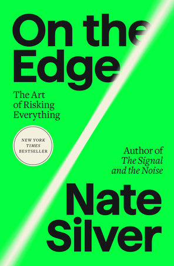

# (Audio) On the Edge, by Nate Silver

When Trump won the 2016 election despite 538's needle showing less
than 50% for him, it split the world. There were people who gave Nate
Silver a hard time about it ("the village") and people who still
thought he was cool ("the river"). Since then, Silver has been hanging
out with his buddies, having a good time playing poker, and he can
write a book about whatever he wants, so here it is. It reads,
unintentionally, as a warning about the risks of seeing the world only
in calculating, risk-taking terms.

---

Silver tries to explain why there are more men than women playing
poker. He suggests that men are more aggressive, and aggression makes
you better at poker. I think Silver misses the big picture: It isn't
really a good idea to play poker in the first place. It's anti-social.
Elsewhere, Silver does explain that the poker ecosystem requires
"fish" for people to take money from. Why are there more men playing
poker? Because they're dumb!

(There is an apparent contradiction here, in that I myself enjoy the
occasional social poker game, and have even played to make money at
casinos a couple times. But I still believe that if you're
consistently playing to make money, it is a kind of legal theft, a
kind of con, as bad as the casino itself. The divide between a
friendly game and stealing wallets from drunk strangers is not always
perfectly clear, but I think it exists.)

---

Silver comes closest to explicitly warning against "the river" way of
thinking in his extended coverage of Sam Bankman-Fried (SBF) and FTX.
He thinks SBF's problem (one of them) was that he bet too big. Silver
references the [Kelly criterion][] for bet-sizing and suggests that
SBF was willing to make bets that were too large.

[Kelly criterion]: https://en.wikipedia.org/wiki/Kelly_criterion

I think Silver missed another aspect, which is that even very small
bets can be bad bets to make - even when they're positive EV. The
thing to consider is the probability of ending up better off or worse
off than currently. Even if the EV is very positive, if the chance of
"hitting it" is low and the chance of getting worse off is high, it's
very sensible to not make that bet.

I wrote up my way of thinking about this a while ago as
[Expected value is not useful for making decisions about lottery tickets][].
See also notes on expected value in connection with
[How Not to Be Wrong, by Ellenberg][] and
[The Scout Mindset, by Galef][]. A related question to ask is:
[Is it worth doing even if it fails?][]

[Expected value is not useful for making decisions about lottery tickets]: /2012/06/04/expected-value-is-not-useful-for-making/
[How Not to Be Wrong, by Ellenberg]: /20200925-how_not_to_be_wrong_by_ellenberg/
[The Scout Mindset, by Galef]: /20210502-the_scout_mindset_by_galef/
[Is it worth doing even if it fails?]: /20181204-worth_doing_even_if_it_fails/

---

At one point Silver quotes Oppenheimer:

> “It is a profound and necessary truth that the deep things in
> science are not found because they are useful; they are found
> because it was possible to find them.”

I like this quote. It reminds me of
[Why greatness cannot be planned (Stanley and Lehman)][]. We often
expand our knowledge along the current frontiers and only later
identify the applications. See also
[The Unreasonable Effectiveness of Mathematics in the Natural Sciences][].

[Why greatness cannot be planned (Stanley and Lehman)]: /20221105-why_greatness_cannot_be_planned_by_stanley_and_lehman/
[The Unreasonable Effectiveness of Mathematics in the Natural Sciences]: https://en.wikipedia.org/wiki/The_Unreasonable_Effectiveness_of_Mathematics_in_the_Natural_Sciences

---

Silver talks some about [secular stagnation][], which reminded me of
[The Rise and Fall of American Growth][] and that despite claims of
stagnation [Mortality rates have improved][] without pause until the
present (apart from the recent impact of Covid). Of course Silver is
really just trying to talk about AI and whether it will kill us all.
(He thinks it might.)

[secular stagnation]: https://en.wikipedia.org/wiki/Secular_stagnation
[The Rise and Fall of American Growth]: https://en.wikipedia.org/wiki/The_Rise_and_Fall_of_American_Growth "The Rise and Fall of American Growth, by Robert J. Gordon"
[Mortality rates have improved]: /20240407-mortality_rates_have_improved/

---

Silver tries to conclude with some sort of morality or politics, but
it feels bolted on. When he was talking about SBF and being critical
of Effective Altruism and Rationalism, I had some thought that perhaps
Silver was self-aware and the conclusion of the book was going to be a
big reveal that he had realized that "the river" was itself a risk to
humanity. But I don't think he got there. So while he does say some
things about the risks of quantification (shades of
[The Tyranny of Metrics][]) Silver is still mostly just hanging out
with his friends and following his interests. Good for him?

[The Tyranny of Metrics]: /20200425-tyranny_of_metrics_by_muller/

---

