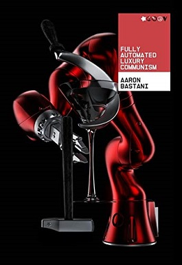

# (Audio) Fully Automated Luxury Communism, by Bastani

Ridiculing [The End of History][] and rejecting
[Capitalist Realism][], [Bastani][] says Marx was ahead of his time:
communism is only now becoming technologically possible. While
Rushkoff [is][] anti-growth, Bastani was saying (even before ChatGPT)
that technology will save us. He says we should demand
[Fully Automated Luxury Communism][].

[The End of History]: https://en.wikipedia.org/wiki/The_End_of_History_and_the_Last_Man "The End of History and the Last Man"
[Capitalist Realism]: https://en.wikipedia.org/wiki/Capitalist_Realism "Capitalist Realism"
[Bastani]: https://en.wikipedia.org/wiki/Aaron_Bastani "Aaron Bastani"
[is]: /20240519-survival_of_the_richest_by_rushkoff/ "Survival of the Richest, by Rushkoff"
[Fully Automated Luxury Communism]: https://en.wikipedia.org/wiki/Fully_Automated_Luxury_Communism "Fully Automated Luxury Communism"

A lot of the book is detail on how technology is advancing (or may
advance) to produce "extreme supply." A surprisingly large amount is
about mining asteroids. Predictions on driverless cars and
[Finless Foods][], for example, seem premature. (The book only came
out five years ago; is it too early to judge?)

[Finless Foods]: https://en.wikipedia.org/wiki/Finless_Foods

I think Bastani is right that the future he imagines is not
inevitable: it depends on political choices. He mostly assumes that
technological development is inevitable. I'm less sure about that.
They are related, of course.

Bastani has some recommendations. He likes municipal protectionism as
in [the Cleveland model][]. He favors [Universal Basic Services][]
over [Universal Basic Income][]. (I tend to agree; can we also get
Universal Basic Stuff?) He wants a "One Planet Tax" on carbon, to fund
renewable energy in the global south via National Energy Investment
Banks, and socialized finance for autonomous state-owned companies.

[the Cleveland model]: https://atlasofthefuture.org/project/the-cleveland-model/
[Universal Basic Services]: https://en.wikipedia.org/wiki/Universal_basic_services
[Universal Basic Income]: https://en.wikipedia.org/wiki/Universal_basic_income

I don't know that Bastani is a great spokesperson, and the book is to
some extent just something to put the title on. But still kind of a
neat book?

---

Summarizing the five crises from pages 22-23:

1. Climate change
2. Resource scarcity
3. Societal aging
4. Global poor / "unnecessariat"
5. Technological unemployment

(These last two, and maybe even the last three, don't seem _that_
different...)

---

> "Now we must build a workers’ party against work – one whose
> politics are populist, democratic and open, all while fighting the
> establishment which, through its power over civil society and the
> state, won’t rest in ensuring FALC never comes to pass." (pag 194)

---

> "Furthermore, preferring UBS to UBI makes a great deal of sense
> within the context of the Third Disruption and the turn to extreme
> supply. As the price for everything shifts ever closer to zero, this
> will imperil production for exchange and profit, meaning the price
> mechanism is an increasingly inefficient way of allocating
> resources. What is more UBS begins the work of communism in the
> present, articulating resources necessary to a decent life – from
> housing to health- care – as human rights rather than potential
> sources of profit. Necessitous people are not free people, and the
> UBS decisively ends such necessity." (page 226)

This references Roosevelt's quotation of "Necessitous men are not free
men" in the 1944 State of the Union ([Second Bill of Rights][]).

[Second Bill of Rights]: https://en.wikipedia.org/wiki/Second_Bill_of_Rights

---

> "While FALC is situated within a transformation as seismic as that
> of the arrival of agriculture, its concrete politics consist in
> specific, readily identifiable demands: a break with neoliberalism,
> a shift towards worker-owned production, a state-financed transition
> to renewable energy and universal services – rightly identified as
> human rights – placed beyond commodity exchange and profit." (page
> 243)
