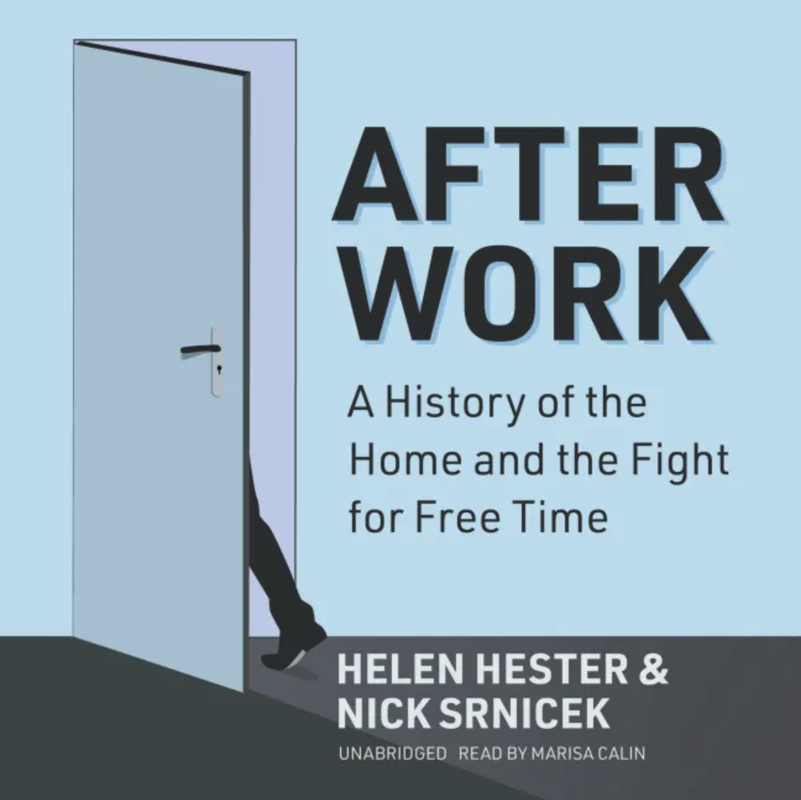

# (Audio) After Work, by Hester and Srnicek

Here's a feminist post-scarcity [book][] pointing out that abolishing
paid work won't automatically eliminate unpaid work. There's quite a
bit of unpaid work, and people may or may not want to do it.
Interesting history and ideas on what to do about it.

[book]: https://www.versobooks.com/products/496-after-work "After Work: A History of the Home and the Fight for Free Time by Helen Hester and Nick Srnicek"

Did you know there was a [Wages for Housework][] movement in the 70s?

[Wages for Housework]: https://en.wikipedia.org/wiki/Wages_for_housework "Wikipedia: Wages for housework"

---

> “As we know, domestic realism was not ultimately overthrown by the
> communalism of the separatists or the hippies. While some
> communities are still operational, Drop City and the vast majority
> of initiatives like it proved to be relatively ephemeral
> experiments, failing to outlive their moment of sociosexual
> upheaval. This may well have been because, as sites of exodus, they
> were not always effective at ensuring their own scalability. They
> were often intended as prefigurative spaces, aiming to offer a taste
> of post-suburban utopia in the here and now (or at least, a utopia
> for the young, the healthy, the able bodied, and the middle class
> with minimal caring responsibilities – that specific and limited
> range of people who might be best able to thrive in a space like
> Drop City). As such, they consciously operated as enclaves within
> the society from which they sought to withdraw – bastions of
> alternative values which were yet to flourish elsewhere – and the
> interventions they staged were in certain respects hyperlocal to the
> point of being site-specific. The ‘simple positing and practising of
> a new world is insufficient to overcome’ the structural forces
> preventing its generalisation.129 Or, as Mike Davis puts it,
> ‘demonstration projects in … rich countries will not save the
> world’.” (page 114)
