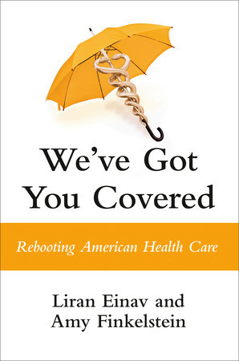

# (Audio) We've got you covered, by Einav and Finkelstein

I read [this book][] because Furman recommended it, and his
[description][] is good. I admire the economist authors' ability to
take a normative stand while staying clear-headed about measured
realities. I'm on board.

[this book]: https://www.penguinrandomhouse.com/books/690632/weve-got-you-covered-by-liran-einav-and-amy-finkelstein/ "We've Got You Covered: Rebooting American Health Care"
[description]: https://www.nytimes.com/2024/10/21/books/review/economics-business-books.html "5 Books to Help You Understand the Economy Before Voting"

The central claim of the book is that we _should_ provide free basic
health care to everyone. They support this by arguing that the US has
been _trying_ to do this: trying to honor an implicit social contract.

The issue then is that the US has been doing a very poor job of it.
The authors propose that health insurance should instead be free and
automatic for everyone, with no sign-up hoops or costs incurred for
receiving care.

Problems with the current US system include its complexity itself, and
health insurance being tied to employment (therefore subject to
termination at any time) and medical costs being a potentially
unbounded burden for individuals, sometimes even for those _with_
insurance.

They point out that insurance doesn't actually have that much
influence on health outcomes, because impact on health is dominated by
behaviors that correlate with wealth, for example, and because people
generally still _get_ health care even if not insured, even if it also
saddles them with debt. So universal health insurance won't resolve
disparities in health outcomes. (This does appear somewhat at odds
with the authors' frequent complaint that the US system often pays for
treatment only after conditions become acute dangers, while earlier
treatment might have been cheaper and prevented the worst health
outcomes.)

The book is also full of interesting current and historical detail
about the US and international health systems.

---

> “We have therefore intentionally focused on what we _should_ do,
> rather than what some may think we currently _can_ do. In this
> sense, our book is in the spirit of the famous Chicago economist
> Milton Friedman. He argued that the role for economists in public
> policy is to develop the best ideas, and keep them alive and ripe in
> the public imagination until the day when “the politically
> impossible becomes the politically inevitable.” (page 14)

---

> “Let’s start with the precarious insurance of the privately insured.
> Almost half of the US population—over 150 million people—receive
> private health insurance through their employers or a family
> member’s employer. That’s almost all Americans who have private
> health insurance.
>
> There’s no natural reason why their boss doubles as their insurer.
> This unusual arrangement arose through an accident of history, a
> common theme of US health-care policy. During World War II, the
> federal government imposed wage and price controls to try to prevent
> inflation. Employers—desperate to attract and retain scarce
> workers—soon discovered a way to get around the wage ceilings and
> provide higher compensation. They could offer—and pay for—their
> workers’ health insurance, because these payments weren’t counted as
> “wages.”
>
> The practice of excluding employer payments for their employees’
> health insurance from the definition of employee earnings has
> remained in place to this day. As a result, any such payments are
> tax-free. An employee doesn’t have to pay income tax on any
> contributions her employer makes to her workplace-based health
> insurance premium.” (page 17)

---

> “Moral commitments are not limitless. Even FDR implicitly
> acknowledged this in his Second Bill of Rights. He spoke of rights
> such as “a decent home,” “a good education,” and “adequate medical
> care.” The economist Arthur Okun, writing a few decades later,
> likewise espoused a right to health care while simultaneously
> cautioning that these rights are not unbounded. With the customary
> bluntness of an economist rather than a politician, he described “a
> heated debate with an audience of medical administrators.” As Okun
> described it, “Taking what I viewed as an outlandish example, I
> suggested that any national health program should not grant me at
> public expense all the pairs of eyeglasses I might like. I learned
> to my surprise that they favored an unlimited right to eyeglasses.”
> (page 74)

---

> The technical term for this quality of life measure is _quality
> adjusted life year,_ or QALY (rhymes with _jolly_). A year in
> perfect health is given a QALY score of one, a year of being dead
> scores zero. Much scientific effort and squabbling go into assigning
> scores to all the various ways a year can be spent in
> less-than-perfect health. (footnote, page 100)

This is part of a section which is a great example of the challenges
of trying to linearize multiple things into one measure. In this case
they were using a ratio of benefits to cost, so a cheap and decent
thing showed up as better than an expensive but essential thing.

> “The faithful and accurate application of cost-benefit analysis had
> produced unacceptable results. Even the commissioners agreed,
> acknowledging that their rankings often conflicted with their own
> intuition. They quickly abandoned the formulaic application of
> cost-effectiveness rankings in favor of a more “holistic” approach.
> They used their judgment—and that of members of the community who
> provided input through public forums—to create broad categories of
> health care that they ranked in order of importance. Effective care
> for acute fatal conditions (such as appendectomies) was ranked high,
> while minimally effective treatments for nonfatal conditions (such
> as tooth capping or medical therapy for diaper rash) were in a
> category near the bottom.” (page 100)
