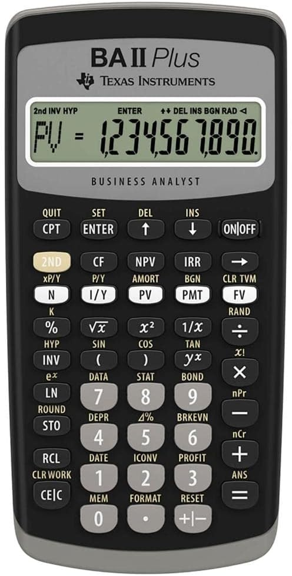
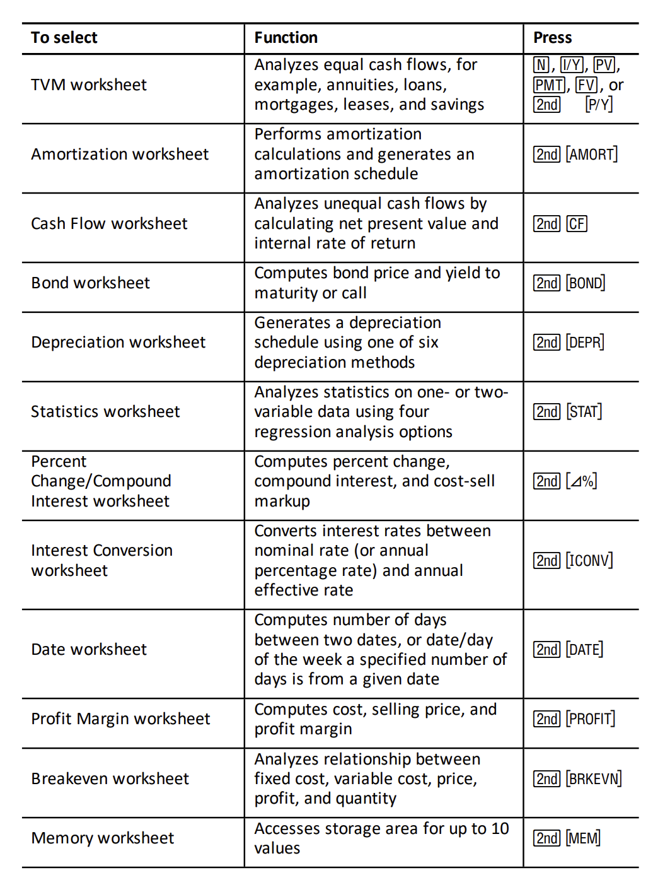

# Financial calculators exist

When you take the [CFP][] exam, you are allowed to use a
[dedicated financial calculator][] like the Texas Instruments
"Business Analyst" [BA II Plus][]. How wild is that?

[CFP]: /20241123-what_are_cfps_supposed_to_know/ "Certified Financial Planner"
[dedicated financial calculator]: https://www.cfp.net/-/media/files/cfp-board/cfp-certification/exam/calculator-policy.pdf
[BA II Plus]: https://www.amazon.com/Texas-Instruments-Advanced-Financial-Calculator/dp/B0029F1OKE

What does it do? You can start to guess from buttons like "IRR," but
the [manual][] explains much more about how the functionality is
organized into "worksheets" and so on.

[manual]: https://education.ti.com/en/guidebook/details/en/ADF11FB65B284B6195B0A7E9502784BA/baiiplus

Do people use these for real, in their work? My guess is that they're
sort of an archaic thing that persists only for the exam? Surely
people use one of many [online calculators][], or Excel, or some other
more user-friendly tool? (Although I don't really know what a great
example is; most of the ones I see at a quick look seem pretty
crummy...)

[online calculators]: https://www.calculator.net/finance-calculator.html
