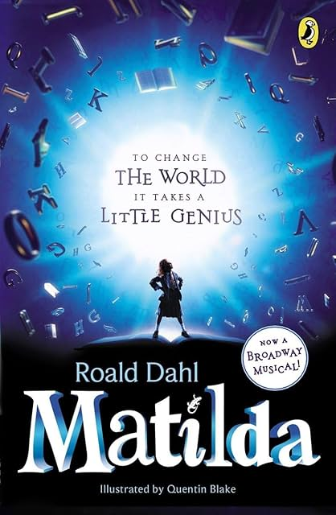

# Matilda, by Dahl

A local middle school put on Matilda, the musical, which made me
curious enough to read the [book][]. It's strange and cute. It's very
episodic, with the main resolution appearing with less warning in the
book than the musical. Apparently in early versions of the book
Matilda was even more malicious.

[book]: https://en.wikipedia.org/wiki/Matilda_(novel)

---

> "It's not fair," Lavender said. "How can she do it and we can't?"
> (page 69)

---

> "You are so much wiser than your years, my dear," Miss Honey went
> on, "that it quite staggers me. Although you look like a child, you
> are not really a child at all because your mind and your powers of
> reasoning seem to be fully grown-up. So I suppose we might call you
> a grown-up child, if you see what I mean." (page 189)

---

> "Without stories we're just eating machines with shoes." (Dennis
> Kelly, script-writer for the musical, in an afterward)

Tim Minchin did the music and lyrics for the musical. He also did
[White Wine In The Sun][].

[White Wine In The Sun]: https://www.youtube.com/watch?v=fCNvZqpa-7Q
