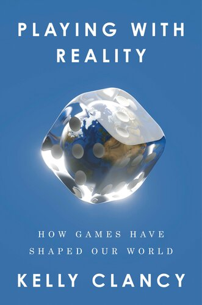

# (Audio) Playing with Reality, by Clancy

I think [Darian Woods][] mentioned [Clancy][]'s book in an episode of
The Indicator. Great recommendation! _Playing with Reality_ could be
the best book of the year. Beautifully written, rich with information,
humane in perspective. The thesis is basically that the map is not the
territory, and games can be kinds of maps. Sort of like
[The Tyranny of Metrics][], it explores ways that simplified and
quantified models can mislead. Fascinating throughout.

[Darian Woods]: https://www.npr.org/people/724387257/darian-woods
[Clancy]: https://www.kellybclancy.com/
[The Tyranny of Metrics]: /20200425-tyranny_of_metrics_by_muller/

---

### History of education

The first game in the book is [Rithmomachia][], the math game you
played as part of your [Quadrivium][] education, which was a thing
from Greek to Medieval times. The history of education is fascinating.

[Rithmomachia]: https://en.wikipedia.org/wiki/Rithmomachia

 * [Trivium][]
     * grammar
     * logic
     * rhetoric
 * [Quadrivium][]
     * “arithmetic (pure numbers)”
     * “geometry (numbers in space)”
     * “music (numbers in time)”
     * “astronomy (numbers in space and time)” (page 5)

[Trivium]: https://en.wikipedia.org/wiki/Trivium
[Quadrivium]: https://en.wikipedia.org/wiki/Quadrivium

> “Some medieval historians blame the quadrivial curriculum for
> holding European scholarship back hundreds of years. Its focus on
> harmony blinkered scientists to fundamental advances, such as the
> discovery of irrational numbers and celestial mechanics. The
> quadrivial curriculum was largely abandoned by the seventeenth
> century, as new mathematical techniques from Persia and India led to
> breakthroughs in calculus and probability theory. Rithmomachia
> similarly fell by the wayside.” (page 7)

This idea, of education hampering progress, is very interesting. I
wonder whether things like the Chinese exam system might have had a
similar effect. What about the current education system? What is
blocking rather than enabling progress?

The book doesn't talk about it, but according to Wikipedia an
intermediate successor curriculum was the [studia humanitatis][]
around the 14th century, with Petrarch.

 * [studia humanitatis][]
     * grammar
     * rhetoric
     * poetry
     * history
     * moral philosophy

[studia humanitatis]: https://en.wikipedia.org/wiki/Humanitas#Revival

Later, the book describes "required training for nobility in Europe
and the Near East."

 * an eighteenth century aristocrat was expected to master
     * calligraphy
     * horseback riding
     * history
     * philosophy
     * weaponry
     * music
     * astrology
     * games, especially chess

> “Kriegsspiel roots back to the late eighteenth century, when
> mathematician Johann Hellwig invented a variant of chess. Chess was
> then considered to be required training for nobility in Europe and
> the Near East; an aristocrat was expected to master calligraphy,
> horseback riding, history, philosophy, weaponry, music, astrology,
> and games, especially chess. Tutors used chess to teach strategic
> thinking and mathematics to their pupils. Chess, originally
> chaturanga, originated in India as an explicit abstraction of war.”
> (page 47)

Lots of the book is about how we learn from games, but in explicitly
educational contexts and elsewhere.

---

### Psychohistory

> “The new field’s [statistics'] success expanded to other social
> sciences. The nineteenth-century Belgian mathematician Adolphe
> Quetelet was a tireless advocate for a new science he called “social
> physics,” whereby he hoped to work out a human correlate of
> celestial mechanics and describe the trajectories of civilization.
> Quetelet used massive datasets to detect underlying patterns. He
> found regularities in births, deaths, suicides, and even crime
> rates. He argued that crimes should not be considered acts of
> individual volition. Instead, he found that they obeyed statistical
> laws at the population level. “Society itself contains the germs of
> all the crimes committed. It is the social state, in some measure,
> that prepares these crimes, and the criminal is merely the
> instrument that executes them.” Criminals were themselves victims,
> helpless to the laws of social physics acting on society, a
> necessary sacrifice to preserve civilization. He suggested that
> evidence-based legislation—aimed more at ameliorating the
> institutional causes of crime and less at punishing individual
> criminals themselves—was the best hope for reforming society.
> Quetelet’s ideas were so pervasive that physicist James Clerk
> Maxwell often illustrated his work in statistical mechanics using
> analogies drawn from social physics. To those armed with the hammer
> of probability theory, the world looked like a statistics problem.
> If we could use math to understand even chance, why not use it to
> understand humanity itself?” (page 40)

“Social physics” is yet another name for [psychohistory][]!

[psychohistory]: /20200714-foundation_trilogy/

> “The historian Hans Delbrück recognized that military and political
> history are inextricably tangled. He was committed to establishing a
> quantitative study of history. Throughout his career, Delbrück pored
> over historical data, hoping to develop a science of war,
> relentlessly workshopping historical battles to test his theories.
> He argued that Germany’s failures in World War I were primarily
> strategic in nature. He advocated for their neutered military to
> take up historical study and simulations. By embracing these
> simulations during the interwar period, the Germans developed a new
> form of combat using theoretical forces that did not yet exist but
> soon would. It promised to solve the stagnant trench warfare that
> had characterized World War I, leveraging surprise to dominate and
> demoralize the enemy. In World War II, this tactic would rain terror
> from the skies across Europe. It would come to be known throughout
> the world as the Blitzkrieg.” (page 52)

And again!

---

> “The real question,” he [Skinner] writes, “is not whether machines
> think but whether men do. The mystery which surrounds a thinking
> machine already surrounds a thinking man.” (page 21)

I think Skinner is getting at the questions of consciousness and free
will. Provocative phrasing.

---

> “Like many scientists of the era, such as Galileo, Cardano was made
> a celebrity by the horoscopes he drew up for the ruling class.
> Astrology played the role of today’s science-funding agencies.”
> (page 34)

Sometimes data science work feels a little like this. People want
predictions, and they don't always want a careful accounting of
uncertainty. They want to hear what they want to hear. And like magic
or divination, why not just take a stab at it? You'll be right
sometimes!

---

> “It seemed so ubiquitous that many scientists used it to simplify
> the measurement of errors in a wide range of datasets, including
> many they shouldn’t have. They were, as mathematician Nassim
> Nicholas Taleb puts it, “blinded by bell curves.” (page 40)

This idea is applied to Black–Scholes, and Taleb's “ludic fallacy” is
described: the mistake of applying the rules of games to real-life
situations.

---

> “Through seemingly objective arguments like these, the status quo
> keeps its finger tipping the scales in the marketplace of ideas,
> assigning invented values to justify arbitrary ideologies.” (page
> 45)

The example is weird MacAskill argument. These "Effective Altruism"
people, jeez.

---

> “His [Hilbert's] student Hermann Weyl writes: “Mathematics is no
> longer knowledge but a game of formulae, ruled by certain
> conventions, which is very well comparable to the game of chess.”
> (page 58)

---

> “We may still choose to make a wager with a low likelihood of
> success if the outcome is something we want enough—like putting in
> the effort to apply for a highly competitive job, even if it’s
> unlikely we’ll get it. In this framework, a rational actor will
> always make choices that they believe will maximize their expected
> utility, balancing their desire for a given option with its risks.
> Given certain assumptions, their preferences can be described by a
> utility function, which can be used to predict their strategies and
> choices. Von Neumann’s elegant formulation transmuted subjective
> individual desire into a shared frame of reference, defined entirely
> by an agent’s actions in a collective playing field. He derived all
> of this in the span of a single afternoon. Morgenstern later wrote
> in his diary that watching von Neumann solve in one day a problem
> that had plagued economists for years “gave me great satisfaction,
> and moved me so much that afterwards I could not think about
> anything else.” (page 66)

This presentation of von Neumann as a 10x genius is interesting.

---

> “In game theory, players’ preferences are usually assumed to be
> fixed. But psychologists have found that people’s choices are
> sensitive to a game’s context. Players behave differently in a
> prisoner’s dilemma depending on how it’s presented to them. If it’s
> called the Wall Street Game, players are more likely to defect. If
> it’s called the Community Game, they’re more likely to cooperate.
> The two games have the exact same structure, payoffs, and penalties
> (e.g., jail time), yet their titles alone cause players to act
> differently.” (page 76)

---

> “Game theory, pioneered by a traumatized man hoping to plumb the
> depths of human nature, has only ever been about math: the dynamics
> of a maximizing function, not of real people. We must be careful not
> to let its models mean anything about ourselves, and careful to
> prevent its fables from seeping into the domain of accepted wisdom.
> Let’s consider the zero-sum bias. People across the globe tend to
> believe that all resources are limited, even when this is not the
> case. An isolationist might oppose immigration because they think
> that immigrants “steal” from a fixed number of available jobs, not
> realizing that immigrants also drive economic growth and create new
> jobs.” (page 80)

> “Game theory’s power lies in its expressiveness: it can convey
> dynamic stories with simple mechanics. Unfortunately, game theory
> has been used to launder dubious beliefs and present racist,
> nativist policies as objective or inevitable. Some of these sinister
> fables have been taken out of context and integrated into the
> foundations of accepted common sense. If game theory continues to be
> used as a model of human behavior, it needs major revisions to
> reflect the fact that most people aren’t singularly focused on
> personal gain. Even then, we’d be better off modeling people for
> what they are: flexible learners.” (page 86)

> “In his book _Economic Fables_, mathematician Ariel Rubinstein
> likens game theory—mathematical abstractions of complex
> situations—to fables with oversimple morals. We should be careful
> not to mistake these for reality. Game theory should be studied for
> its mathematical beauty, but it cannot pretend to tell us about the
> real world. Rubinstein argues that even many academics don’t fully
> understand it and often fail to communicate its limitations. This
> would not be an issue if game theory remained a purely academic
> pursuit. But it’s been adopted for use in modern systems that impact
> billions of people worldwide.” (page 98)

---

> “In 1930, Fisher collected and extended his genetic insights in his
> opus, The Genetical Theory of Natural Selection, which almost
> single-handedly revitalized Darwin’s ideas and rescued them from
> years of neglect by academics. In the book, Fisher elaborates—in his
> characteristically cryptic style—what is now one of the most
> celebrated arguments in evolutionary biology and an early seed of
> game-theoretic thinking in the life sciences.” (page 113)

The part I'm interested in here is that Fisher is said to have a
"characteristically cryptic style." This is the guy who wrote
"Statistical Methods for Research Workers" and "The Design of
Experiments." Is his cryptic style part of why frequentist statistics
is such a poorly understood mess?

---

> “The [Price equation][] is the fundamental theorem of evolution and
> can be used to derive other basic theorems of evolution. The
> equation’s generality lends it its power. This same generality
> invites misuse from researchers unfamiliar with its nuances. Some
> have dismissed it as a tautology, nothing more than a statistical
> identity. Others have praised its depth.” (page 123)

[Price equation]: https://en.wikipedia.org/wiki/Price_equation

---

> “Games remain an impressive way to evaluate a program’s
> capabilities. In the early 1980s, graduate students Shafi Goldwasser
> and Silvio Micali invented a powerful new form of mathematical proof
> by imagining how they might play a secure poker game over the phone.
> The resulting technique, interactive proof systems, consists of two
> subparts, a prover and a verifier. These exchange messages until the
> verifier is “convinced” that an answer is correct. Interactive
> proofs became a foundational technique in computer science and
> cryptography. They’re also the metaphoric heart of how we hope to
> verify intelligence through games. Traditional math proofs are
> inevitable, each step an irresistible conclusion unfolding from the
> last. Interactive proofs, on the other hand, are probabilistically
> true. By testing again and again, the verifier becomes increasingly
> convinced of the prover’s claim. The Turing test, for instance, can
> be mathematically formalized in this framework. Games take the same
> form: human experts repeatedly test a game-playing computer program
> to convince themselves of its capabilities. There is no single
> measure of intelligence, or its mechanical approximation. Its
> evaluation will be, by nature, interactive: the iterated probing of
> a system.” (pages 137-138)

---

> “To borrow social theorist Sherry Turkle’s phrase, we too easily
> abdicate authority to simulations. Simulations are ultimately
> constrained by their creators’ assumptions: games are self-contained
> universes ticking along to preprogrammed logic. They don’t
> necessarily reflect anything fundamental about the world. Models’
> conclusions are less interesting than the assumptions on which
> they’re based—assumptions that are typically hidden.” (page 159)

---

> “Utopia is the process of making a better world, the name for one
> path history can take, a dynamic, tumultuous, agonizing process,
> with no end. Struggle forever.” (page 160, quoting Kim Stanley
> Robinson)

> “The game Moksha Patam (today’s Snakes and Ladders) is often
> credited to the thirteenth-century Marathi saint Dnyaneshwar, though
> it may have been invented hundreds of years earlier. It was designed
> to teach players about karma and illustrate the precarity of fate.
> In it, souls ascend to the heavenly realms, dragged down by vices
> (snakes) and buoyed by virtues (ladders). Snakes are labeled with
> the names of demons and the vices they represent, and players
> recount stories from Hindu mythology as they play.” (page 160)

---

> “Scholars have sought to find a purely logical foundation for the
> question of morality and how society should be structured. In the
> mid-twentieth century, philosopher John Rawls began a line of
> inquiry that culminated in his celebrated 1971 treatise, _A Theory
> of Justice_. In this work, he posits fairness as the foundational
> principle, or “first virtue,” on which society should be built.”
> (page 163)

---

> “In the 1950s, game theorists discovered that some repeated games
> support an infinite number of stable equilibrium strategies. This
> became known as the folk theorem, because it was such an obvious
> outcome that no one bothered formally publishing it.” (page 165)

---

> “Board game designer Reiner Knizia claims that the scoring system is
> the most important part of designing a new game. It’s the score that
> drives players’ behaviors. Similarly, in a subfield of game theory
> known as mechanism design, or reverse game theory, mathematicians
> design institutional rules that incentivize players to behave in
> particular ways.” (page 174)

This is pretty neat. Start with the end in mind, and then rather than
thinking we can influence people directly, imagine we can control "the
rules of the game" (through policy, etc.) - how do they get set up to
achieve the desired end? Possible connection also to "nudge" ideas,
etc.
