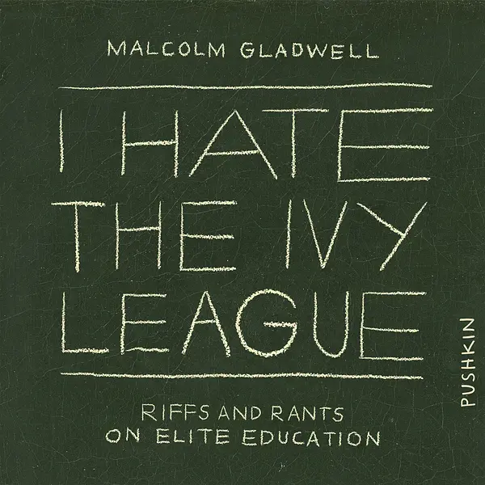

# (Audio) I Hate the Ivy League, by Gladwell

This is the first time I've seen a collection of podcasts packaged as
an [audiobook][]. There is no corresponding printed book that you can
buy. Sort of weird, but Gladwell is good enough that it works.

[audiobook]: https://www.pushkin.fm/audiobooks/i-hate-the-ivy-league-riffs-and-rants-on-elite-education

---

I tend to agree with Gladwell. Education shouldn't be an elitist thing
based on keeping people out.

---

One thing Gladwell discusses is two opposing views of what education
should do, corresponding to two opposing views of what we need.

He uses basketball and soccer to illustrate the two views, saying that
in basketball you win based on your _best_ players, while in soccer
you win based on your _worst_ players. So in basketball it's okay to
have some weaker players, if your star/s is/are great, while in soccer
you might win more by improving your worst players.

I've heard this explicitly, for education. Kai-fu Lee [says][] that
good educational "programs seek to identify and realize the potential
of the country's top technical minds, an approach suited to creating
the material prosperity that can then be broadly shared across
society."

[says]: /20200926-ai_superpowers_by_lee/ "AI Superpowers, by Lee"

From another angle, it's the [great man theory][] against the
[Ortega hypothesis][], roughly.

[great man theory]: https://en.wikipedia.org/wiki/Great_man_theory
[Ortega hypothesis]: https://en.wikipedia.org/wiki/Ortega_hypothesis

From another angle, it's conservatism vs. progressivism: individuals
should be able to succeed wildly, vs. the poorest should be helped.

Gladwell also relates this idea to the Industrial Revolution happening
in England. He attributes it to the abundance of tinkerers/inventors
all working on things. (Cf. [Power and Progress][])

[Power and Progress]: /20250322-power_and_progress_by_acemoglu_and_johnson/

---

Gladwell doesn't like timed tests. I'm a little torn, but I do have to
wonder: Did timed standardized tests influence my work style? Would I
have been better off with more focus on longer-term planning and
projects?

---

“Mirror-tocracy”

---

There's an interesting bit about how [Kelly McConville][]'s students
reverse-engineered the US News college rankings. It's a place where
regression makes sense, because the methodology of the rankings
matches up with what regression can do. It also reminded me of my old
project on [Understanding MyinTuition][].

[Kelly McConville]: https://mcconville.rbind.io/
[Understanding MyinTuition]: /20190529-understanding_myintuition/

---

