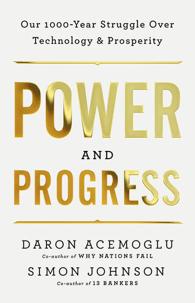

# (Audio) Power and Progress, by Acemoglu and Johnson

This [book][] from [Acemoglu][] and [Johnson][] explains that
technological progress doesn't automatically make everyone better off.
They're right, but they're also too conventional to see beyond the
labor exchange paradigm, constraining the application of their thesis.

[book]: https://shapingwork.mit.edu/power-and-progress/
[Acemoglu]: https://en.wikipedia.org/wiki/Daron_Acemoglu "Daron Acemoglu"
[Johnson]: https://en.wikipedia.org/wiki/Simon_Johnson_(economist) "Simon Johnson (economist)"

The authors understand that we make choices about who benefits from
technology, but they're also committed to the idea that people should
have to work for a living. This limits their imagination and results
in recommendations that pursue full employment instead of enabling a
vision of a yet brighter future.

---

> Workers complained about conditions and the backbreaking effort.
> Most egregious to many were the rules they had to follow in
> factories. One weaver put it this way in 1834: “No man would like to
> work in a power-loom, they do not like it, there is such a
> clattering and noise it would almost make some men mad; and next, he
> would have to be subject to a discipline that a hand-loom weaver can
> never submit to.”
>
> New machinery turned workers into mere cogs. As another weaver
> testified before a parliamentary committee in April 1835, “I am
> determined for my part, that if they will invent machines to
> supersede manual labour, they must find iron boys to mind them.”
> (page 8)

I include this selection because I found the phrase “iron boys”
weirdly evocative in its contrast. It reminds me a little bit of
“[windup girls][].”

[windup girls]: https://en.wikipedia.org/wiki/The_Windup_Girl "The Windup Girl"

The point of the weaver is that working with the new machines is less
pleasant than his accustomed artisanal process. It is less humane. It
is dehumanizing.

It also highlights that the conversion is incomplete; the attempt “to
supersede manual labor” has not fully succeeded, while people still
have to work with the machines. I find myself agreeing that “they must
find iron boys to mind them.”

---

> “In [_Novum Organum_][], published in 1620, Bacon had argued that
> scientific knowledge would enable nothing less than human control
> over nature.” (page 12)

[_Novum Organum_]: https://en.wikipedia.org/wiki/Novum_Organum

I feel like I should have recognized this immediately, but I had to
look it up. It is the shift from pure logic to focus on observation.
Pure logic is limited or full of madness; science has shaky
foundations but remarkable technological fruit.

---

> Optimism regarding shared benefits from technological progress is
> founded on a simple and powerful idea: the “productivity bandwagon.”
> This idea maintains that new machines and production methods that
> increase productivity will also produce higher wages. As technology
> progresses, the bandwagon will pull along everybody, not just
> entrepreneurs and owners of capital. (page 15)

On the one hand, it seems ridiculous that anyone would believe in such
a “productivity bandwagon,” but on the other hand, people do seem to
believe something like it, often.

---

> technology is about control, not just over nature but often over
> other humans. It is not simply that technological change benefits
> some more than others. More fundamentally, different ways of
> organizing production enrich and empower some people and disempower
> others. (page 26)

This could be a thesis for the book.

There is perhaps a false divide between “nature” and “other humans.”
In both cases there is an “othering.”

---

> Central to this volte-face was a change in the direction of
> technology away from new tasks and opportunities for workers and
> toward a preoccupation with automating work and cutting labor costs.
> (page 32)

Listening to the audiobook and unfamiliar with “volte-face,” which is
French for “about-face” (a complete and sudden change) I made a quick
mental note to look it up later. Only half-remembering the context, I
thought it might be some proper noun I was unfamiliar with. I guessed
it was spelled “voltfass” and that it might be German. Asking ChatGPT
about this, it was happy to hallucinate and send me on a merry chase
around the internet. It took me quite some time to track it to what it
actually was.

---

> To understand [Lesseps][]’s vision, we must first turn to the ideas
> of the French social reformer Henri de Saint-Simon and his colorful
> followers. Saint-Simon was an aristocratic writer who maintained
> that human progress is driven by scientific invention and the
> application of new ideas to industry. But he also thought that the
> right leadership was critical for this progress: “All enlightened
> peoples will adopt the view that men of genius should be given the
> highest social standing.” (page 36)

[Lesseps]: https://en.wikipedia.org/wiki/Ferdinand_de_Lesseps "Ferdinand de Lesseps"

Okay so [Lesseps][] was this canal guy who made the Suez Canal and
then failed to make the Panama Canal because he stubbornly wanted to
do it the same way. The chapter is called “Canal Vision” and it's
basically saying look, the best ideas don't win automatically.
Personality matters, reputation matters, rhetoric matters. And if you
put all your faith in this one guy, he can screw it up.

This all hits fairly close to home. At work, I sometimes feel like I'm
witnessing a Panama Canal effect, where someone who had past success
is forging ahead with something new regardless of whether the new
thing is a good idea really. “Vision is power,” influence without
authority, etc.

---

[Acemoglu][] and [Johnson][] are the [New Institutional Economics][]
guys, and they talk about how they think the Industrial Revolution
happened in Britain because people could try to get rich and were
allowed to.

[New Institutional Economics]: https://en.wikipedia.org/wiki/New_institutional_economics

---

> Friedman, who, like Hayek and Stigler, was awarded the Nobel Prize
> in economics, made important contributions to many areas, including
> macroeconomics, price theory, and monetary policy. Arguably,
> however, his most influential work did not appear in an academic
> journal but in a short piece published in September 1970 in the New
> York Times Magazine, immodestly titled “[A Friedman Doctrine][].”
> Friedman argued that the “social responsibility” of business was
> misconstrued. Business should care only about making profits and
> generating high returns for their shareholders. Simply put, “The
> social responsibility of business is to increase its profits.” (page
> 205)

[A Friedman Doctrine]: https://www.nytimes.com/1970/09/13/archives/a-friedman-doctrine-the-social-responsibility-of-business-is-to.html "A Friedman doctrine‐- The Social Responsibility of Business Is to Increase Its Profits"

Oh my. I think I hadn't realized that this had been put so explicitly.

---

They go on about “Machine Usefulness” and automation vs. creating new
tasks, and there's something to it, but I don't think it amounts to an
optimal path forward. They're focused on ensuring that benefits go to
workers, but I think we need to get beyond making everybody be a
worker.
