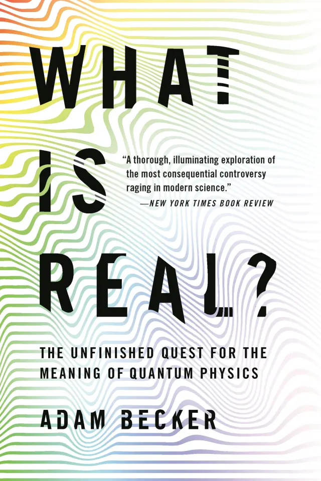

# What is real? by Becker

> “The fact that an adequate philsophical presentation
> [of quantum physics] has been so long delayed is no doubt caused by
> the fact that Niels Bohr brainwashed a whole generation of
> theorists,” Gell-Mann wrote in 1976. (page 253)

As a former physics undergraduate student, I was excited to see if the
ugly Copenhagen interpretation had finally been retired. Becker gave
me some hope but in the end it looks like people are still mostly
shutting up and calculating. I still like the “what is real” framing,
even if the [book][] can't completely deliver.

[book]: https://www.hachettebookgroup.com/titles/adam-becker/what-is-real/9781541698970/

A few thoughts:

 * One of the unique things about quantum physics is its ontic
   randomness. Even just skimming some of the book's references, like
   [Born][] and [Hermann][], it's clear people were wrestling with
   this a lot. But the author sort of puts it out of scope.
 * How, in a book on what is real, do you come so close as to discuss
   Quine's [Two Dogmas][] but not dive into the myth of physical
   objects? (To be clear, there is discussion of scientific realism,
   but this aspect of it isn't much explored, as I recall.)
 * Similarly, there isn't much discussion of what we really think
   exists. Pointlike particles? (In what sense does anybody believe in
   them?) Discrete space? Something else? In what may be a bit of
   humor, the very last note at the end of the book is about how many
   interpretations don't, in fact, believe in "particles" as such at
   all.
 * I would have liked for there to be more on [map vs. territory][] as
   it pertains to what is real. Where do we think the theory is "real"
   vs. where is it just a model? (There is some discussion of
   epistemic vs. ontic interpretations, though this could have been
   clearer too. I think this connects to
   [Unreasonable Effectiveness][], which also would have been
   interesting to see explored more.
 * Another connection that seems interesting is the mathematical idea
   of model theory, where you differentiate between a formal system
   and a model that satisfies it. With multiple interpretations that
   don't seem to have different predictions than "standard quantum
   physics" the interpretations start to feel like models in this
   sense.
 * It would have been nice to get more/clearer on Heisenberg's
   uncertainty principle. Looking into it more myself, I got as far as
   an interesting hint that you can understand it as position and
   momentum wave functions being mutually Fourier transforms, so if
   one is narrow the other is spread out.
 * In general, the author seemed sometimes to assume knowledge instead
   of clearly laying out enough to get up to speed. Part of this is
   probably just trying to avoid technicality that would put people
   off. To illustrate: DeWitt's [Quantum Mechanics and Reality][] is
   great (and very approximately a short version of the whole book)
   but it has enough math notation in it that it probably puts off a
   lot of people who would otherwise read and enjoy it. (And it's
   trying to be gentle itself.) But if you don't explain spin or
   polarization (etc.) at all, people will also be left out. And when
   interpretation is largely about putting meaning to the math, it's
   hard to think about if you never see the math.
 * What kinds of things are eligible to constitute an interpretation?
   The math alone seems not to be. Do things have to reduce to
   [naïve physics][] in order to be part of an interpretation? Is any
   (non-mathematical) abstraction acceptable? Must it satisfy some
   assumptions? (Some might have put locality in that bucket,
   previously?)

[Born]: https://ia601501.us.archive.org/1/items/in.ernet.dli.2015.204850/2015.204850.Natural-Philosophy_text.pdf
[Hermann]: https://web.archive.org/web/20190601184313/https://www.hcs.harvard.edu/~hrp/issues/1999/Hermann.pdf
[Two Dogmas]: https://en.wikipedia.org/wiki/Two_Dogmas_of_Empiricism
[map vs. territory]: https://en.wikipedia.org/wiki/Map%E2%80%93territory_relation
[Unreasonable Effectiveness]: https://en.wikipedia.org/wiki/The_Unreasonable_Effectiveness_of_Mathematics_in_the_Natural_Sciences
[naïve physics]: https://en.wikipedia.org/wiki/Na%C3%AFve_physics

What is the Copenhagen interpretation?

 * divide quantum vs. classical scales (vague)
 * wave function collapse on observation (measurement problem)
 * no hidden variables (it's not just that we don't know the state
   yet)
 * says nothing about the world (?)
 * wave-particle duality ("complementarity")

Other interpretations:

 * Bohm pilot-wave
 * multiple worlds
 * superdeterminism
 * spontaneous collapse

In the end, I still don't understand all of physics. Magnets are
weird. Light is weird. Gravity is weird. Becker has more to say
tearing down Copenhagen than in building any particular replacement;
as in the subtitle, the quest is unfinished. Excelsior?

---

> “The soundest fact may fail or prevail in the style of its telling.”
> (Ursula K. Le Guin)

This is from _The Left Hand of Darkness._

---

> The godfather of quantum physics, Niels Bohr, talked about a
> division between the world of big objects, where classical Newtonian
> physics ruled, and small objects, where quantum physics reigned. But
> Bohr was maddeningly unclear about the location of the boundary
> between the world. (page 9)

This alone is not such a big deal. Different models apply to different
views, scales, etc. Statistical Mechanics doesn't apply to individual
particles, for example. It is weird if you treat the divide as
fundamental, but if you treat it as a matter of convenience or
approximation, I don't have a problem with it.

The heart of the Copenhagen weirdness is the measurement problem as in
Schrödinger's cat: denying decided existence until we look.

---

> Born's book, [_Natural Philosophy of Cause and Chance_][], made
> quite an impression on Bell—especially the discussion of a proof by
> the great mathematician and physicist John von Neumann. According to
> Born, von Neumann had proven that the Copenhagen interpretation was
> the only possible way of understanding quantum physics. So either
> the Copenhagen interpretation was correct or quantum physics was
> wrong. And, given the wild success of quantum physics, it seemed
> that Copenhagen and its vagueness were here to stay. (pages 9-10)

[_Natural Philosophy of Cause and Chance_]: https://ia601501.us.archive.org/1/items/in.ernet.dli.2015.204850/2015.204850.Natural-Philosophy_text.pdf

Well, what does Born say?

> It would be silly and arrogant to deny any possibility of a return
> to determinism. For no physical theory is final; new experiences may
> force us to alterations and even reversions. Yet scanning the
> history of physics in the way we have done we see fluctuations and
> vacillations, but hardly a reversion to more primitive conceptions.
> I expect that our present theory will be profoundly modified. For it
> is full of difficulties which I have not mentioned at all—the
> self-energies of particles in interaction and many other quantities,
> like collision cross-sections, lead to divergent integrals. But I
> should never expect that these difficulties could be solved by a
> return to classical concepts. I expect just the opposite, that we
> shall have to sacrifice some current ideas and use still more
> abstract methods. However, these are only opinions. A more concrete
> contribution to this question has been made by J. v. Neumann in his
> brillant book, _Mathematische Grundlagen der Quantenmechanik._ He
> puts the theory on an axiomatic basis by deriving it from a few
> postulates of a very plausible and general character, about the
> properties of 'expectation values’ (averages) and their
> representation by mathematical symbols. The result is that the
> formalism of quantum mechanics is uniquely determined by these
> axioms; in particular, no concealed parameters can be introduced
> with the help of which the indeterministic description could be
> transformed into a deterministic one. Hence if a future theory
> should be deterministic, it cannot be a modification of the present
> one but must be essentially different. How this should be possible
> without sacrificing a whole treasure of well-established results I
> leave to the determinists to worry about. (_Natural Philosophy of
> Cause and Chance_ pages 108-109)

This isn't about the Copenhagen interpretation, is it? This is about
hidden variables? (No-hidden-variables isn't what we mean by
Copenhagen, is it? I thought everybody agreed about no hidden
variables...)

This is fairly bad for the big structure of the book, which hinges on
the "proof of the Copenhagen interpretation" coming undone.

Coming back to this later: Maybe no-hidden-variables is/was part of
the Copenhagen interpretation? It seems like the author argues the
pilot-wave interpretation has hidden variables (but not locality) and
that shows von Neumann was wrong. But still, Born was talking about
determinism, and hidden variables also isn't the same thing as
determinism...

---

> What does quantum physics tell us about the world? According to the
> Copenhagen interpretation, this question has a very simple answer:
> quantum physics tells us nothing whatsoever about the world. (page
> 14)

Is this quite fair? Doesn't it say the cat is both alive and dead?
It's a weird thing to say, but it seems to say it...

---

> Quantum physics uses infinite collections of numbers called _wave
> functions_ to describe the world. (page 16)

This is a little bit like calling a line an infinite collection of
numbers: technically true but not super helpful.

---

> Once you do find that electron, a funny thing happens to its wave
> function. Rather than following the Schrödinger equation like a good
> wave function, it collapses—it instantly becomes zero everywhere
> except in the place where you found the electron. (page 17)

Is there a problem in treating the wave function as describing our
state of knowledge? We don't have any problem with making
probabilistic predictions, for example, and then when we get data we
switch from the probabilistic prediction to the observed data. How
different is the quantum wave function really?

(I think there _is_ a problem in thinking about it this way, and it
would have been nice for the author to make this clearer... For
example, if the wave function is 50% along two paths, they shouldn't
interfere with one another if the wave function is just a description
of our knowledge.)

---

> So what is real? Copenhagen's reply is silence—and a look of stern
> disapproval for having the temerity to ask the question in the first
> place. (page 20)

At some point we really can't say anything about the "underlying
reality" of what we observe. Is quantum mechanics that boundary?

(No.)

---

> [Mach][] believed that science should be based on descriptive laws
> that don't make any claims about the true nature of the world—he
> dismissed such claims as unnecessary for the practice of science. To
> Mach, one of the worst offenders was the great god of physics, Isaac
> Newton himself. Newton's master-work, the _Principia,_ opened with
> the assumption that space and time were absolute entities unto
> themselves, with real existence out in the world. This “conceptual
> monstrosity of absolute space” was, in Mach's view, “purely a
> thought-thing which cannot be pointed to in experience.” Mach
> thought that a proper science of mechanics would dispense with these
> kinds of ontological claims—claims about what things actually exist
> in the real world—and instead simply lay down descriptive,
> mathematical laws that accurately predict the observed motion of all
> objects. Good theories, according to Mach, were about connecting
> observations, not about positing things that couldn't be observed at
> all. (page 25)

[Mach]: https://en.wikipedia.org/wiki/Ernst_Mach

Map and territory... How different is it to have absolute space be
model, just "act as if," without the ontological claim?

---

> Mach had loudly and repeatedly proclaimed that he did not believe in
> atoms, as they were too small to be observable in principle. (page
> 27)

This is silly. Nothing is _directly_ observable in principle, and yet
we believe in chairs, other people, etc.

If he's _really_ positivist, how does he believe in anything other
than claims about sense perceptions? "I see a chair" doesn't imply "I
believe there is a chair."

---

> Heisenberg started thinking about what would happen if you tried to
> measure the position of a single particle, like an electron, to very
> high precision. He realized that you could do this the same way
> you'd look for a lost wallet in a dark field: shine a flashlight
> around until you've found what you're looking for. An ordinary
> flashlight wouldn't work for an electron, though—the wavelength of
> visible light is far too large for that. But Heisenberg knew you
> could find an electron using higher-energy light, with a shorter
> wavelength: gamma rays. Shine a gamma-ray flashlight around a room,
> and you'll find your electron. But gamma rays pack a punch—bounce
> one gamma-ray photon off an electron, and the electron will go
> careening off in some random direction. So you'll know where the
> electron was, but you won't know how fast it's going or where it's
> heading now. (page 38)

This is a standard bad take. Even if there's some historicity to it,
in how Heisenberg was thinking, it's misleading to make uncertainty
seem like it's about physicality of measurement.

---

> Bohr pointed to the Heisenberg uncertainty principle as further
> justification for the inevitability of complementarity. Using
> Heisenberg's gamma-ray flashlight as an example, he pointed out that
> there was no way to precisely measure the momentum of an electron
> when observing its position, and vice versa. Bohr then echoed Mach,
> as Heisenberg had, and claimed the impossibility of measuring both
> properties simultaneously. Position and momentum, like particles and
> waves, were complementary—never used at once but both needed for the
> complete description of a situation.
>
> But Bohr was wrong. There was nothing inevitable or necessary about
> complementarity—other interpretations of quantum physics are
> possible. Indeed, the claim of inevitability is an awfully strong
> and strange claim to make about any interpretive issue in science,
> precisely because it is always possible to reinterpret any theory.
> Yet Bohr was convinced that complementarity was the deepest insight
> into nature found within the quantum theory.
>
> Stranger still is Bohr's use of the gamma-ray flashlight to bolster
> his claims. It's certainly true that the thought experiment
> illustrates a world in which there are limits on our knowledge, but
> it's also a world where particles have well-defined positions and
> momenta at all times. Hitting an electron with a gamma ray can't
> alter the electron's momentum unless it has a momentum in the first
> place. We don't know what that momentum is—but that's certainly not
> the same thing as saying it doesn't exist. (page 40)

---

> Why were Bohr, Heisenberg, and others so convinced that the quantum
> world couldn't be visualized? Why did they seem to think that things
> couldn't be real until they were observed? Why did they insist that
> the classical world obeyed fundamentally different rules from the
> quantum world? Why, in short, did they believe the strange
> assemblage of claims that came to be known as the Copenhagen
> interpretation? (page 47)

---

> He dismissively said of another physicist's paper that “it is not
> even wrong.” (page 48, quoting Pauli)

Huh! So that's where that came from!

---

> As Bohr put it years after Solvay, “It is wrong to think that that
> task of physics is to find out how nature is. Physics concerns what
> we can say about nature.” (page 49)

Writing koans, this guy...

---

> In short, quantum physics is either incomplete or nonlocal. (page
> 56)

---

> But Einstein's concerns had little, if anything, to do with
> determinism—they were about the importance of locality and a
> physical reality that exists independently of anyone observing it.
> (page 59)

---

> Some took him [von Neumann] to be saying that consciousness itself
> causes the collapse of the wave function; this was a view promoted
> by physicists Fritz London and Edmond Bauer in a book they wrote
> several years later, heavily influenced by von Neumann's work.
> Wigner also adopted this view later. But this is a weird view.
> Stating that consciousness collapses wave functions does arguably
> solve the measurement problem but only at the price of introducing
> new problems. (page 68)

---

> ... the Nazi bomb program, unlike the Manhattan Project, was a
> disorganized mess, with vital information compartmentalized and no
> clear vision of how to proceed. (page 77)

---

> “The conditions we work under today certainly aren't hastening [a]
> breakthrough,” he [Goudsmit] said in 1953. (page 81)

This is in a part about how the militarization of physics made it less
concerned with philosophy and "understanding" as it focused on
shutting up and calculating...

---

> Research into the meaning of quantum physics was one of the
> casualties of the war. With all these new students crowding
> classrooms around the country, professors found it impossible to
> teach the philosophical questions at the foundations of quantum
> physics. Before the war, courses in quantum physics on both sides of
> the Atlantic, like Heisenberg's in Leipzig and Oppenheimer's in
> Berkeley, spent a great deal of time on conceptual issues. Textbooks
> and exams from the prewar period asked students to write detailed
> essays on the nature of the uncertainty principle and the role of
> the observer in the quantum world. But, with ballooning class sizes,
> detailed discussion of philosophy became all but impossible. (page
> 82)

Also kind of weird to have students write essays on the role of the
observer, if nobody had really good ideas on the topic anyway?

---

"Atavistic" is used on page 83: "relating to or characterized by
reversion to something ancient or ancestral."

---

> Given the damage done to his reputation by his activities during the
> war, Heisenberg's invention of a single unified Copenhagen
> interpretation may have been an attempt to rework the history of
> quantum physics to his benefit. (pages 83-84)

---

> Questions of interpretation, while vital for the progress of science
> in the long term, were immaterial when it came to the hard-nosed
> applications of quantum theory that were so suddenly and desperately
> prized. (page 84)

I think I agree that interpretation is important for progress, but I
don't think the claim is very strongly established or supported in the
text.

---

> But Bohm's thesis research, on interactions between atomic nuclei,
> was nonetheless very relevant for the work going on at Los Alamos—so
> much so that it was immediately classified beyond Bohm's clearance.
> His notes and calculations were seized by the Army, and he was
> forbidden from writing his own thesis. (page 94)

Silly!

---

> He [Bohm] was assembling his quantum physics course materials into a
> textbook, taking great care to explain and defend the Copenhagen
> interpretation. But doubts had crept in, and, as the book neared
> completion in the summer of 1950, those doubts grew. “When I
> finished the book, I wasn't quite satisfied that I really understood
> it,” Bohm said. (page 95)

Wild! (But also, maybe not that uncommon in the vicinity of quantum
books?)

The text is [Quantum Theory][].

[Quantum Theory]: https://store.doverpublications.com/products/9780486659695

---

> In Bohm's interpretation of quantum physics, much of the mystery of
> the quantum world simply falls away. Objects have definite positions
> at all times, whether or not anyone is looking at them. Particles
> have a wave nature, but there's nothing “complementary” about
> it—particles are just particles, and their motions are guided by
> pilot waves. Particles surf along these waves, guided by the waves'
> motion (hence the name). Heisenberg's uncertainty principle still
> holds—the more we know about a particle's position, the less we know
> about its momentum, and vice versa—but according to Bohm, this is
> simply a limitation on the information that the quantum world is
> willing to yield to us. (page 98)

The difference between an answer being there but we can't know it,
versus there not being an answer apart from our attempt to know it.

---

> the [Aharonov–Bohm effect][], an unusual feature of the behavior of
> electrons and other charged particles traveling near electromagnetic
> fields. (page 115)

[Aharonov–Bohm effect]: https://en.wikipedia.org/wiki/Aharonov%E2%80%93Bohm_effect

Neat! Seems to suggest that wave functions have some sort of "reality"
to them even when their real component is zero?

---

> Each experiment, each quantum event, spun off new branches of the
> universal wave function, creating a multitude of universes in which
> that one event had every possible outcome. (page 124)

This doesn't solve the measurement problem! This makes measurement
central to the evolution of the universe(s), which is just as bad if
not worse!

And measurements don't have just simple binary outcomes; infinite
position outcomes (or nearly so, if we go to the nearest Planck
length) are possible, etc.

So we say the wave function doesn't collapse. In some sense the wave
function _is_ the "multi-verse," then, and the "many worlds" aren't
really many but just aspects of the wave function multi-verse...

Coming back later: The book doesn't do it, but I am now suspecting
that there is some better definition of "quantum event" in terms of
when the wave function becomes decoherent or something... In
multi-worlds the wave function is sometimes behaving weirdly quantum,
interfering with itself and so on, and sometimes things settle into a
"branch" where one thing seems to have happened.

But: some people still [don't think][] decoherence solves the
measurement problem.

[don't think]: https://en.wikipedia.org/wiki/Quantum_decoherence#cite_note-Adler2001-16

---

The annoying and typical tale of Wheeler advising Everett to do a lot
of work to get Bohr on board with ideas Bohr doesn't like. (around
page 130)

Also: Funny when DeWitt later says Wheeler is a backer of multiple
worlds.

---

On page 145 the author does clarify that von Neumann's proof
(mentioned page 9) was purporting to show the impossibility of
hidden-variable interpretations. I still think this is quite a bit
more specific than "the Copenhagen interpretation"... Bohm's theory is
given as an example of one with hidden variables that does work.

> Specifically, Bell found that a hidden-variables theory could avoid
> the traps laid by these proofs if it had a rather peculiar property,
> later dubbed _contextuality._ (page 146)

Wikipedia's [Quantum contextuality][] notes that "Nonlocality, in the
sense of Bell's theorem, may be viewed as a special case of the more
general phenomenon of contextuality".

[Quantum contextuality]: https://en.wikipedia.org/wiki/Quantum_contextuality

But this isn't good! This is more measurement problem!

> In demolishing the no-hidden-variables proofs, Bell also
> demonstrated that quantum physics describes a contextual world.
> (page 147)

---

> “What is proved by impossibility proofs,” concluded Bell, “is lack
> of imagination.” (page 148)

> Bell toyed with this EPR-Bohm thought experiment, trying to
> construct a model that would maintain all the predicted results of
> quantum physics while remaining purely local. “Everything I tried
> didn't work,” Bell said. “I began to feel that it very likely
> couldn't be done. Then I constructed an impossibility proof.” (page
> 150)

This has to be intentional, right? This is humor?

---

> This proof, now known as Bell's theorem, has rightly been called
> “the most profound discovery of science.” (page 151)

This was by [Stapp][], in [Bell's theorem and world process][].

[Stapp]: https://en.wikipedia.org/wiki/Henry_Stapp
[Bell's theorem and world process]: https://escholarship.org/uc/item/7m59f6nz

---

> As Bell himself said, “I don't know any conception of locality which
> works with quantum mechanics. So I think we're stuck with
> nonlocality.” (page 160)

---

> Bell's theorem is merely a claim about the world, independent of
> quantum mechanics. (page 160)

---

> In short, Bell's theorem really leaves only three unequivocal
> possbilities: either nature is nonlocal in some way, or we live in
> branching multiple worlds despite appearances to the contrary, or
> quantum physics gives incorrect predictions about certain
> experimental setups. (page 160)

The author is at pains to explain that "realism" is not a distinct
assumption that could be false, though I think I've seen this
explained differently...

Superdeterminism is also mentioned but dismissed.

---

> Physicists certainly talked about electrons as if they were real,
> but this was merely a shorthand for their perceptions and not to be
> taken literally. (page 169)

This also works for chairs etc.

---

"Rumbustious" is used on page 171: "boisterous or unruly."

---

> He [Otto Neurath] worked to develop an international symbolic
> language, ISOTYPE, that would precisely specify sense data in
> unambiguous ways, to aid international collaboration in science and
> philosophy. (page 171)

[Huh!](https://en.wikipedia.org/wiki/Isotype_(picture_language))

---

> And few physicists truly believed, as the Vienna Circle did, that
> electrons didn't exist. (page 177)

Books don't exist.

When I think I have a book in my hand I believe that in addition to my
conception of the book there is some "real thing" that is the book. I
believe that my sensation of holding the book is because of that real
thing. But I can't _directly_ perceive that thing. I see light from
the book, I feel pressure from the book on my fingers.

Sense perception of many things is indirect. I've never been on the
dark side of the moon, but I believe it has a "real thing" existence
like a book.

This extends to electrons. They are not less real than anything else.
Other things aren't more real than them.

Why (and how?) make a distinction between things that are part of
"naïve physics" and things that are part of more sophisticated models?
They're all models, all map, none of them territory.

---

> Quine's paper, “[Two Dogmas of Empiricism][],” took aim at the core
> of the positivist program, the verification theory of meaning. Quine
> pointed out that there was no way to verify single statements—all
> attempts to verify a statement inevitably involve the assumed truth
> of other statements, which are themselves subject to the same
> problem. (page 180)

[Two Dogmas of Empiricism]: https://en.wikipedia.org/wiki/Two_Dogmas_of_Empiricism

Quine spends more time on the analytic-synthetic distinction than on
reductionism ("the verification theory of meaning").

On the analytic-synthetic distinction, I think Quine is pointing out
problems with human language, not proving the non-distinction he aims
to prove. Certainly mathematical tautologies are analytic.

It is indeed hard to talk about the world though (synthetic). From the wiki:

> According to Quine, there are two different results of his
> reasoning. The first is a blurring of the line between metaphysics
> and natural science. The common-sense theory about physical objects
> is epistemologically comparable to the gods of Homer. Quine is a
> physicalist, in the sense that he considers it a scientific error
> not to adopt a theory which makes reference to physical objects.
> However, like Gods of Homer, physical objects are posits, and there
> is no great epistemic difference in kind; the difference is rather
> that the theory of physical objects has turned out to be a more
> efficient theory. After having defined himself an "empiricist",
> Quine states in Two Dogmas: "The myth of physical objects is
> epistemologically superior to most in that it has proved more
> efficacious than other myths as a device for working a manageable
> structure into the flux of experience".

I like this "myth of physical objects;" maybe that's a helpful phrase
for thinking about things. As in the discussion of books and electrons
above: which myths do you think are useful? Which do you really
believe? Is it helpful to "really believe" in those things in Plato's
realm of ideals?

---

> The interpretation of a physical theory, like quantum physics, is
> important for the day-to-day practice of science itself. Logical
> positivism couldn't account for this. (page 183)

> Hanson dubbed the role that nonobservable entities play in
> scientific work the “theory-laden” practice of science, a name that
> stuck. (page 183)

> And, while there was much they didn't agree on, a new consensus
> began to form among professional philosophers of science, a position
> in opposition to logical positivism, which they called _scientific
> realism._ (page 183)

What do I think? I think it's asking too much to believe in
everything. Maybe I can call my point of view “deep agnosticism,” in
which nothing is officially believed, though of course you can't walk
around without having some beliefs in practice. _Something_ is going
on. Hard to say exactly what. But that doesn't have to stop us living
with chairs and books and electrons.

---

> If the unobservable “metaphysical” content of our best scientific
> theories—stuff like electrons—really bears no relation at all to the
> actual stuff in the world, then why do our scientific theories work
> at all?

First, "bears no relation at all to the actual stuff in the world" is
not the same as "is the same as the actual stuff in the world."
Electrons can be a useful thing to act as if is real, regardless of
whether electrons "exist" in a physical sense or we're in a simulation
that's programmed as if there are electrons.

> The theories themselves suggest explanations for the phenomena that
> we see based on the unobserved stuff. But if the unobserved stuff is
> just a convenient picture that just happens to come along with the
> “real” content of the theory (i.e., the predictions about the
> observable world) and that picture really doesn't line up with the
> stuff in the world in any way, then we're astonishingly lucky that
> our theories work so well! (page 185)

Astonishingly lucky? Unreasonably lucky? This reminds me of The
Unreasonable Effectiveness of Mathematics in the Natural Sciences,
which is not so different: We make models, and the models work really
well.

> Hilary Putnam put it more succinctly. “Realism,” he claimed, “is the
> only philosophy that doesn't make the success of science a miracle.”
> (page 187)

---

> While Einstein and Bohr's generation was widely schooled in
> philosophy, the push toward specialization after World War II had
> taken its toll on the liberal arts education of the new crop of
> physicists. (page 189)

---

> The solution to the measurement problem, Wigner was convinced, lay
> somewhere in the special qualities of human consciousness—a view he
> also attributed to von Neumann. (page 199)

---

"Samizdat" is used on page 214: "the clandestine copying and
distribution of literature banned by the state, especially formerly in
the communist countries of eastern Europe."

---

> “I am a quantum engineer,” he [Bell] once announced at the start of
> a talk, “but on Sundays I have principles.” (page 222)

---

> And a celebrated series of articles on Bell's theorem by the
> distinguished Cornell physicist N. David Mermin elucidated the
> subject for his fellow physicists through a set of particularly
> simple thought experiments, which rapidly became the standard way of
> teaching the subject. (page 224)

Maybe one of them is this "[Quantum mysteries for anyone][]" which
features the example that our author presents as variations on
roulette wheels. (Credit is given, in a note on page 333.) It's nice that at the end Mermin explains a real
possible realization of the apparatus.

[Quantum mysteries for anyone]: https://www.ringnebula.com/CosIG/28e-Mermin-Quantum-mysteries-for-anyone-1981.pdf

---

---

> One method, [of quantum cryptography] developed by Charles Bennett
> and Gilles Brassard in 1984, was based on a result known as the
> “[no-cloning theorem][],” which had been proven in response done by the
> Fundamental Fysiks Group. (page 226)

[no-cloning theorem]: https://en.wikipedia.org/wiki/No-cloning_theorem

> In physics, the no-cloning theorem states that it is impossible to
> create an independent and identical copy of an arbitrary unknown
> quantum state, a statement which has profound implications in the
> field of quantum computing among others.

---

> “I expect that the Copenhagen interpretation will some time be
> called the greatest sophism in the history of science,” he [Zeh]
> wrote to Wheeler in 1980, “but I would consider it a terrible
> injustice if—when some day a solution should be found—some people
> claim that ‘this is of course what Bohr always meant,’ only because
> he was sufficiently vague.” (pages 232-233)

---

> (Wheeler himself misunderstood the Bell experiments as ruling out
> determinism, rather than locality.) (page 234)

The reference is Wheeler and Zurek's 1983 _Quantum Theory and
Measurement,_ page 188.

Wheeler says, in his chapter called "Law without Law":

> Not the slightest hard evidence has ever been found that would throw
> doubt on the plain, straightforward prediction of quantum mechanics,
> the prediction that no prediction is possible. Probability? Yes. A
> definite forecast? No. Einstein could be unhappy that “God plays
> dice”; but Bohr could tell him jokingly, “Einstein, stop telling God
> what to do.”

It isn't super clear to me that this ties directly to Bell
experiments, but I didn't look at the Wheeler book for long. And
didn't everybody agree that (non-probabilistic) determinism was out
anyway? Doesn't seem like you need Bell for that.

---

> Why do we even need a different [from Copenhagen] interpretation,
> much less a different theory altogether
> [given quantum theory works so well]?
>
> Bell framed his reply as a moral issue. “It is not right to tell the
> public that a central role for conscious mind is integrated into
> modern atomic physics. Or that ‘information’ is the real stuff of
> physical theory. It seems to me irresponsible to suggest that
> technical features of contemporary theory were anticipated by the
> saints of ancient religions ... by introspection.” Bell felt an
> urgent need to solve the problems at the core of quantum physics—but
> he had little patience for purported solutions that were little more
> than vague declarations of faith. He wanted something more definite,
> something that wasn't a professional embarrassment, a true theory
> that didn't shy away from questions about what happened during
> measurement. His relentlessly clear writing gave no quarter to
> anyone hoping to take solace in the comforting platitudes of the
> Copenhagen interpretation. “Surely, after 62 years, we should have
> an exact formulation of some part of quantum mechanics?” Bell said
> in 1989. “[Measurement devices] should not be separated off from the
> rest of the world into black boxes, as if [they] were not made of
> atoms and not ruled by quantum mechanics.” In a talk he gave in
> Geneva in January 1990, Bell acknowledged that the task at hand was
> difficult and that his own theorem proved that there was some
> radical change necessary, something that physics would have to come
> to terms with. “I think you're stuck with the nonlocality,” Bell
> told the small group who came to hear him speak that day. “I don't
> know any conception of locality which works with quantum mechanics.”

On information specifically, I'm reminded of my old buddy [Kantor][],
whose work I've still never really understood.

[Kantor]: /2012/05/18/quotes-from-frederick-w-kantor/

But overall yes, I agree with Bell here.

---

Looks like "the Jura" are another mountain range, like "the Alps" also
are. (page 239)

---

"Pellucid" is used on page 240. It means "translucently clear."

---

> DeWitt's article, “[Quantum Mechanics and Reality][],” did review
> several interpretations. (page 243)

[Quantum Mechanics and Reality]: https://cqi.inf.usi.ch/qic/deWitt1970.pdf

Let's read that article.

> Some writers have also insisted that the process described by
> equation 4 merely prepares the system and that the measurement is
> not complete until a more complicated piece of apparatus observes
> the outcome of the preparation.

This is very funny, as the "more complicated piece of apparatus" is a
person: he's alluding to consciousness, but obliquely. (He gets to it
shortly.)

> Quantum mechanics is a theory that attempts to describe in
> mathematical language a world in which chance is not a measure of
> our ignorance but is absolute.

> This universe is constantly splitting into a stupendous number of
> branches, all resulting from the measurementlike interactions
> between its myriads of components.

"Measurementlike" is key, and possibly confusing. Maybe "decoherent"
would be better?

> For example, in the very early moments of the universe, during the
> cosmological "Big Bang," the universal wave function may have
> possessed an overall coherence as yet unimpaired by condensation
> into noninterfering branches.

This was the bit that made me start to think I understood better what
decoherence means, and why the splitting of many worlds doesn't
necessarily have the observer problem any more.

> Finally, the EWG ["many worlds"] interpretation of quantum mechanics
> has an important contribution to make to the philosophy of science.
> By showing that formalism alone is sufficient to generate
> interpretation, it has breathed new life into the old idea of a
> direct correspondence between formalism and reality. The reality
> implied here is admittedly bizarre. To anyone who is awestruck by
> the vastness of the presently known universe, the view from where
> Everett, Wheeler and Graham sit is truly impressive. Yet it is a
> completely causal view, which even Einstein might have accepted. At
> any rate, it has a better claim than most to be the natural end
> product of the interpretation program begun by Heisenberg in 1925.

I like some of [Deutsch's stuff], but I hadn't been on board re: many
worlds, before. Maybe I'm getting convinced?

[Deutsch's stuff]: /20220410-beginning_of_infinity_by_deutsch/

Something interesting happens then, doesn't it? Quantum mechanics is
indeed ontologically random, at the lowest level, and the wave
function captures that. But as we look backward in time, it's
epistemic from the point of view of the evolution of our specific
world vantage point. Before we start a Schrödinger's cat experiment,
we predict 50/50 odds and that's really true, there's an irreducible
randomness. After running the experiment, however, the wave function
describes our state of knowledge but not the reality. The cat really
is alive or dead and not both, in the world path that we're really in.

And that's how it always is, isn't it? Predictions forward, knowledge
backward...

---

> General relativity didn't merely deal with abstruse situations—it
> was also written in abstruse mathematics. The theory is very
> mathematically complex, far more so than quantum mechanics. (page
> 246)

---

> But it's not clear that Everett himself truly believed that the many
> worlds implied by his interpretation were literally real, as DeWitt
> did. (page 251)

I'm not sure it's even clear what "literally real" means here... It
seems clear they're not like islands in the sea, independent entities
that you can skip between. More like aspects of the wave function than
like separate wave functions, right?

---

> When Don Reisler, a physicist with a PhD in quantum foundations,
> applied to work at Everett's company, Everett shyly asked if he was
> a ware of the relative-state interpretation. Reisler immediately
> thought, “Oh my God, you are _that_ Everett, the crazy one.” (page
> 251)

(Everett's many-worlds interpretation was also called "relative-state.")

---

> As Quine said, our beliefs about the world can only be tested
> against the world as a group, not individually, and this holds for
> falsification just as much as for verification. No theory, in
> isolation, is falsifiable. (page 262)

(part of a takedown re: Popper)

---

> Ultimately, arguments against a multiverse purportedly based on
> falsifiability are really arguments based on ignorance and taste:
> some physicists are unaware of the history and philosophy of their
> own field and find multiverse theories unpalatable. But that does
> not mean that multiverse theories are unscientific. (pages 263-264)

Yikes! Who hurt you?

(It's right about here that the writing gets dramatically spicier.)

---

> Zeilinger has suggested that the “message of the quantum” is the
> fairly positivist idea that “the distinction between reality and our
> knowledge of reality, between reality and information, cannot be
> made.” (page 271)

---

> Just a few generations ago, at the birth of quantum physics, all
> physicists received some schooling in philosophy. Einstein read
> Mach, Bohr read Kant. But the shifts in research funding and physics
> classrooms after World War II also led to broader shifts in
> university curricula. For Einstein and Bohr's generation, philosophy
> was part of the core educational curriculum in central Europe. But
> in postwar America, it was (and is) relatively easy for an
> intelligent student to go all the way from kindergarten to a PhD in
> physics at a top-tier university without ever darkening the door of
> a philosophy classroom. (page 273)

(part of a section decrying lack of love for philosophy)

---

> But with the massive increase in knowledge and information in the
> last century, education became unavoidably specialized. (page 273)

Unavoidably? I think this is an exaggerated claim. I think maybe we've
done a poor job in organizing and explaining the knowledge we (should)
have. Not to mention all the people who seem to get a lot of education
and still come out knowing basically nothing.

A contributing factor might be the allegedly unopinionated kitchen
sink nature of curricula, where the view is wide and often historical
even when the knowledge isn't fundamentally historical in nature.

---

> “All of the proposals we have for solving the measurement problem
> are weird in one way or another,” said David Albert. “Bell's theorem
> proves they have to be weird. ... [But] there's a huge difference
> between being weird and being incoherent or unintelligible.” And,
> Albert added, many physicists still do not seem to appreciate this
> point. “Physicists will say, ‘Yes, the Copenhagen interpretation is
> weird, but so is everything else.’ And you sort of want to slap them
> and say, ‘No! The Copenhagen interpretation is not _weird,_ it's
> gibberish, it's unintelligible.’” (page 283)

I agree with this; it seems generous to even call Copenhagen an
interpretation.

Oh! And in this note (page 340) there's a quote from Bas van Fraassen:

> “by today's standards [Copenhagen] is not an interpretation.”

---

> Science and culture form an undivided whole, now more than ever, in
> our world whose every corner has been reshaped by human activity.
> (page 285)

---

The appendix, _Four Views of the Strangest Experiment,_ is good.

---

> ... Copenhagen delenda est.

Copenhagen must be destroyed, following the shortened form of Cato's
repeated call for the destruction of Carthage.

---

> In most versions of many-worlds, there are no particles as such; the
> same is true for most versions of spontaneous-collapse theories. So
> my use of the word “photon” is a bit of a fudge, but you can just
> read it as “wave packet” if you're really persnickety. (page 342)
