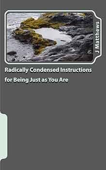

# Radically condensed instructions for being just as you are

This funny little [book][] was mentioned in [Four Thousand Weeks][].
It's on [nonduality][]. The title joke seems to be that usually people
say even more, writing on this topic, when arguably not much needs to
be said. There are still pretty many words here, and many of them are
"poignancy."

[book]: https://www.scribd.com/document/165080210/Radically-Condensed-Instructions-for-Bei-Matthews-J-Jennifer
[Four Thousand Weeks]: /20250921-four_thousand_weeks_by_burkeman/
[nonduality]: https://en.wikipedia.org/wiki/Nondualism

My personal philosophy has some affinity with this nondualism stuff.
My starting point is that experience is the only thing we have direct
experience of. Nondualists seem to argue that this should be both
starting point and ending point. I'm all about living in the moment
and all, but I tend to feel that just because we can't prove things
exist, it doesn't mean we shouldn't believe that they do. But it's
okay to grant that this is a leap.

There's some cute discussion of how trying too hard to live in the
moment is a good way to take yourself out of the moment. I think this
is kind of like falling asleep: trying to make yourself fall asleep is
stressful. You have to relax, and again, you don't relax by trying
hard to relax. Also like meditating, where you aim to let thoughts
come and let them go, not by trying hard to do this, but by not
trying. So we have a "philosophy of not-philosophy," and a perfect
practitioner doesn't need to read this book. I'm not sure the
comparison is perfect, but it reminds me of Star Wars: "I don't know;
fly casual."

Thinking about this more, I wonder if what [Four Thousand Weeks][] is
really trying to offer is a time management of not-time-management.
The idea that you shouldn't be trying to manage time, but that you
should be living and doing things without worrying about the time
management. I think there's something here: getting in the flow of
doing something, not focusing on planning but on doing, etc. This
feels like a better interpretation of [Four Thousand Weeks][] than I
had previously given it. (Maybe better than it really deserves...)

Anyway, sure, cute short book.

---

> Life is the most incredible mystery.

---

> We can not get anything out of life. There is no outside where we
> could take this thing to. There is no little pocket situated outside
> of life, which would steal life’s provisions and squirrel them away.
> The life of this moment has no outside where. (page 27)

---

> Perception is the very fabric of experience! How could it exist in a
> head? (page 44)
