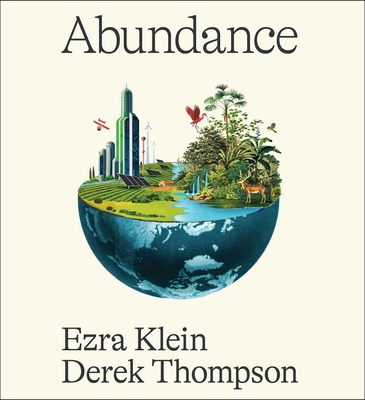

# (Audio) Abundance, by Klein and Thompson

I started listening to Dunkelman's [Why Nothing Works][], but
abandoned it. Ezra Klein's name, I think, is why I made it through the
similar [Abundance][]. Crazy culturally mediated world.

[Why Nothing Works]: https://www.hachettebookgroup.com/titles/marc-j-dunkelman/why-nothing-works/9781541700215/
[Abundance]: https://en.wikipedia.org/wiki/Abundance_(Klein_and_Thompson_book)

I was very pleased that Klein explicitly references
[Fully Automated Luxury Communism][]. [Breakneck][] turns out to be
substantially similar to Abundance as well, and references it. The
general vibe has been in the air.

[Fully Automated Luxury Communism]: /20240921-fully_automated_luxury_communism_by_bastani/
[Breakneck]: https://wwnorton.com/books/9781324106036

The vibe is: Regulate less, build more. Less restriction, more
expansion. Less red tape, more research.

This requires giving government more room to act, which makes sense if
the government is going to do the right things. Power is needed to do
big things, but its tendency to corrupt may still be an issue.

Some interesting references: [Homelessness is a housing problem.][]
[WTF Happened In 1971?][] Apparently the US has four times as many
lawyers per capita as France.

[Homelessness is a housing problem.]: https://homelessnesshousingproblem.com/
[WTF Happened In 1971?]: https://wtfhappenedin1971.com/

There are hints of [Why greatness cannot be planned][] in Thompson's
second half on science and technology. It makes me wonder about the
limits of fully federated action, as opposed to central control. What
truly requires the power of a government, a university?

[Why greatness cannot be planned]: /20221105-why_greatness_cannot_be_planned_by_stanley_and_lehman/

> Just as feudalism blocked production that only capitalism could
> unleash, so did capitalism constrain an abundance that a new
> paradigm might unleash. Core to this analysis of the economy was an
> idea that has come to be called the “fettering of production.” Marx
> observed that many companies’ obsession with profit kept the entire
> economy from exploring ideas that threatened incumbent margins or
> failed to produce immediate returns. Among capitalism’s many sins,
> Marx wrote, was that it prevented the most wondrous and useful
> technology from being invented and deployed in the first place. An
> economy run amok with useless fettering serves the rich few at the
> expense of the poorer many. (page 127)
