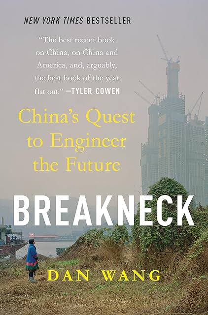

# (Audio) Breakneck, by Dan Wang

It's about China as contrasted with the US, mostly via critiques as in
[Abundance][]. The US is "the lawyerly society" and China is "the
engineering state," and while the one child and zero covid policies
are criticized (for example) the eventual recommendation is to be more
like China, more like Robert Moses.

[Abundance]: /20251120-abundance_klein_thompson/

---

I learned about China's "[Industrial Party][]," which is interesting.
Sort of techno-optimism as a nationalist prescription.

[Industrial Party]: https://en.wikipedia.org/wiki/Industrial_Party_(China)

Does anybody else remember Vonnegut's [Slapstick][]? In which "Western
civilization is nearing collapse as oil runs out, and the Chinese are
making vast leaps forward by miniaturizing themselves and training
groups of hundreds to think as one. Eventually, the miniaturization
proceeds to the point that the Chinese become so small they cause a
plague among those who accidentally inhale them, ultimately destroying
Western civilization beyond repair."

[Slapstick]: https://en.wikipedia.org/wiki/Slapstick_(novel)

---

There's some interesting stuff about process knowledge and encouraging
communities of practice. I don't know whether this is what makes
Shenzhen successful, or whether the lack of it is what's troubled
Boeing, but I agree that process knowledge is _something_ and that
it's too often ignored or undervalued.

Is Boeing's problem really loss of process knowledge, or is the
problem too much belief in the Friedman doctrine, too much blind focus
on near-term profit?

---

I tried to find where Heidegger said that philosophy was dying, to be
replaced with cybernetics, and it seems to be
[The End of Philosophy and the Task of Thinking][]. How could anyone
ever be taken seriously who wrote like this?

[The End of Philosophy and the Task of Thinking]: https://grattoncourses.wordpress.com/wp-content/uploads/2016/12/22the-end-of-philosophy-and-the-task-of-thinking22.pdf

---

---

> Only a country ruled by engineers could be so single-minded about
> pursuing a number. (page 123)

This reminds me of [The Tyranny of Metrics][], and the kind of cynical
"data driven" perversions you can find in industry.

[The Tyranny of Metrics]: /20200425-tyranny_of_metrics_by_muller/

---

> In the United States, physics and mathematics PhDs hardly have a
> chance to consider working in their field before a tech giant or
> hedge fund picks them up at the sidelines of a conference, flashes
> them with a humongous pay package, and folds these eager minds into
> their glamorous embrace. Senior government advisers have more or
> less stated that Beijing intends to block these temptations. Yao
> Yang, a dean at Peking University, has remarked with satisfaction
> that salaries have fallen in the financial industry after regulators
> imposed a salary cap of $400,000 on the financial sector. Its idea,
> Yao said, “is to reduce the attractiveness of finance and to
> increase the development of manufacturing.” (page 162)

This reminds me of Jeff Hammerbacher's quote, "The best minds of my
generation are thinking about how to make people click ads. That
sucks."
