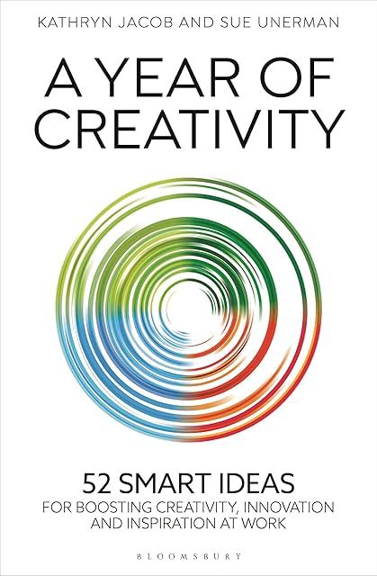

# A year of creativity, by Jacob and Unerman

This [book][] has 52 weekly chapters, each with an approach for being
creative. I read (very nearly) one per week in 2025. They remind me
somewhat of my [Thinking Cards][], and prompted me to finally get a
set of Brian Eno's _Oblique Strategies_ as well. The biggest concept
for all of these is just to do something different, to get out of your
usual groove, to _try_ to be creative. It's nice that creativity can
respond to effort.

[book]: https://www.bloomsbury.com/us/year-of-creativity-9781399413244/ "A Year of Creativity"
[Thinking Cards]: /20201206-thinking_cards/

What even _is_ creativity? I think it's to do with taking steps that
other people haven't taken, going somewhere others haven't gone.
Taking more steps, taking steps that other people haven't yet or
couldn't take, maybe using knowledge or experiences unique to you. And
then you get to that result, that success, that product that stands on
its own, and if you don't show the steps that led to it, it looks like
something that just appeared out of the blue.

The chapter titles are sometimes quite opaque, but here they are, 13
each for spring, summer, fall, and winter:

1. Push the idea until it breaks
2. Start a revolution
3. Use new
4. Exaggerate
5. Be brave
6. Allow time for shoots to flourish
7. Double the resources available
8. Prompt the unconscious
9. Change direction
10. Make it iconic
11. Give it purpose
12. Random link
13. Spring forward and be more dog
14. Indulge your gut instinct
15. Re-express with a different language
16. Be more pirate
17. Be bored
18. Give into your worst impulse
19. What won’t you do? And why?
20. Do nothing
21. Use an old idea
22. Work against your better judgement
23. Build back better
24. What would someone else say?
25. Take a trip
26. Be more Wimbledon
27. Organize for medium-term success
28. Make it famous, fast
29. Build communities
30. Make the team happy
31. Be generous
32. Build bridges
33. Make people’s lives better
34. Deliver outstanding teamwork
35. What is missing?
36. Harvest
37. Listen hard
38. Do things in the wrong order
39. What would your worst enemy do?
40. Uproot and destroy
41. Burn bridges
42. Go outside
43. Deliver long-term success
44. How can you get people to want much more?
45. Plan to get it up and running in six weeks
46. Spend a million
47. Be extravagant
48. Strip it back
49. Quick win
50. Push the idea until it scares you
51. Give the past a vote (but not a veto)
52. Hibernate
