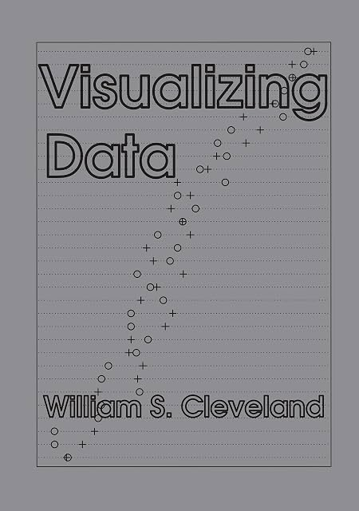

# Visualizing data, by Cleveland

> We cannot learn efficiently about nature by routinely taking the
> rich information in data and reducing it to a single number. (page
> 85)

I have developed some gripes with [Cleveland][]'s 1993 book, but
there's a lot to like too. I feel like some of this school of data
visualization techniques has been lost.

[Cleveland]: https://en.wikipedia.org/wiki/William_S._Cleveland

One thing he does throughout is try to catch errors in other people's
work. It's fairly engaging, but he does sometimes come off as a bit of
a scold.

What should a data/visualization book do? It feels like there's too
much to cover, in some ways. Cleveland is opinionated and bites off a
specific chunk.

---

> The visualization of statistical data has always existed in one form
> or another in science and technology. For example, diagrams are the
> first methods presented in R. A. Fisher's _Statistical Methods for
> Research Workers,_ the 1925 book that brought statistics to many in
> the scientific and technical community. (page 2)

So that's Cleveland. And here's what Fisher said:

> The preliminary examination of most data is facilitated by the use
> of diagrams. Diagrams prove nothing, but bring outstanding features
> readily to the eye ; they are therefore no substitute for such
> critical tests as may be applied to the data, but are valuable in
> suggesting such tests, and in explaining the conclusions founded
> upon them. ([page 25][], Statistical Method For Research Workers)

[page 25]: https://archive.org/details/in.ernet.dli.2015.205971/page/n39/mode/2up

Fisher and Cleveland are quite far apart here! I could imagine
Cleveland saying "hypothesis tests prove nothing if they are
unsupported by diagrams." And for some tests at least, for example
tests of distribution ("is this data normal?") Cleveland seems to
promote visualization-only.

---

> The histogram is a widely used graphical method that is at least a
> century old. But maturity and ubiquity do not guarantee the efficacy
> of a tool. The histogram is a poor method for comparing groups of
> univariate measurements. ... The venerable histogram, an old
> favorite, but a weak competitor, will not be encountered again.
> (page 8)

I used part of this fun quote in my first [presentation][] on pavement
plots.

[presentation]: https://docs.google.com/presentation/d/1vq-fGC8PvBenJo61VBIe7Xx2L1bLkTurVIERr8TpX1s/edit?slide=id.g33629d184a6_0_1#slide=id.g33629d184a6_0_1

---

Cleveland differentiates between data with multiple quantitative
variables (bivariate, trivariate, hypervariate) and data with a single
quantitative variable and multiple categorical variables ("multiway").
He uses his "multiway dot plot" for that case.

Cleveland doesn't mention, as far as I recall, the all-categorical
case. I think that case is the focus of Geometric Data Analysis (Le
Roux and Rouanet) which I meant to understand. Something about PCA on
cross-tabs, I think, which would put it in the family of converting
categorical to quantitative. That family also includes, much more
popularly these days, embeddings.

The general case is a bunch of categorical _and_ quantitative
variables. What to do?

---

Cleveland puts "f-value" ("fraction" of the data) on the x axis (page
16 and throughout) and I think this is not a good choice, usually... I
did it that way in a [plot][] a while back and people pointed out it's
not the typical way to do a CDF. (Also "f-value" just isn't a great
term, I think.)

[plot]: https://www.linkedin.com/posts/ajschumacher_30daychartchallenge-share-7446328870942924800-5qOs/

---

Cleveland cites (page 21) [Wilk and Gnanadesikan][] as originators of
the q-q plot, which might even be right, but I don't see an open
access copy of the paper to check in more depth. Bell Labs loves to
cite Bell Labs.

[Wilk and Gnanadesikan]: https://www.jstor.org/stable/2334448

---

Oh right: and a Tukey mean-difference plot is a sort of transform on a
q-q plot. (pages 22-23) Hardly ever see these... Cleveland uses it to
argue for an additive shift structure between two groups of singer
heights. Cleveland also often calls it an "m-d" plot and makes you
remember what that means.

---

Thought: is it always good to de-mean quant vars in regression so that
the intercept is more interpretable? (otherwise what, average value
for zero-height people? etc.)

---

On page 24 Cleveland does "Pairwise Q-Q Plots" which we might also
call a q-q matrix, analogously to a scatterplot matrix... I wondered
about simplifying it to compare each group to the overall
distribution, but at that point I'd probably just do
[pavement plots][] anyway.

[pavement plots]: https://pypi.org/project/pavement/

---

On qq plots... Drawing a line connecting the first and third
quartiles? That's always seemed a little weird to me. Why that?

---

Cleveland introduces (page 40) "residual-fit spread plots" ("r-f
spread plots") which are sort of a visual way of getting at the
R2 idea of "[variance explained][]." But it _doesn't_ show
the spread of the original data itself, so you could imagine some
strange situations, possibly.

[variance explained]: /2013/06/13/r-squared-and-adjusted-r-squared-for-a-linear-model/

One thought is that often this is all done in a transformed domain,
which can obscure how successful the model really is in the
untransformed domain...

---

In section 2.6, Cleveland introduces random dot stereograms. It's a
data example (for log transforms) but I think later he wants to
suggest we might use them as data visualizations in 3D. (They don't
work for me at all and have not caught on.)

---

There's a discussion of kurtosis around page 70. The terminology
drives me nuts a little bit. Leptokurtosis has lepto meaning "thin,"
but these are the fat-tailed ones. Then platykurtosis is from platy
meaning "broad," but these feel like narrower distributions if we
consider the whole shape. The tail behavior is what drives the
measure, but the names focus on the middle part of the distribution,
maybe? Just seems a little confusing. (Never mind other ways kurtosis
can be [misleading][].)

[misleading]: https://aakinshin.net/posts/misleading-kurtosis/

---

Cleveland mentions how in 1969 Edwark Fowlkes was making systems
supporting direct manipulation of visualized data (removing outliers,
etc.) - these kinds of things are _still_ not commonly supported in
most visualization systems.

(Also, in trying to look up Fowlkes' work, I came across a neat
[history of data visualization][]!)

[history of data visualization]: https://www.datavis.ca/papers/hbook.pdf

---

> The fusion-time experimenters based their conclusions on rote data
> analysis: probabilistic inference unguided by the insight that
> visualization brings. They put their data into an hypothesis test,
> reducing the information in the 78 measurements to one numerical
> value, the significance level of the test. The level was not small
> enough, so they concluded that the experiment did not support the
> hypothesis that prior information reduces fusion time. Without a
> full visualization, they did not discover taking logs, the additive
> shift, and the near normality of the distributions. Such rote
> analysis guarantees frequent failure. We cannot learn efficiently
> about nature by routinely taking the rich information in data and
> reducing it to a single number. Information will be lost. By
> contrast, visualization retains the information in the data. (page
> 85)

---

Cleveland is sometimes concerned, not quite with general
heteroskedasticity, but with _monotone spread._ On page 50 he
introduces the "spread-location plot" ("s-l plot") which has fitted
value on the x axis and square root absolute residual on the y axis.

> The square root transformation is used because absolute residuals
> are almost always severely skewed toward large values, and the
> square root often removes the asymmetry. (page 51)

I'm not so sure... Kind of a lot of choices baked into this one, and
you lose the ability to see patterns in over vs. under-predicting
(because of taking absolute value).

---

> A ratio, which has a numerator and denominator, is a strong
> candidate for a log transform. When the numerator is bigger, the
> ratio can go from 1 all the way to infinity, but when the numerator
> is bigger, the ratio is squeezed into the interval 0 to 1. The
> logarithm symmetrizes the scale of measurement; when the numerator
> is bigger, the log ratio is positive, and when the denominator is
> bigger, the log ratio is negative. The symmetry often produces
> simpler structure. (page 110)

Sort of assuming numerator and denominator are both positive
measurements, but yeah, this makes sense.

---

Thought: You could do a q-q plot as a slope graph instead of a
scatterplot, and this might even be better for showing which parts of
the distributions are relatively squished or spread out. It would be
like having parallel pavement plots with corresponding quantiles
connected by lines.

---

Cleveland really likes [loess][], including seasonal loess (page 170).
I'm not as much of a fan, but Hadley seems to have been on the loess
train, so maybe I'm wrong?

[loess]: https://en.wikipedia.org/wiki/Local_regression

---

I'm reminded that I don't really know a good way to evaluate how
likely a dataset is to have come from a particular distribution... I
mean I know there's Kolmogorov-Smirnov, but I don't know the details
and I don't know a general approach... Surely we can just get, given a
distribution, log-likelihood of all the data or something?

---

> Probabilistic inference was carried out using a standard t-interval
> method that is based on an assumption that the deviations of the
> response from the line are a homogeneous random sample from a normal
> population distribution.
>
> ...
>
> The rote data analysis of the experimenters has produced nonsense.
> The visualizations earlier in the chapter showed that a line does
> not fit the data. That ends matters right there. The standard
> t-interval method is not valid. The sampling variability that it
> prescribes for the estimate is not the actual variability.
>
> ...
>
> The visualizations of the chapter also showed that a quadratic
> polynomial fits CP ratio without lack of fit, but there is monotone
> spread. So even with the right function, the t-interval method is
> inapplicable because the residuals are not homogeneous. (page 177)

---

Coplots (as on page 189) are pretty neat... Trying to "hold constant"
one variable by looking at scatterplot of two others in small
multiples binned over the control variable in narrow-ish bins.

This kind of thing is hard enough that it just isn't done usually, I
think... Or it's done with a partial regression controlling things
out, maybe. (I wonder how these might compare...)

---

Just as an interesting terminology thing, Cleveland uses "lack of fit"
and "surplus of fit," which I think correspond to what we usually call
"underfit" and "overfit."

---

> The mistreatment of these data by the experimenter and others who
> analyzed them will be taken up at the end of this chapter. (page
> 217)

There are pretty many of these punchy quotes...

---

> For this scientific application, the nonlinear surface is not worth
> the cost. (page 226)

Cleveland throws in a few judgement calls like this. His reasoning is
explained, but they're still judgement calls, I think.

---

> Data analysis is difficult. Serendipity should be exploited. (page
> 232)

---

> How things get measured is a fascinating topic. And a critical one,
> of course. In many domains of science, brilliance and great
> ingenuity abound in measurement techniques. This intellectual effort
> is crucial because measurement is the foundation of scientific
> enquiry. (page 257)

---

> Visual linking is the reason, despite the redundancy, for including
> both the upper and lower triangles in the scatterplot matrix; the
> upper left triangle has all pairs of scatterplots, and so does the
> lower right triangle. (page 275)

---

> Fisher was a brilliant scientist who also was a pioneer of
> mathematical genetics. (page 328)

Cleveland is a little uncomfortably uncritical of Fisher's work.

---

Cleveland closes his book arguing that the Morris portion of the
barley dataset has the years backward. Maybe so. At least one person
has argued that it [isn't backward][].

[isn't backward]: https://www.r-bloggers.com/2014/07/theres-no-mistake-in-the-barley-data/
