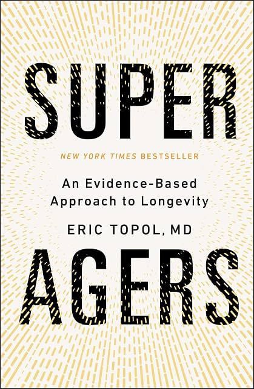

# (Audio) Super Agers, by Topol

Dr. Topol [offers][] his adult-in-the-room response to such books as
Attia's [Outlive][] and Sinclair's [Lifespan][]. He specifically
recommends _against_ taking rapamycin, for example, and doesn't (as
far as I could tell) use misleading graphs the [way][] Attia did. He
does throw around words like "sequelae" and "senolytics" and narrate
the audio book himself.

[offers]: https://drerictopol.com/portfolio/super-agers/
[Outlive]: /20240128-outlive_by_attia/
[Lifespan]: /20240319-lifespan_by_sinclair/
[way]: /20240407-mortality_rates_have_improved/

He pronounces GLP-1 as "glip one" and really likes it, and really
likes AI, and mentions very many times that the gut microbiome is
connected with everything, and thinks we should use waist
circumference more in medical contexts.

One interesting connection that caught my attention was that he
related pleiotropic genes (genes that cause multiple things, and we
don't always know why or how) and AI explainability (a model does
something, and we don't always know why or how). I think the broader
point was that in medicine, we don't always know the _mechanism_ by
which something (some drug, etc.) works, and we're satisfied if it
_does_ work. Maybe AI is not so different.

In the end the book mostly has the same core recommendations for
healthspan that everyone knows: eat healthy, exercise, etc. It has a
_lot_ more detail, on a wide range of things, and is really long,
compared to some of the other pop live-forever books. It's reserved in
its predictions of longevity breakthroughs. It's "an evidence-based
approach to longevity."

---

 * Five dimensions
     * Lifestyle+
     * Cells
     * Omics [Aaron: As in genomics, proteomics, etc.]
     * AI
     * Drugs & Vaccines

(A bunch of the book is organized around these.)

---

 * Hallmarks of aging
     * Primary
         * Genomic instability
         * Telomere attrition
         * Epigenetic alterations
         * Loss of proteostasis
         * Disabled macroautophagy
     * Antagonistic
         * Cellular senescence
         * Mitochondrial dysfunction
         * Deregulated nutrient-sensing
     * Integrative
         * Dysbiosis [Aaron: gut microbiome etc.]
         * Chronic inflammation
         * Altered intercellular communication
         * Stem cell exhaustion

(This is the content of figure 12.1, which is itself based on the 2023
[Hallmarks of aging: An expanding universe][].)

[Hallmarks of aging: An expanding universe]: https://pubmed.ncbi.nlm.nih.gov/36599349/
