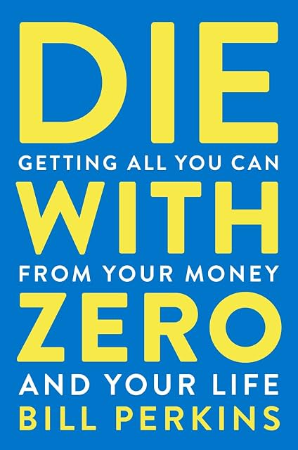

# (Audio) Die with Zero, by Perkins

There's something zeitgeisty about Perkins' carpe diem advice, focused
on experiences over possessions and fatalistic about the future. I
expect writing and promoting the book is a good experience for him.
But his advice is not good in general and it doesn't seem like he
takes it all that seriously.

Perkins several times criticizes the "but I love my job" viewpoint,
suggesting that people are fooling themselves. But as far as I can
tell, he's firmly in this camp. The book's [site][] (which sounds so
AI-generated it's embarassing) includes an attempt to get ahead of
this critique:

> "Skylar, SkyFi, and SynMax aren't separate ventures from Die With
> Zero — they're proof of it: for Bill, building is the
> highest-fulfillment use of time."

[site]: https://diewithzerobook.com/

It's hard to take him seriously given that he's still presumably
getting income from his hedge fund and other companies.

The advice itself, where it's concrete at all, isn't as dramatic as it
wants to seem. Perkins gives one formula for how much money you need,
and it's annual expenses times years you expect to live times 70% to
allow for some growth of capital. If you expect to still live 35.7 or
more years, this gives a number _higher_ than the 4% rule does.

Granted, the 4% rule was originally based on a 30-year retirement, and
Perkins' recommendations about giving to children and charity sooner
rather than later isn't bad as such, but I think the whole "die with
zero" idea ignores the income value of money. If you spend all your
money you destroy the future income-generating potential of that
money. You can only sell the farm once.

This is particularly clear in Perkins' recommendation that people
consider [annuities][]. I'm not sure annuities are a good deal. If
you're scared about volatility, why not get bonds for income _and_
continue to own your principle? Is a slightly higher monthly payment
really worth losing your principle? There are more complexities, but
you really have to bet that you're going to live a long time and
markets are going to do super poorly if you want annuities to be a
good deal, and in such a circumstance I don't know what guarantee you
have that the company doing this deal for you doesn't go under anyway.
So I don't like annuities, for the most part.

[annuities]: https://www.immediateannuities.com/

I mostly agree with Karsten Jeske's [analysis][] of the book's ideas.

[analysis]: https://earlyretirementnow.com/2023/10/06/how-useful-is-the-die-with-zero-retirement-approach-swr-series-part-60/

The book isn't all bad. Thinking about health, wealth, and time is
worthwhile. The "memory dividends" idea is fun. He references
[Your money or your life][], and his book is kind of a spendier
version. He credits his ghostwriter, Marina Krakovsky, in the
acknowledgments, which is nice to see. For sure, there's no reason to
hoard money for the sake of it. But there's no great reason to die
with zero either.

[Your money or your life]: /20251123-your_money_or_your_life/

### Perkin's "rules"

1. Maximize your positive life experiences.
2. Start investing in experiences early.
3. Aim to die with zero.
4. Use all available tools to help you die with zero.
5. Give money to your children or to charity when it has the most impact.
6. Don’t live your life on autopilot.
7. Think of your life as distinct seasons.
8. Know when to stop growing your wealth.
9. Take your biggest risks when you have little to lose.
