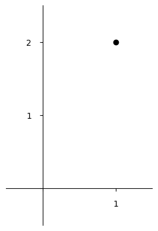
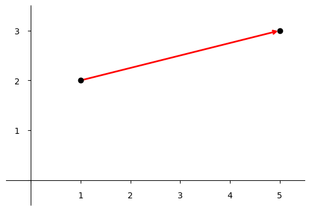

# Outline for Fundamental Linear Algebra

I'm thinking about how to make linear algebra so simple that it could
be taught much earlier than it usually is. I think it's often
presented with some mix of excessive abstraction (proofs,
symbols-only) and excessive concreteness (obsession with Gaussian
elimination and manipulating matrices by hand) and often with things
(matrix multiplication) that should be explained introduced as if they
sprung up by magic. Consider this my thinking draft.

\\[
\begin{array}{l}
\text{Linear} \cr
\begin{bmatrix} 1 & \hspace{0.7em} 2 \end{bmatrix} \cr
\text{Algebra}
\end{array}
\hspace{-0.6em}
\begin{bmatrix} 1 \cr \rule{0pt}{1.4em} 2 \end{bmatrix}
\\]

Linear Algebra is a mathematics of multiple dimensions. For example,
you can think of the matrix \\( \begin{bmatrix} 1 \cr 2 \end{bmatrix}
\\) as a point in two-dimensional space.

A matrix is also a linear transformation. For example, the row vector
\\( \begin{bmatrix} 1 & 2 \end{bmatrix} \\) transforms the column
vector \\( \begin{bmatrix} 1 \cr 2 \end{bmatrix} \\) and produces 5.

\\[
\begin{bmatrix} 1 & 2 \end{bmatrix}
\begin{bmatrix} 1 \cr 2 \end{bmatrix}
= 1 \cdot 1 + 2 \cdot 2 = 1 + 4 = 5
\\]

Going left to right and top to bottom, just as we read and write, we
pair elements, multiply them, and add up the products. This is called
the dot product.

The same operation extends to transformations that produce
multidimensional outputs.

\\[
\begin{bmatrix} 1 & 2 \cr 3 & 0 \end{bmatrix}
\begin{bmatrix} 1 \cr 2 \end{bmatrix}
= \begin{bmatrix} 1 \cdot 1 + 2 \cdot 2 \cr 3 \cdot 1 + 0 \cdot 2 \end{bmatrix}
= \begin{bmatrix} 1 + 4 \cr 3 + 0 \end{bmatrix}
= \begin{bmatrix} 5 \cr 3 \end{bmatrix}
\\]

You can picture this transformation as "moving" a point.

Linear transformations can stretch, rotate, and reflect. They can also
behave like zero for one or more of their dimensions.

Matrix multiplication is the natural simplification of multiple
subsequent transformations using dot products. We see that often,
order matters, and \\( MN \neq NM \\).

Doing algebra with multidimensional linear transforms lets you solve
problems. For example, in \\(MX = C\\), each of _M,_ _X,_ and _C_ is a
matrix, and _X_ is unknown. We solve for _X_ by multiplying both
sides, on their lefts, by the inverse of _M,_ and find \\( X = M^{-1}C
\\).

Just as with square roots, it's possible to do calculations like this
by hand, but in practice we use computers.

There are more techniques, like factorizations, and many more
applications.

### Thoughts

The version here is already getting long for a one-page summary, and
the typography and graphics are fiddly. Is there a good way to
condense even more?

I feel like the "input/output" thinking I like is a little buried
here... How can I foreground that more effectively?

Should I include my dimensionality diagrams here already?

Eigenvector stuff: should it appear quite early, around the "what do
matrices do" topic? Or come later? (Really, maybe even SVD should be
in the "what do matrices do" topic? But how do you get it to come
then?)

When I say I'm thinking about linear algebra, people rarely fail to
mention [3Blue1Brown][]. And indeed, looking at it again now, I wonder
how much it influenced me. Maybe I should go look at it again now. I
think there are differences (for example I think he has _even less_ on
solving MX = C?) and I wonder what he would consider his "learning
goals" for viewers... What would I consider mine?

[3Blue1Brown]: https://www.youtube.com/playlist?list=PLZHQObOWTQDPD3MizzM2xVFitgF8hE_ab

I guess he's focused on the visual intuition side of things... Is that
an end in itself? Maybe it helps with understanding, generally...

I think my goal is more around application: Linear algebra should be
understood as "ordinary mathematics," as a tool for solving problems.
I would like learners to be able to map linear algebra onto things in
the world and use it to solve problems. To model things with it and
have enough facility in the algebraic side, and enough understanding
to know when/whether a solution is possible, and then to use software
to do the actual calculations.

### Other posts related to linear algebra

 * 2024-06-24: [A brief development of matrix multiplication](/20240624-brief_development_matrix_multiplication/)
 * 2024-06-16: [Linear Algebra Done Right, by Axler](/20240616-linear_algebra_done_right/)
 * 2021-09-15: [You can derive the formula for the determinant](/20210915-you_can_devive_the_formula_for_the_determinant/)
 * 2021-09-15: [The flow metaphor for matrix multiplication](/20210915-flow_metaphor_for_matrix_multiplication/)
 * 2026-07-24: [One-dimensional Linear Algebra](20260724-one_dimensional_linear_algebra/)
