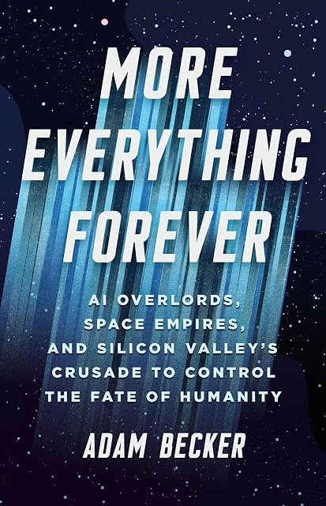

# (Audio) More Everything Forever, by Becker

Those "rationalists" are even weirder than I thought! [Becker][] (who
also wrote [What is Real?][]) delivers an impassioned humanist history
([e.g.][]), exposé, and analysis of a modern trend in the
over-empowered misusing their power. It comes out (as Becker notes)
very similar to the "[TESCREAL bundle][]" analysis of Gebru and
Torres. A lot of the book is of the form "so-and-so says X is good and
inevitable, but there are reasons to think it's [not][] either."
Becker's concluding recommendation ("tax billionaires out of
existence") seems a little tacked on and not fully argued, but I'm not
sure it's a bad idea.

[Becker]: https://freelanceastrophysicist.com/
[What is Real?]: /20250601-what_is_real_by_becker/
[e.g.]: https://gwern.net/doc/science/1962-good-thescientistspeculates.pdf "The Scientist Speculates"
[TESCREAL bundle]: https://firstmonday.org/ojs/index.php/fm/article/view/13636
[not]: https://www.centauri-dreams.org/2026/07/10/a-metallurgists-doubts-about-self-replicating-probes/

I mostly agree with Becker throughout. Below, I'm going to write my
own thoughts as inspired by the book, which often overlap with its
content but not completely.

### Utilitarianism is nonsense

There are at least two important parts here:

1. Quantifying utility as a single dimension isn't a good idea. There
   are standard [Tyranny of Metrics][] problems. "Utils" over-simplify
   and are unavoidably subjective. The approach attempts to give the
   appearance of objectivity and knowledge of what might happen in the
   future, but it has neither.
2. Utilitarians (at least longtermists) seem to use expected value to
   justify their decisions. Expected value is not a good decision tool
   when there's only one future. We don't get to roll out the future a
   billion times and collect the total utils across all of them.

[Tyranny of Metrics]: /20200425-tyranny_of_metrics_by_muller/

### Consciousness is irreducible

I still think [Dennett][] and friends are being obtuse, at best. The
consciousness of other _humans_ is something you have to take on
faith, and I do, but I wouldn't extend that to even a perfect
simulation of my own brain. I don't see any reason to think a
[workspace][] (or any particular feature) grants conscious experience.
I don't think current AI is even a little bit conscious. I don't know
how it ever could be. I maintain that we don't know how consciousness
works. I wouldn't believe in consciousness at all if not for it being
my constant experience.

[Dennett]: /20220918-consciousness_explained_by_dennett/
[workspace]: https://www.anthropic.com/research/global-workspace

Some consequences:

 * When will AI be conscious? Never.
 * Do I want to die in a transporter? No.
 * Would "uploading" my brain mean immortality? No.

### Fast is different from FOOM

A singularity has slope going to infinity. The physical universe puts
limits on speed, but actual speeds are likely to be much slower. I'm
thinking [AI as Normal Technology][].

1. The smarter you get, the harder it gets to know whether you're
   getting smarter. It's already hard (and expensive) to get reliable
   expert evaluations, even in math where things are relatively
   objective and checkable. Math can support automated verification
   with proof assistants like [Lean][], but even there knowing whether
   a "discovery" is good or important is socially constructed. In most
   domains you have to do something in the real world (build
   something, do an experiment) to know if you're even right. We will
   have to determine whether AI is really meaningfully "superhuman" by
   its accomplishments in creating things in the real world, which
   takes time.
2. Chaos and irreducible complexity are everywhere. No amount of
   intelligence lets you achieve arbitrary goals. You can't predict
   the weather three weeks out. There seems to be a delusion that
   arbitrary deduction and control like in the shark-jumping
   [Final Problem][] episode of [Sherlock][] is a real threat.
3. There's an argument that we should expect intelligence to follow a
   logistic curve rather than an exponential. I'm not sure about the
   exact form. When it comes to scientific knowledge, I think it could
   be an exception to limits-to-growth arguments. (See:
   [The Beginning of Infinity][])

[AI as Normal Technology]: https://www.normaltech.ai/p/ai-as-normal-technology
[Lean]: https://en.wikipedia.org/wiki/Lean_(proof_assistant)
[Final Problem]: https://en.wikipedia.org/wiki/The_Final_Problem_(Sherlock)
[Sherlock]: https://en.wikipedia.org/wiki/Sherlock_(TV_series)
[The Beginning of Infinity]: https://planspace.org/20220410-beginning_of_infinity_by_deutsch/

### Smarter isn't bad

People seem scared of AI getting smarter than them.

For one thing, given any human, some AI is already "smarter" in at
least some way. (Go? Chess? Multiplication?)

If you're hiring for some position, surely you want to hire the
smartest candidate you can find. You _hope_ they'll be smarter than
you. You do better work when you work with smart people.

When you went to college, were you afraid the professors would take
over the world? No. You were happy to learn from them.

We should be so lucky as to have "superhuman" AI. We should see it
improving the quality of everything - quite the opposite of "slop."

### Projection from unsavory characters

The people who think Artificial Intelligence is the most important
thing seem to be the people who think their own intelligence is very
important.

The people who worry the most about AI being manipulative seem to be
the most manipulative people.

The people who worry the most about AI killing all non-AI seem to be
the people least concerned about people not like them.

### Discussing goals can be good

They may be nuts, but at least some of these nuts are directly
addressing the "what should we do" question. As in
[Inventing the Future][], I think we need more and better proposals.

[Inventing the Future]: http://localhost:8000/20240929-inventing_the_future_by_srnicek_and_williams/
