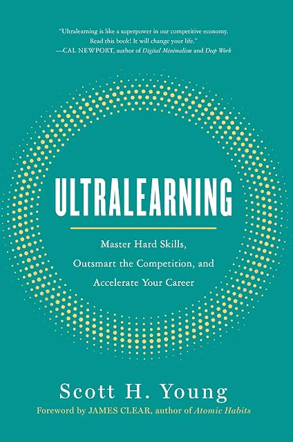

# Ultralearning, by Young

Scott Young's first book came out in 2019. It's okay, and it was
reasonably successful. "Intense learning" is at least as good a name.
There are some good ideas. I worry about everyone (Young) needing to
release content constantly and be an "influencer" with goofy hooks;
that culture permeates the book. But I do support diving in and
learning things.

Young motivates the book too much, in my opinion, as being about
developing job skills. It's sort of a version of "escaping the
permanent underclass:" Young references [Average is Over][] directly.
The argument doesn't age particularly well, and I wonder whether to
some extent it was forced on the author by editors concerned about
selling books.

[Average is Over]: https://en.wikipedia.org/wiki/Average_Is_Over

The title of the book was a gift from Cal Newport, who wrote about
Young's effort to study the contents of a four-year degree in one
year. The title of Newport's [post][] was "Mastering Linear Algebra in
10 Days: Astounding Experiments in Ultra-Learning." (Unfortunately,
there's nothing interesting about Linear Algebra in the post.)

[post]: https://calnewport.com/mastering-linear-algebra-in-10-days-astounding-experiments-in-ultra-learning/

Young also borrowed a name from Feynman, and it was Feynman's name. He
claims to be the originator of "the Feynman Technique," which is now
broadly mis-attributed ([ex1][], [ex2][]) to Feynman himself. I don't
see any reason to doubt him; I can't find any real source linking the
technique to Feynman except to some degree in spirit.

[ex1]: https://fs.blog/feynman-technique/
[ex2]: https://www.colorado.edu/artssciences-advising/resource-library/life-skills/the-feynman-technique-in-academic-coaching

Young says in a footnote, "Calling this the Feynman Technique was
possibly unwise. It's unclear if Feynman ever used this exact method,
so I may have inadvertently given the technique an illustrious history
it doesn't possess." Solid self-awareness.

The overall organization of the book is fairly good, in my opinion. I
appreciate that it's thoughtfully laid out; it seems like it grew from
a good outline. The meat that covers the bones doesn't always fit
perfectly. The main example in my mind is that Ramanujan's use of a
book without proofs is supposed to animate the "retrieval" chapter,
which doesn't make sense. Ramanujan wasn't "retrieving" those proofs
from memory - he was coming up with them on his own. It would fit
better with "directness" or "intuition," maybe.

 * Metalearning: First Draw a Map
     * Why
         * Tactic: The Expert Interview Method
     * What: Concepts, Facts, Procedures
     * How
         * Benchmarking (against common ways people learn)
         * The Emphasize/Exclude Method
     * The 10 Percent Rule (spend 10% of time on planning)
 * Focus: Sharpen Your Knife
     * Start (avoid procrastinating)
     * Sustain (don't get distracted)
         * Distraction sources: Environment, Task, Mind
     * Optimize quality
 * Directness: Go Straight Ahead (Do it for real, transfer is hard)
     * Tactics
         * Project-Based Learning
         * Immersive Learning
         * The Flight Simulator Method (get as close as you can)
         * The Overkill Approach (learn beyond the level you want)
 * Drill: Attack Your Weakest Point (train "rate-limiting" skills,
   focusing with less total cognitive load)
     * Methods
         * Time Slicing (just do part of the thing, like a song)
         * Cognitive Components (just do a particular sub-skill)
         * The Copycat
         * The Magnifying Glass Method (spend more time on one part)
         * Prerequisite Chaining (start harder than you can do, go
           back and fill in gaps as you find them)
 * Retrieval: Test to Learn (don't re-read, recall)
     * Tactics
         * Flash Cards
         * Free Recall (can be better than cued recall)
         * The Question-Book Method (take notes as questions)
         * Self-Generated Challenges (not just questions)
         * Closed-Book Learning (concept map from memory, etc.)
 * Feedback: Don't Dodge the Punches
     * Types
         * Outcome Feedback ("what's my score on this")
         * Informational Feedback ("what am I doing wrong")
         * Corrective Feedback ("what should I do to improve")
     * Tactics to Improve Your Feedback
         * Noise Cancellation (focus on the right feedback)
         * Hitting the Difficulty Sweet Spot (50/50 goals)
         * Metafeedback (evaluate success of your learning techniques)
         * High-Intensity, Rapid Feedback
 * Retention: Don't Fill a Leaky Bucket
     * Memory Mechanisms
         * Spacing: Repeat to Remember
         * Proceduralization: Automatic Will Endure
         * Overlearning: Practice Beyond Perfect
         * Mnemonics: A Picture Retains a Thousand Words
 * Intuition: Dig Deep Before Building Up
     * Rules
         * Don't Give Up on Hard Problems Easily
         * Prove Things to Understand Them
         * Always Start with a Concrete Example
         * Don't Fool Yourself
 * Experimentation: Explore Outside Your Comfort Zone
     * Tactics
         * Copy, Then Create
         * Compare Methods Side-by-Side
         * Introduce New Constraints
         * Find Your Superpower in the Hybrid of Unrelated Skills
         * Explore the Extremes

---

> This rapid change in technology means that many of the best ways of
> learning old subjects have yet to be invented or rigorously applied.
> (page 31)

I think this is not just about technology, but about old subjects
being taught in old ways with old understandings of the subjects and
old goals for studying them.

---

> The uniqueness of ultralearning projects is one of the elements that
> ties them together. (page 47)

---

> Although studying Latin has fallen out of favor, many educational
> pundits are reviving new incarnations of the formal discipline
> theory by suggesting that everyone learn programming or critical
> thinking in order to improve their general intelligence. Many
> popular "brain-training" games also subscribe to this view of the
> mind, assuming that deep training on one set of congnitive tasks
> will extend to everyday reasoning. It's been more than one hundred
> years since the verdict came in, yet the allure of a general
> transfer procedure still has many searching for the Holy Grail.
> (page 96)

---

> Astute readers will probably notice a tension between this principle
> [drill] and the last [directness]. If direct practice involves
> working on a whole skill nearest to the situation in which it will
> eventually be used, drills are a pull in the opposite direction. A
> drill takes the direct practice and cuts it apart, so that you are
> practicing only an isolated component. (page 111)

---

Young's "Feynman Technique" on page 192:

> 1. Write down the concept or problem you want to understand at the
>    top of a piece of paper.
> 2. In the space below, explain the idea as if you had to teach it to
>    someone else.
>     a. If it's a concept, ask yourself how you would convey the idea
>     to someone who has never heard of it before.
>     b. If it's a problem, explain how to solve it and—crucially—why
>     that solution procedure makes sense to you.
> 3. When you get stuck, meaning your understanding fails to provide a
>    clear answer, go back to your book, notes, teacher, or reference
>    material to find the answer.

---

> I applied this to understanding the concept of voltage in an early
> class on electromagnetism during the MIT challenge. Though I was
> comfortable using the concept in problems, I didn't feel that I had
> a good intuition of what it was. It's obviously not energy,
> electrons, or flows of things. Still, it was hard to get a mental
> image of an abstract concept on a wire. Going through this technique
> and comparing equations to the ones for gravity, it's clear that
> voltage is to the electrical force as height is to the gravitational
> force. Now I could form a visual image. (page 195)
