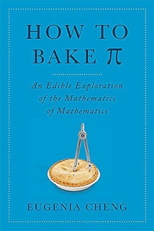

# How to bake π, by Cheng

It may not have won a Pulitzer, but [Cheng's book][] reminds me of
nothing quite so much as [Gödel, Escher, Bach][]. It's committed to
its gimmick, it's fun to read, it's self-involved, its success as an
argument is incomplete, there's some math but there could have been
more. GEB had better editing.

[Cheng's book]: https://en.wikipedia.org/wiki/How_to_Bake_Pi
[Gödel, Escher, Bach]: https://en.wikipedia.org/wiki/G%C3%B6del,_Escher,_Bach

Just as I was most interested in the incompleteness theorem bits of
GEB, _How to bake π_ is ostensibly about category theory and that's
what I was hoping to learn more about. I've tried to learn about
category theory in the past ([ex][]) and I've never felt like I've
"gotten" it. The book has some bits _about_ category theory, but I
still don't feel like I have a good understanding of category theory
_really_. (Possibly there's more in there than I realize because the
author avoids formal language... Was she talking about the Yoneda
Lemma in there, maybe?)

[ex]: https://planspace.org/20150125-monads_by_diagram/

Luckily, what Cheng actually wants to talk about is philosophy of
math. (The book contributes many quotes to my "[mathematics is][]"
quote collection.) I largely agree with her ideas on the importance of
"illumination" (understanding at a level different from formal proof)
and math as easy relative to the complexity of the "real world" (which
also appears in [More Everything Forever][]). I'm less sure, but I
also suspect we both think about non-mathematical beliefs as being
fundamentally supportable only by "axioms" taken on faith.

[mathematics is]: https://github.com/ajschumacher/ajschumacher.github.io/issues/205
[More Everything Forever]: /20260721-more_everything_forever_by_becker/

It's unfortunate that the copy editing isn't as tight as it could be.
There's at least one "and and" in there. On page 199 there's a
composition of a function from A to B with a function from B to C and
it somehow gives a function from A to B. Toward the end, there start
being references to things that came earlier except they never did
come earlier. Distracting.

---

> The story I'm going to tell is about abstract mathematics. I'm going
> to argue that its power and beauty lie not in the answers it
> provides or the problems it solves, but in the _light_ that it
> sheds. That light enables us to see clearly, and that is the first
> step to understanding the world around us. (page 13)

---

> In the end mathematics is simply about things that are true. (page
> 116)

---

> Mathematics is easy, as long as you have the right definition of
> "easy" (page 143, section header)

---

> A rope over the top of a fence has the same length on each side, and
> weighs one-third of a pound per foot. On one end hangs a monkey
> holding a banana, and on the other end a weight equal to the weight
> of the monkey. The banana weighs 2 ounces per inch. The length of
> the rope in feet is the same as the age of the monkey, and the
> weight of the monkey in ounces is as much as the age of the monkey's
> mother. The combined age of the monkey and its mother is 30 years.
> Half the weight of the monkey plus the weight of the banana is a
> quarter the sum of the weights of the rope and the weight. The
> monkey's mother is half as old as the monkey will be when it's three
> times as old as its mother was when she was half as old as the
> monkey will be when it's as old as its mother will be when she's
> four times as old as the monkey was when it was twice as old as its
> mother was when she was a third as old as the monkey was when it was
> as old as its mother was when she was three times as old as the
> monkey was when it was a quarter as old as it is now. How long is
> the banana?

To monkeys really hold bananas that weigh more than half their body
weight?

<!--

monkey's mother's age = 1/2 * 3 * 1/2 * 4 * 2 * 1/3 * 3 * 1/4 * monkey's age
 = 1.5 * monkey's age

rope over fence, same length either side
rope 1/3 lb per foot
banana 2 oz per inch
rope length feet = monkey age
monkey weight oz = monkey's mother's age
monkey age + monkey's mother's age = 30 years
(1/2 monkey weight) + banana weight = 1/4 (rope weight + weight)

monkey's age = 12 years
monkey's mother's age = 18 years
rope = 12 feet (6 feet per side)
     = 4 lbs (2 lbs per side)
     monkey's weight = 18 oz
9 oz + banana = 1/4 (4 lbs + 18 oz) = 1 lb + 4.5 oz = 20.5 oz
banana = 11.5 oz
5.75 inches

-->

---

> Mathematics is not life (page 156, section header)

The author includes a proof:

> So: math is easy, life is hard, therefore math isn't life. (page
> 156)

> The pursuit of mathematics is the process of working out exactly
> what is easy, and the process of making as many things easy as
> possible. (page 156)

---

> _The process of working out exactly which parts of math are easy,
> and the process of making as many parts of math easy as possible._
> (page 162, defining category theory)

---

> The freedom of this situation is a type of universal property that
> is closely related to "forgetting structure," as we discussed in the
> chapter on structure. (page 253)

I don't see where that was discussed in the chapter on structure. (On
page 211 there's another "we saw" that I can't find the antecedent for
either.)

---

> "Mathematics makes a steady advance, while philosophy continues to
> flounder in unending bafflement at the problems it confronted at the
> outset." (page 263, quoting Michael Dummett in _The Philosophy of
> Mathematics_)

---

> Proof has a sociological role; illumination has a personal role.
> Proof is what convinces society; illumination is what convinces us.
> (page 274)
>
> In a way, mathematics is like an emotion, which can't ever be
> described precisely in words—it's something that happens inside an
> individual. What we write down is merely a language for
> communicating those ideas to others, in the hope that they will be
> able to reconstruct the feeling within their own mind. (page 275)

---

> I think that the key characteristic of proof is not its
> infallibility, but its sturdiness in transit. Proof is the best
> medium for communicating my argument to X in a way that will not be
> in danger of ambiguity, misunderstanding, or distortion. Proof is
> the bridge for getting from one person to another, but some
> translation is needed on both sides.
>
> When I read someone else's math, I always hope that the author will
> have included a raeson and not just a proof. When this does happen,
> the benefits are very great. Unfortunately, a lot of math is taught
> without any attempt at illumination. Even worse, it's sometimes
> taught without any explanation at all. But even if it is explained,
> not every explanation is illuminating. (page 277)

I agree especially with the the second paragraph here.

---

> Category theory seeks to illuminate math. (page 278)
