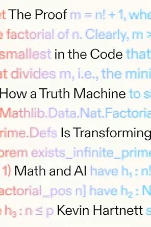

# (Audio) The proof in the code, by Hartnett

[Kevin Hartnett][], that prolific writer for [Quanta Magazine][], has
written the first [book][] published by [Quanta Books][]. It's a solid
human-oriented history of [Lean][] and its increasing importance in
formalizing mathematics and in connection with AI.

[Kevin Hartnett]: https://kevinstenhartnett.com/index.html
[Quanta Magazine]: https://www.quantamagazine.org/
[book]: https://www.quantabooks.org/books/the-proof-in-the-code/
[Quanta Books]: https://www.quantabooks.org/
[Lean]: https://lean-lang.org/

I'm excited for the next two books coming out from Quanta:
[Six Math Essentials][] from Terry Tao, and [Everything Is Fields][]
from David Tong. In the latter case, it seems we have the Simons
Foundation publisher publishing a book from a professor whose position
is funded by the Simons Foundation. I did a Simons Foundation
fellowship myself, but I mean... doesn't it seem like it would be
great for things like this to not depend on hedge fund money?
Regardless, those two books look like they should be great!

[Six Math Essentials]: https://www.quantabooks.org/books/six-math-essentials/
[Everything Is Fields]: https://www.quantabooks.org/books/everything-is-fields/

I hadn't realized how much Lean and even more so [Z3][] and other
parts of [de Moura][]'s work are related to satisfiability. It's not
exactly the same, but it's related even to the CP-SAT kinds of stuff I
did [a little bit][] of work with a while ago. (CP-SAT is Constraint
Programming - Satisfiability, like OR-Tools. SMT is Satisfiability
Modulo Theories, like Z3. And then Lean is basically a type checker
with a _lot_ of tooling for writing types: applied Curry-Howard
correspondence.)

[Z3]: https://en.wikipedia.org/wiki/Z3_Theorem_Prover
[de Moura]: https://en.wikipedia.org/wiki/Leonardo_de_Moura
[a little bit]: http://localhost:8000/20230316-solving_a_matching_problem_with_ortools_cpsat/

I tried the current version of the [Natural Number Game][] and proved
2+2=4 using simple tactics. I installed Lean (doing it inside VSCode
is highly recommended) but really the [web version][] is enough to
play around with.

[Natural Number Game]: https://adam.math.hhu.de/#/g/leanprover-community/NNG4
[web version]: https://live.lean-lang.org/#project=mathlib-stable&codez=PQWhAIEFwBwJwJYFsCm4EGdwENwDsBXJAIxTnABts4BzM8AFwAts9wBGcAdwWfwHtGiAG4JsFcABMEojPzhYQwAFCSUAM3ABJDAAVEqcAAo2ALnAA5bAwCU4UwF4O4ADz5wgciJwgACJwAawAaZzc/cEAkwn9XdwiAGsjAYiJ8ZWVQCABRYTIAT3wiUnIqWnpmVmcWLFx4ZDR1bABjBnlwJWVmFHkUJHAUAA9MBgwAfSrUQdqGptNlcBmffCDONzYIwGAifyCdfWrIr1DEsydiLOn0PAY4QTYmdhOwcDTeJnoAAzxn9CwRlAA6X5OjwZ1bAYFBYJhfezaPQGNB4E4AdvANEQeEk4AA2lYGN9JMJJIM4BoKABdW4QX7fcBNXjgco4AR4EDnGRiCTSWRNHh8Sow8DjRpwBFU4gMbAINiAC/JAuBBoBL8kha2lix2kSWngS7kc4COJ1m4AwyBgg3EEnRmxhpL1/BFYslMCCgwd8q1vX6Qy+Y3qAsiRiOSJRkhsuv94rRmOsOLxg3OrAwpJSdwAKk8+V75Kygmp1OKUGjCXUCAoZCgKFkglymOACxhGl08PxRQwEPw2C0s6mJohxJCseFLNYTgAfcAABnADgAfBwh/gANScSfGNizjh2ABUHYFrKS9cbzbwpnYI+PY7YACIAIRn8dT/np7twhMQZM1NNdiSYWD8A1NzLNFRtB0XR3u+wzfpCvh4EEY5qhe9iHMcMziuclwANynJIBANPu7guKhU7IqGGIgay8apOAFI4KiUgsmoaJ+rwWB1C2Na8AQKBnJu8iKABTxAVIUYkd25iQUEvihIAJkTzKOUShBEezuHBWo6khZwXPg6GhlhTYtrh+HBoR1HhtiuL4kgBAUASCA0EwDBBFikZmRZgwUBoDCDPw6iDKZQRCSSySpMoADqaAYEw/BcIwLAMNwNREdQxC8HA1A5IUdDGKwaLMAQWDitmeC8CWxxIKwWR2BChAkGQGBBH6MAIHUfjijQVE4HAiUxnAOSVfk4CvM8yiZfq4U8HgLUlDFrxwSu7DvHSPLbCBlDUHQ5AlGw/XfMoLSAYSXRaHg+VsWoADy6hbKgWAidJawwOAU5QVCF1oHdymIacKFJDMLB/uYypsNNzhvSGRl+WBcYnNaoriuAEr2rS8NyvB3R9DW7owp6nZLuAgPsHYzCYCcGAEOo2Z1KC4AxHdUlsH6hmSCcyHqUYgyQtT+BBt92C/cEsDI+C3w3FzPN3fsOPI6ZmNbg+fOAJwE7N4IAXATGHTAac7S3NoFqDmS8TxDgPL4Bi7jyuG8bisnPTGIOdgkj4nrgKsOTlmueodn9iZUYtigxJAA

It's a little strange reading a "history" that's so recent. Some of
the more distant history was also interesting. I hadn't realized that
[Leibniz][] had an effort to formalize all human reasoning, and
thought that people could settle disputes by using his system of
formal logic. Hartnett failed to note that [this][] was published when
Leibniz was 20, and Leibniz seems to have later found it embarassing.

[Leibniz]: https://en.wikipedia.org/wiki/Gottfried_Wilhelm_Leibniz
[this]: https://en.wikipedia.org/wiki/De_Arte_Combinatoria

It's interesting thinking about the extreme formalization here in
comparison to [Cheng's book][]... The concern here is with
correctness, like [Bourbaki][] on steroids. Tao is excited about it
because it helps math "scale" beyond what one person can do, what one
person can understand, I think. If AI can write a proof, it can be
verified formally, whether or not anyone understands how the proof
works. It's almost the opposite mathematical view to what Cheng and I
think is important, which is the human understanding aspect.

[Cheng's book]: /20260728-how_to_bake_pi_by_cheng/
[Bourbaki]: https://en.wikipedia.org/wiki/Nicolas_Bourbaki

