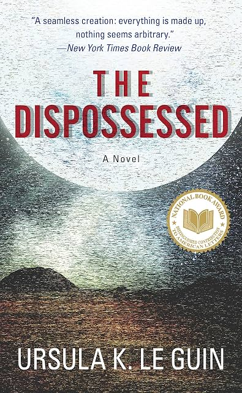

# The Dispossessed, by Le Guin

I finally read my copy of [The Dispossessed][]. I hadn't realized how
it relates to other things I've read on post-scarcity; apparently it
was heavily inspired by [Post-Scarcity Anarchism][]. I also hadn't
known that Le Guin originated the "ansible" in scifi. The book was
subtitled "an ambiguous utopia," but Le Guin pretty clearly prefers
the anarchist society. Perhaps the least realistic aspect was the
proletariat's awareness of their condition, and their ability to
organize. It gives something to think about.

[The Dispossessed]: https://en.wikipedia.org/wiki/The_Dispossessed
[Post-Scarcity Anarchism]: https://en.wikipedia.org/wiki/Post-Scarcity_Anarchism

> You _can_ go home again, the General Temporal Theory asserts, so
> long as you understand that home is a place where you have never
> been. (page 55)

This ties to the ending a bit.

---

> They did not stand about sullenly waiting to be ordered to do
> things. Just like Anaresti, they were simply busy getting things
> done. It puzzled him. He had assumed that if you removed a human
> being's natural incentive to work—his initiative, his spontaneous
> creative energy—and replaced it with external motivation and
> coercion, he would become a lazy and careless worker. But no
> careless workers kept these lovely farmlands, or made the superb
> cars and comfortable trains. The lure and compulsion of _profit_ was
> evidently a much more effective replacement of the natural
> initiative than he had been led to believe. (page 82)

There are a number of fun perspective reversals like this, here
playing on the capitalist fear that without financial motive people
would be lazy.

---

> Most Defense work was so boring that it was not called work in
> Pravic, which used the same word for work and play, but _kleggich,_
> drudgery. (page 92)

I like this idea. It's annoying that in English it's difficult to
differentiate working _for pay_ in particular as distinct from just
working on things that you want to work on.

---

> Shevek's career, like the existence of his society, depended on the
> continuance of a fundamental, unadmitted profit contract. Not a
> relationship of mutual aid and solidarity, but an exploitative
> relationship; not organic, but mechanical. Can true function arise
> from basic dysfunction? (page 117)

This kind of critique of the anarchists arises here and there but is
basically overrident but distaste for the exploitation of the
archists.

---

> Even from the brother there is no comfort in the bad hour, in the
> dark at the foot fo the wall. (page 125)

Lots of stuff on isolation, lots of wall imagery.

---

> Shevek at twenty-one was not a prig, exactly, because his morality
> was passionate and drastic; but it was still fitted to a rigid mold,
> the simplistic Odonianism taught to children by mediocre adults, an
> internalized preaching. (page 155)

Something about this "simplistic X taught to children by mediocre
adults" phrase caught my attention.

---

Bedap wanted to work on "the improvement of science instruction in the
learning centers" (page 165) and so I was cheering for Bedap.

---

> They all looked, to him, anxious. He had often seen that anxiety
> before in the faces of Urrasti, and wondered about it. Was it
> because, no matter how much money they had, they always had to worry
> about making more, lest they die poor? Was it guilt, because no
> matter how little money they had, there was always somebody who had
> less? Whatever the cause, it gave all the faces a certain sameness,
> and he felt very much alone among them. (page 207)

---

> "You ask questions like a true profiteer," Shevek said, and not a
> soul there knew he had insulted Dearri with the most contemptuous
> word in his vocabulary; indeed Dearri nodded a bit, accepting the
> compliment with satisfaction. (page 224)

---

They have "Simultanist" and "Sequentist" physics, and on page 225 they
talk about their "dilemmas," which are the lack of free choice (free
will?) and Zeno's paradox, respectively. Neither are serious, and this
is maybe the weakest part of the fun physics side of things.

---

> Odo wrote: "A child free from the guilt of ownership and the burden
> of economic competition will grow up with the will to do what needs
> doing and the capacity for joy in doing it. It is useless work that
> darkens the heart. The delight of the nursing mother, of the
> scholar, of the successful hunter, of the good cook, of the skillful
> maker, of anyone doing needed work and doing it well—this durable
> joy is perhaps the deepest source of human affection, and of
> sociality as a while." (page 247)

---

> Even Ainsetain, the originator of the theory, [of relativity] had
> felt compelled to give warning that his physics embraced no mode but
> eh physical...

"Ainsetain," get it? Cute.

---

> The Odonian society was conceived as a permanent revolution, and
> revolution begins in the thinking mind. (page 333)
