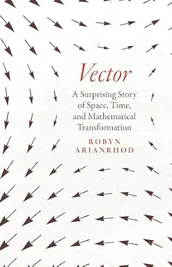

# Vector, by Arianrhod

What a fun [book][]! I came for the history of vectors, hoping to get
interesting linear algebra background. I got more interesting stories
about the history of quaternions and quite a lot more on tensors and
general relativity than I'd seen before. Possibly a narrow audience
will enjoy it, but I was in that audience.

[book]: https://press.uchicago.edu/ucp/books/book/chicago/V/bo213793784.html

_i2 = j2 = k2 = ijk = -1_

### Tensors vs. n-dimensional arrays of numbers

Ever since TensorFlow, I've not quite understood what the heck a
"tensor" is that's different from an n-dimensional array of numbers.
Typical explanations are brief and hand-wavy, like "it's a physics
thing, you wouldn't understand," or "it has to do with invariance, you
wouldn't understand." These "explanations" are not helpful. With the
reading of this book, combined with other investigations of linear
algebra, I think I finally have it.

The invariance-under-transformation focus I find to be a bit of a red
herring for thinking about the tensor-vs-array question. The thing is,
if you start with an array, and you've chosen an appropriate
transformation and measurement, then those guarantee invariance when
you transform the array. The only way you can fail to comply with
invariance is if you have two arrays (or a way for generating arrays)
already and you find that they don't follow a given transformation.

The useful way to understand the relationship between tensors and
arrays is that tensors are abstractions and arrays can be
representations of tensors, once you choose a basis. This is exactly
as, in linear algebra, a linear transformation is not a matrix, but a
matrix can be a representation for a linear transformation, given a
basis.

Every array of numbers can be a representation of some tensor in some
basis, and the array alone doesn't tell you which tensor and basis, or
even which _type_ of tensor it might represent. For example, bilinear
forms and linear transformations are both tensors and both can be
represented by matrices: the matrix alone doesn't tell you which it
is, if indeed it's intended to be either. (Specifying a transformation
rule would specify the type of tensor, so invariance does connect
here.)

A simple analogy might be that "a number is not a length." A number
certainly _can_ represent a length, and indeed _any_ number can, but
you have to know that the number is intended to represent a length,
and ideally what the units of measurement are, if you want to really
connect the number to a particular length.

TensorFlow works with n-dimensional arrays of numbers, regardless of
whether they're representing a tensor at all.

---

I highlighted so much in the ebook that it warned me when I was
exporting that I had used some percentage of the total 10% allowable
by the publisher... Many of those selections follow, sometimes with my
notes.

---

> The shapes produced in these “vector files” do “carry” lines from
> point to point along the shape, and “carrier” is the original
> meaning of “vector.” (page xxv)

Kind of fun... "Carrier" of numbers?

---

> But William Rowan Hamilton didn’t get so excited just because you
> can write down any number of components to represent various
> physical, digital, and economic systems or scenarios. Storing and
> representing data has been important ever since humans could count
> and write, but so has computation—and vectors and tensors enable you
> to do both the representing and the calculating at the same time.
> That’s where the magic comes into it: despite the simplicity and
> utility of writing vectors as lists of components, what Hamilton was
> so thrilled about was that when you consider the vector as a whole,
> not just its individual components, the rules of vector arithmetic
> make vectors far more powerful than numbers alone. (page xxv)

---

> Hamilton pulled the rug out from almost everyone when he discovered
> that, unlike ordinary arithmetic, there is more than one way to
> carry out multiplications in vector arithmetic. (xxvi)

---

> Photons are not Newtonian-style material particles, but in their
> interactions with atoms they can behave in a particle-like way.
> (page 19)

Interesting way of phrasing... Reminds me of [What is real?][].

[What is real?]: /20250601-what_is_real_by_becker/

---

> So Hamilton asked his experimentalist friend Humphrey Lloyd to see
> if he could find this new kind of [conical] refraction—and when he
> did, Hamilton became a sensation, for it was perhaps the first time
> that mathematics had been used to predict the very existence of a
> physical phenomenon, rather than explaining what was already known.
> Many more such breakthroughs were to come: the prediction of the
> existence of Neptune would follow a decade later, and then a host of
> predictions, from radio waves and radiation pressure to photons and
> _E=mc2_ to the Higgs boson, gravitational waves, and
> much, much more. (page 20)

Says this conical refraction is used for "optical tweezers"!

---

> “Mathematicks were not, at that time, looked upon as Academical
> Learning, but the business of Traders, Merchants, Sea-men,
> Carpenters, land-measurers, or the like....” (page 33, quoting
> [Wallis][])

[Wallis]: https://en.wikipedia.org/wiki/John_Wallis

"That time" being his lifetime, in the sixteen-hundreds, I believe...

---

> It was just six years after his appointment at Oxford when Wallis
> published his algebraic Arithmetica Infinitorum. At the time, most
> mathematicians still preferred using tangible geometric ideas to
> develop ways of handling infinite sums and infinitesimal
> increments—and Thomas Hobbes was particularly vociferous on the
> subject. His fame today rests on his political philosophy—and his
> dour conclusion that life is “nasty, brutish, and short” without the
> protection of a state. But he also dabbled in mathematics, and he
> expressed this pro-geometrical sentiment by pronouncing Wallis’s
> Arithmetica Infinitorum a “scurvy book” and “a scab of symbols.” In
> fact, he denounced “the whole herd of them who apply their algebra
> to geometry.” He evidently was not a sunny person. (page 33)

---

> Einstein explained in detail the importance of this achievement:
> “Before Newton,” he said, “there existed no self-contained system of
> physical causality [about] the deeper features of the empirical
> world.” For instance, he added, Kepler’s observation-based laws of
> planetary motion, including the elliptical shape of planetary
> trajectories, established how the planets move, but not why. That’s
> because “these laws are concerned with the movement as a whole, and
> not with the question how the state of motion of a system gives rise
> to that which immediately follows it in time; they are, as we should
> say now, integral and not differential laws.” We’ll see Newton’s
> differential second law of motion shortly, and later we’ll see that
> this same preference for differential over integral laws is key to
> James Clerk Maxwell’s success in uncovering the secret of light.
> (page 35)

---

> Among Newton’s early champions in France were Émilie du Châtelet and
> her partner, the provocative playwright Voltaire. In the 1730s, they
> collaborated on a popular book aimed at bringing Newton’s theories
> of gravity and light to a wider audience. (page 37)

Seems like this is "Éléments de la philosophie de Newton," subtitled
"mis à la portée de tout le monde" ("put within everyone's reach")
([English][], [French][] wiki). Neat that the two of them were doing
science popularizations!

[English]: https://en.wikipedia.org/wiki/Elements_of_the_Philosophy_of_Newton
[French]: https://fr.wikipedia.org/wiki/%C3%89l%C3%A9ments_de_la_philosophie_de_Newton

---

> But what has i to do with vectors? It hinges on the question of how
> to represent information—and the related question of what kind of
> numerical constructs qualify as objects of mathematical study, by
> obeying clear mathematical rules. (page 53)

---

> [Euler's] work on [complex numbers] really began to come together in
> the 1740s, when he connected _i_ with the “circular” functions sinθ
> and cosθ. (Bear with me here, because circles are related to
> rotations, and coming to grips with the algebra of rotations is what
> will lead Hamilton to create vectors. But first he will need to
> understand the connection between rotations and _i_.) (page 54)

Goes on to explain how Euler took cosθ2 + sinθ2
= 1 and factored it as (cosθ + isinθ)(cosθ - isinθ) = 1, then getting
eiθ = cosθ + isinθ, based on Taylor series, it seems.

---

> Multiplication by an imaginary number does indeed seem to be nothing
> more than a simple rotation! So, the wonderful thing about the
> complex plane is that it shows just how imaginary numbers can be
> related to real ones: via geometric rotations. (page 59)

---

> Hamilton’s multiplication of couples, with its jumbled-up mixture of
> multiplications, additions, and subtractions, was something very
> different. (page 61)

This is talking about Hamilton defining multiplication of ordered
pairs to behave isomorphic with complex numbers. The
[matrices as complex numbers][] approach is analogous but leans on
matrix multiplication.

[matrices as complex numbers]: /20260804-some_matrices_behave_just_like_complex_numbers/

---

> Newton had likewise refused the [Anglican] oath
> [required for fellowships at Comabridge and Oxford], not because he
> was in favor of religious tolerance—far from it—but because he was a
> secret Arian, which meant he didn’t believe in the divinity of
> Jesus. (page 72)

---

> The single [vector] symbol _a,_ [Hamilton] said presciently, is
> “indicative of one (complex) thought.” He went on to elaborate this
> in terms of his mathematical philosophy of time, suggesting to De
> Morgan that these n numbers—where you can choose any value of n,
> depending on the problem—represent a chronological ordering of
> events, and therefore a “notion of cause and effect.” (page 74)

---

> But you may not know that the bold type often used today for vectors
> is due to the idiosyncratic Englishman Oliver Heaviside. We’ll meet
> him properly later, along with the urbane American Josiah Willard
> Gibbs, who gave us the dot for scalar products (also now called “dot
> products”) and the cross for the vector (or cross) product. (page
> 78)

---

> Hamilton is often described as “the liberator of algebra.” (page 80)

---

> Today, for example, noncommutative algebras underpin quantum
> mechanics and general relativity. In quantum mechanics, Heisenberg's
> famous uncertainty principle says that you cannot _precisely_
> measure a quantum particle's position _X_ and momentum _P_ at the
> same time. But you _can_ precisely measure first one of these
> attributes, say the position, and then the other. The trouble is
> that by the time you’ve made this second measurement, the position
> measurement you made first will no longer be quite so accurate,
> because subatomic particles are always moving or vibrating—so you’ll
> get a different answer if you measure it again. (page 80)

This, I think, is not quite right. It makes it seem like the problem
is logistics. I don't think that's the problem.

---

> In general relativity, noncommutativity gives a measure of the
> curvature of space-time, so we’ll revisit this when we come to
> tensors. Meantime, you might already be thinking that along with
> vectors, ordinary matrices offer a more familiar example of
> noncommutative multiplication. (page 81)

---

> Mathematicians had, in fact, been representing information in arrays
> and tables for thousands of years—but they hadn’t been adding and
> multiplying these arrays as algebraic entities in themselves until
> Arthur Cayley spelled out how to do it, fifteen years after Hamilton
> announced his quaternion algebra. (page 81)

[A Memoir on the Theory of Matrices][], 1858

[A Memoir on the Theory of Matrices]: https://archive.org/details/philtrans05474612/mode/2up

---

> For Gaussian elimination doesn’t use matrix multiplication or
> addition. (page 83)

I think this is wrong, or at least should be considered wrong, if
understanding it properly.

---

> Cayley initially got the idea for multiplying any two compatible
> matrices—not just a matrix and a vector—when he was trying to find a
> neat, laborsaving way of representing multiple linear
> transformations. (page 85)

---

> But it turns out that quaternions are more efficient than matrices
> in more complicated situations where you need to combine several
> rotations around different axes, in order to orient an object in a
> particular way or to drive it via a smooth sequence of rotations—a
> satellite, for instance, or an airplane, a robot, your mobile phone
> screen, or a computer animation. Quaternions are more compact than
> matrices, and they are faster, because they require fewer
> calculations and use less computer power. (page 92)

> For instance, to adjust the yaw and pitch angles, you’d multiply the
> two relevant matrices—and if you count out all the row-by-column
> steps in multiplying two 3 × 3 matrices, you’ll find there
> twenty-seven multiplications and eighteen additions. But if these
> rotations are represented by quaternions instead of matrices and
> roll, pitch, yaw angles, it turns out that there are only sixteen
> multiplications and twelve additions. (page 93)

I wish there was more of an example for this... Maybe I'll try to do
one.

---

> It’s a quirk of quaternion rotation algebra that turns θ into 2θ.
> And it’s a quirk of quantum mechanics that although you can rotate
> an ordinary material thing, such as a ball or a planet, through 360°
> and get it back to its starting point, quantum math says that a
> particle such as an electron needs to “spin” through 720° to get
> back to its original state. (page 94)

This is neat and I don't think I totally get it yet... something about
quaternions being a "double-cover" of the sphere...

The book goes into spin here, and somehow or other I found this
reference to Goudsmit's [The discovery of the electron spin][]. (Ah:
it was in note 25, page 362.)

[The discovery of the electron spin]: https://www.lorentz.leidenuniv.nl/history/spin/goudsmit.html

> The German physicist Wolfgang Pauli had already made a start on the
> nonrelativistic mathematics of spin and had introduced three
> quantities now known as Pauli matrices, which Dirac adapted in his
> formulation. As Pauli spelled out explicitly, these three
> matrices—which help describe spin angular momentum components about
> the three spatial axes—relate to each other in exactly the same way
> as Hamilton’s unit quaternions i, j, k: multiply any two of them and
> you get plus or minus the third—the same rules Hamilton had carved
> on Broome Bridge eighty-five years earlier! (page 96)

Maybe this is the connection?

---

Seems like [Grassmann][] is an interesting character and early
inventor of vector space ideas... in "The Linear Theory of
Extensions." (mentioned page 103)

[Grassmann]: https://en.wikipedia.org/wiki/Hermann_Grassmann

---

> Even John Herschel, who had been so excited when he heard Hamilton
> lecture on his new discovery back in 1847, wrote to him saying the
> [Quaternion] Lectures would “take any man a twelvemonth to read, and
> near a lifetime to digest.” (page 108)

---

> “It is worth noting,” Leibniz said, “that notation facilitates
> discovery. This, in a most wonderful way, reduces the mind’s
> labors.” (page 111)

---

On Maxwell (with Tait) starting to use vector fields... (page 124)

---

> It was such a difficult problem that, just as with Grassmann’s entry
> in the Leibniz centenary competition, Germain’s was the only essay
> submitted. (page 126)

Are there still essay competitions like this?

---

> The idea of something that “operates” when a function is “inserted”
> will become especially important when we come to tensors. (page 127)

(Like differentiation is an operator.) ("Higher-order functions"?)

---

> When Maxwell first set out on his electromagnetic journey, sorting
> out the math of it had become rather tricky. It had to do with the
> advantages and pitfalls of using analogies in science—in this case,
> between gravity, hydrodynamics, and electricity. I’ve mentioned
> already the mathematical parallels between gravity and static
> electricity, but hydrodynamics—the study of how fluids behave as a
> result of forces—was important because in those early days people
> tended to visualize electricity as a fluid. That’s why they used the
> word “current” to describe the flow of “charged fluid,” whatever it
> was: the electron wouldn’t be discovered until the very end of the
> nineteenth century. But Maxwell realized, as very few had done, that
> analogies could lead you astray—indeed, electricity turned out not
> to be a fluid at all. Still, he knew that initially, at least, this
> analogy had offered a timely and powerful way into the mathematics
> of the new phenomenon of electromagnetism. The challenge was to use
> the math without confusing it with the physical reality. (page 129)

---

> Gauss was one of the pioneers in developing this math, so the laws
> relating the gravitational and electrical flux through a closed
> surface to the enclosed amount of mass and charge, respectively, are
> called “Gauss’s laws.” (page 131)

---

> But Faraday reasoned that even when you’d taken all the other iron
> filings away, the force from the magnet was still acting in all the
> same places as it was before—even if you could no longer see its
> effects. In particular, there must be force acting all the way
> through the space between the magnet and the “test” filing—just as
> there’d been when all the filings were present. To describe this
> idea, Faraday came up with the concept of “lines of force,” in
> direct analogy with the lines of iron filings. It was as if the
> filings made manifest the invisible force emanating from the magnet,
> just as light makes a watermark visible. (page 135)

---

> The field, whatever it was made of, mediated these changes through
> space—just as the field of wheat mediates a breeze rippling through
> it like a wave. (page 137)

I'm not sure how I feel about this analogy... Not great, I think?

---

> Maxwell had to find the right equations for relating this changing
> magnetic flux to the amount of current induced. This is known today
> as “Faraday’s law.” Then there was “Ampère’s law,” the mathematical
> version of Øersted’s discovery, in terms of the magnetic force
> produced by a changing electric current. (page 138)

---

> So, part of what I’ve been trying to show throughout this story is
> just how long it takes for ideas to develop and find their best
> form. (page 140)

---

> Fourier had published the heat equation in 1822, and then used it in
> the founding document of climate science, his 1827 paper, “On the
> Temperatures of the Terrestrial Sphere and Interplanetary Space.”
> (page 142)

---

> Tait also linked this symbol with a name, “nabla,” which his
> assistant William Robertson Smith suggested, because “nabla” is the
> Latin transliteration of the Greek word for an ancient Assyrian
> harp, which had an inverted triangle shape similar to ∇. (Later,
> Gibbs will replace Hamilton’s “nabla” with “del”—apparently because
> ∇ also resembles an upside-down version of the Greek letter “delta.”
> Both names are used today.) (page 143)

---

> Tait had also been working on a chapter on kinematics for his
> Elementary Treatise on Quaternions, which he’d been writing at the
> same time. He told his readers that although quaternion calculus may
> be difficult to learn, it is worth mastering because it offers “the
> most extraordinary advantage to the advanced student, not alone as
> aiding him in the solution of complex questions, but as affording an
> invaluable mental discipline.” (page 148)

---

> Maxwell mentioned Thomson, but he went on to say that Hamilton had
> provided an even more fundamental type of classification than
> analogy, by dividing physical quantities into scalars and vectors.
> This innovation was so fruitful, Maxwell said, that the importance
> of quaternions could only be compared with Descartes’s invention of
> coordinates. (page 151)

---

> But while Thomson believed quaternions and vectors were just a
> shorthand for equations already worked out, Maxwell saw that
> “Quaternions, or the doctrine of Vectors, is a mathematical method,
> but it is a method of thinking”—it is not just a creative
> laborsaving device for calculations. (page 158)

---

> Thomson was perhaps the most famous dissenter. He didn’t even accept
> Maxwell’s theory of electromagnetism in component form, likening it
> to mysticism—all that math, with no mechanical model explaining in
> concrete terms how electromagnetic waves propagate! (page 159)

---

> For physics in the everyday 3-D world, Clifford, like Maxwell, found
> that the separate scalar and vector products were far more useful
> than the full quaternion product—and this was another step toward
> the break away from quaternions to modern vector analysis. (page
> 162)

---

> As for Lewes, he was a philosopher, critic, biographer, and a
> marvelous raconteur. In 1873 he was finishing a new book, Problems
> of Life and Mind. It was a forensic, empiricist exploration of the
> possible biological basis of consciousness, part of “the new
> psychology” of the time, which was bringing a more modern scientific
> approach to long-standing debates on the “mind-body problem”—the
> contested relationship between consciousness (mind) and the brain
> (body). (page 164)

---

> This computational use of potentials is often known today as “gauge
> theory”: the idea is to choose a “gauge”—an equation in terms of A
> and ϕ—that simplifies the calculations without changing the values
> of E and B. In other words, the electric and magnetic fields remain
> invariant under “gauge transformations”—analogous to the way a
> rotating ball looks the same no matter which way you turn it. Gauges
> are now used to simplify calculations not just in electromagnetism,
> but in quantum theory and relativity, too. (page 176)

---

> Gibbs quietly got on with his own work—and in 1881 and 1884, he
> self-published parts 1 and 2 of his little book Elements of Vector
> Analysis. He wasn’t the first American to work on what he called
> “multiple algebras,” algebras whose symbols represent more than one
> number, so that “double algebras” were complex numbers, vectors were
> “triple algebras” (in 3-D space), quaternions were “quadruple
> algebras” because they included a scalar plus the three spatial
> vector components—and so on. (page 178)

---

> Inspired by Hamilton’s discovery of a new algebra without the
> commutative law, the Harvard mathematics professor Benjamin Peirce
> had long been working on creating dozens of other new algebras.
> Later, his son Charles proved that the only algebras allowing
> division or the existence of inverses—and hence ways of solving
> equations and of reversing rotations—are those of real numbers (that
> is, traditional school algebra), complex numbers, and quaternions.
> (page 178)

---

> Today this general form is often called an “inner product,”
> following Grassmann. By contrast, I’ve already mentioned that the
> vector (or cross) product is only defined in three dimensions,
> whereas Grassmann’s analogous “outer product” was general, and we’ll
> see this in more detail in chapter 11. (page 179)

---

> In 1888, Gibbs sent a copy of his Vector Analysis to everyone he
> could think of—including Thomson, Tait, and Heaviside. Heaviside was
> pleased to find he was not the only one working on vectors—but Tait
> was infuriated! And by the 1890s, a none-too-genteel debate had
> erupted in the pages of Nature and other leading scientific
> magazines. The question was: Should whole-vectorial systems be used
> at all—the likes of Thomson and Arthur Cayley said no, components
> were sufficient; but if they were to be used, then was it Hamilton’s
> quaternions or Grassmann’s algebra? Or should it be Gibbs’s and
> Heaviside’s utilitarian vector analysis, which Tait saw as little
> more than a rip-off of Hamilton? (page 179)

---

> In his preface McAulay went so far as to advocate that students
> should study quaternions rather than Cartesian geometry—adding that
> the only way to encourage students to study the subject would be to
> make it “pay,” as he tellingly put it, by including more exam
> questions on the subject. Not much has changed: most students, it
> seems, want to learn how to pass exams rather than how to think.
> Such are the pressures on our students, and the limitations of our
> education and employment policies. (page 184)

---

> But the key point is not the details but the fact that when you
> change your coordinate frame, the two sets of coordinates are
> related by specific equations. This is key to the idea of tensors.
> (page 190)

Invariance, yes... It seems like this is really more a characteristic
of the change of coordinates and "specific equations" rather than the
tensors themselves as such... (Depends on some idea of what kind of
tensor we're even talking about, which basis...)

---

> Tait didn’t know it, but the coordinate-free, invariant way of
> writing equations that he championed, such as a ∙ b = 0, is the key
> link between vector analysis and tensor analysis. (page 194)

---

> if a charge is at rest in one frame, a relatively moving observer
> will see a magnetic field, but an observer in the charge’s frame
> will not. (page 202)

---

> Four-Dimensional Space-Time Needs Four-Dimensional Vector Analysis
> (page 205)

---

> As Einstein later recalled, “We found that the mathematical methods
> for solving problem 1 lay ready in our hands in the absolute
> differential calculus of Ricci and Levi-Civita”—that is, in tensor
> calculus. (page 219)

---

> Arthur Cayley, for example, wasn’t just the inventor of matrix
> theory, and a spirited opponent of vector analysis; he was also a
> pioneer in both invariant theory and n-D geometry—specifically, the
> geometry of a curved surface when it is projected onto flat
> Euclidean space, like a shadow on the ground. (page 230)

---

> Riemann didn’t give a name to these three-and four-index quantities.
> They are essentially the components of what are now—thanks to Ricci
> and Levi-Civita—called the Christoffel symbols and the Riemann
> tensor, respectively. (page 237)

---

> the point once again is simply that if something has indices, it
> isn’t necessarily a tensor; as I indicated, it needs to have other
> properties—notably invariance under linear coordinate
> transformations. (page 237)

---

> the Riemann tensor, the bedrock of general relativity. (page 238)

---

> When Chisholm did her PhD with Klein in the 1890s, she, too, would
> be struck not just by his brilliant mind, but also by the way he
> would encourage his students to have the confidence to “never be
> dull!” (page 242)

---

> (So technically they are “tensor fields,” but as I mentioned in the
> previous chapter, less rigorously “tensors” will do nicely.) (page
> 244)

---

> And instead of saying “tensor calculus,” Ricci named the calculus of
> his systems the “absolute differential calculus.” By “absolute” he
> meant unchanging, because the interesting thing about tensors is
> that they encode the idea of invariance. (page 244)

---

> You can see the idea of tensor (or outer) products in figure
> 11.1—which also highlights the fact that vectors and matrices can be
> thought of as tensors. There’s a sophisticated mathematical reason
> for this, but for now it’s enough to notice that like tensors, their
> components are represented with indices—one index for vectors, two
> for matrices, as the caption to figure 11.1 spells out. (page 245)

---

> Ordinary numbers are represented by a symbol such as a. If they
> represent quantities that don’t depend on coordinates—such as
> temperature—then they are scalars, and since scalars don’t change
> under coordinate changes, they are tensors. (page 246)

---

> The “rank” is also called the “order” of the tensor, for this is
> what Ricci called it when he introduced the idea. It has to do with
> the number of transformation matrices needed to transform from one
> coordinate system to another, but it essentially corresponds to the
> number of indices, each one representing a different type of
> information. (If you’re familiar with matrix algebra, note that for
> matrices viewed as tensors, this is a different use of “rank” from
> that in linear algebra.) (page 246)

---

> These kinds of multi-index constructions—these tensors, and their
> products—are so important in data science that Google named one of
> its machine-learning platforms TensorFlow, and there are various
> other programs and tools, such as Tensorlab and Tensorly. (page 248)

---

> the ordinary matrix rules don’t allow you to multiply a 2 × 1 matrix
> by a 2 × 2 one at all, but the tensor product does: (page 249)

---

> where ⊗ is the symbol for tensor products. (page 250)

---

> To make the probabilities work, α and β are complex numbers. (page
> 251)

This doesn't feel like enough explanation to me...

Maybe "to make the probabilities work in any basis"?

---

> So, you can see that it makes a difference whether you write your
> vector, your data, as a row or column. This is the kind of thing
> that might make math seem bizarre and contradictory—but it’s just
> this sort of detail that piques a creative mathematician’s
> curiosity. (page 253)

Hmm... Is it?

---

> So, in the case of a matrix formed from a column vector times a row
> vector, the elements can be represented as u1v1, u1v2, u2v1, u2v2,
> and so on. Straightaway you can see, just by looking at the
> notation, that you are multiplying two different kinds of vector.
> Decades later, Dirac would apply this distinction via his bra and
> ket notation. (page 253)

---

> Today the word “vector” in this context refers to column vectors,
> while row vectors are called “one-forms” or “dual vectors.” Early
> twentieth-century researchers coined these terms; the idea
> originates with Grassmann, who had used the term “complement”
> instead of “dual.” Bras are examples of one-forms. Back in the
> 1880s, Ricci called vectors and one-forms “contravariant vectors”
> and “covariant vectors,” respectively, and these names are also used
> today. (page 253)

Okay so contravariant are regular column vectors, and covariant are
row vectors... Change of basis yup yup yup.

---

> So, to earn the title of tensor, it’s not enough simply to put
> information into a list or array—the Mesopotamians were doing that
> sort of thing four thousand years ago. To be a tensor, the arrays
> have to obey certain rules, just as we saw with vectors and matrices
> in chapter 4. (page 254)

Yes yes, but this is misleading...

---

> But the most important thing in math and physics is the ability of
> tensors to represent information invariantly—“ absolutely”—without
> spurious data coming from the choice of coordinates. (page 255)

---

> This is why Ricci said that vectors are tensors: their
> components—like higher-order tensor components—transform in a
> specific way under a change of coordinates. And scalars are tensors
> because they are just numbers or numerical expressions that don’t
> depend on the coordinates at all—so they are automatically invariant
> under coordinate transformations. (Just to dot i’s, not all numbers
> are invariants or scalars—for instance, frequency depends on the
> relative motion of the observer, as exemplified in the Doppler
> effect that we’ll see in the next chapter. And if the
> [Unruh effect][] is finally detected, it may even turn out that
> temperature is not exactly the coordinate-independent scalar I said
> it was in chap. 7 and fig. 11.1—although you’d have to be traveling
> close to the speed of light to detect one degree of temperature
> change.) (page 263)

[Unruh effect]: https://en.wikipedia.org/wiki/Unruh_effect

Looks like it's more about acceleration than speed, but sure.

---

> Similarly, multiplying a row vector (a covariant vector or one-form
> or dual vector) by a column vector (a contravariant vector) gives a
> scalar—the scalar product in Euclidean space. (page 264)

---

> Tensor expressions such as vμuμ and
> Tμνhμν are examples of the tensor operation
> called “contraction”—because when you set a pair of upstairs and
> downstairs indices equal, you’re reducing, or contracting, the rank
> of your tensor. (page 266)

---

> In fact, if T is a metric tensor—which from now on, and cribbing
> from Einstein, I’ll denote by g, with components gμν—then
> this particular inner product is, in fact, just what we’ve been used
> to calling the scalar product of u and v. For, as we've seen, the
> metric actually defines the scalar product. (page 268)

So what's going on here is we have two data vectors, coordinates of a
point or whatever, and they're both contravariant, upstairs index,
column vectors. Then the metric is a bilinear form, covariant, two
downstairs indexes. And in this case it's just ones on the diagonal,
to give the usual dot product. (And then things get weird when gravity
"bends spacetime" by changing the metric directly...)

---

> Grossmann may never have realized what a crucial role he had played
> in putting tensors on the map. But since 1975 his legacy in general
> relativity has been honored in the Marcel Grossmann Meetings, which,
> every three or four years, bring together researchers from all over
> the world to discuss the latest developments. And in honoring
> Grossmann, these meetings also honor—implicitly, at least—the
> mathematical brilliance of Ricci and Levi-Civita, and the genius of
> Einstein. (page 319)

Wasn't he "Grassmann" before?

Oh jeez... There was Hermann Grassmann (1809–1877) who's not the same
person as Marcell Grassmann (1878–1936). Was I asleep?

Anyway, cool party.

---

"NLA" for "Numerical Linear Algebra" (page 323)

---

> In the mid-1920s Paul Dirac provides theoretical support for spin in
> his relativistic theory of quantum mechanical electron behavior—he
> uses Pauli spin matrices to describe electron rotations, and
> Wolfgang Pauli had shown that the math of these has exactly the same
> structure as Hamilton’s quaternion rotations. In 1975, Tony Klein
> and Geoff Opat show that spin is physical, not just a mathematical
> analogy. (page 336)

---

> Hamilton’s process, from negative numbers/ science of time to
> complex couples to quaternions, is explained in detail by Teun
> Koetsier, “Explanation in the Historiography of Mathematics: The
> Case of Hamilton’s Quaternions,” Studies in History and Philosophy
> of Science Part A 26, no. 4 (1995): 593–616. (page 355)

---

Huh; the "Argand plane" is just the complex plane...

---

Explaining that to rotate with quaternions you do "rotated =
transforming * original *
transforming-inverse-which-is-also-complex-conjugate"...

> Geometrically, this U-1 factor is needed to counteract an
> extraneous rotation that happens because it's taking place a 4-D
> hyperspace, but that is beyond my scope here. Algebraically we’re
> talking about the quaternion analog of a matrix similarity
> transformation. (page 360)

---

> For an example of matrices giving gimbal lock, see Justin
> Wyss-Gallifent’s MATH431 lecture “Gimbal Lock,” November 3, 2021:
> http://www.math.umd.edu/~immortal/MATH431/book/ch_gimballock.pdf.
> (page 361)

---

> Ernan McMullin, “The Origins of the Field Concept in Physics,”
> Physics in Perspective 4 (2002): 13–39 (esp. 14). (page 369)

---

> Michael J. Crowe, A History of Vector Analysis (page 377)

---

> Martin Rees offers solutions to these problems
> [of education challenge etc.] in If Science Is to Save Us
> (Cambridge: Polity Press, 2022). (page 378)

---

> Maxwell had assumed charge was continuously distributed—hence the
> charge density term ρ and current density J in his equations;
> Lorentz showed that these densities are an approximation or average
> of the distribution of charges (points), and that Maxwell’s
> equations are singular at these points, but hold everywhere else.
> (page 380)

---

> Bertram E. Schwarzbach], The Noether Theorems: Invariance and
> Conservation Laws in the Twentieth Century (page 381)

Seems like an interesting book!

---

> Minkowski had called these particular two-index quantities “vectors
> of the second kind,” and Sommerfeld called them “six-vectors.” Today
> they are simply called tensors—in this case, antisymmetric
> second-rank or second-order tensors, where the “rank” or “order”
> refers to the number of indices on its components. (If these tensors
> are defined through space, rather than at one point, then
> technically they are tensor fields.) (page 382)

---

> Note that some researchers have suggested that the Event Horizon
> Telescope’s (EHT’s) first direct image of a black hole could, in
> fact, be that of a gravitomagnetic monopole rather than a black
> hole; they have calculated parameters that would distinguish the two
> possibilities when future, more accurate EHT observations are made:
> M. Ghasemi-Noedi et al., “Investigating the Existence of
> Gravitomagnetic Monopole in M87*,” European Physics Journal C 81,
> no. 939 (2021); https://doi.org/10.1140/epjc/s10052-021-09696-3.
> (page 385)

---

> Maxwell’s process is “additive”—you add the light from the three
> filters and project the image onto a screen. It is used today in
> slides and in TV and digital images. Printed images use the
> “subtractive” method (discovered after Maxwell paved the way), where
> the three colors are reflected from the pigment on the paper rather
> than transmitted through the filters/ layers of pixels to a screen.
> The three primary colors of the subtractive method are the
> “opposites” of Maxwell’s—they are cyan, magenta, and yellow. (page
> 387)
