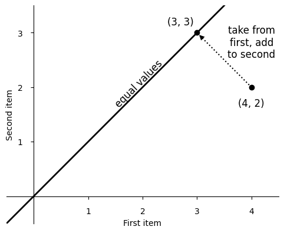
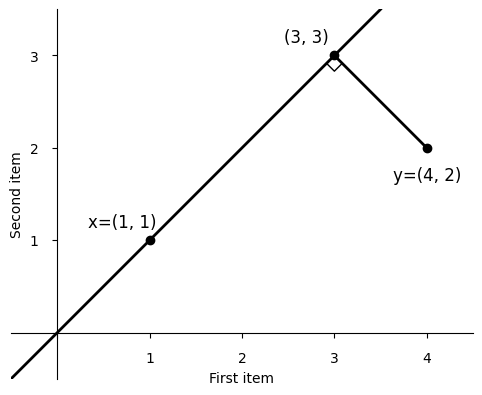
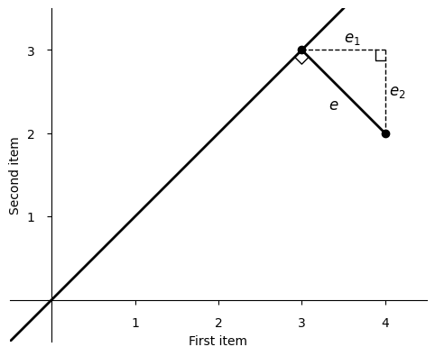
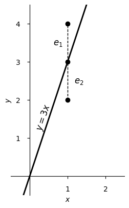
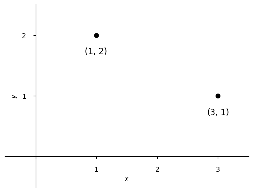
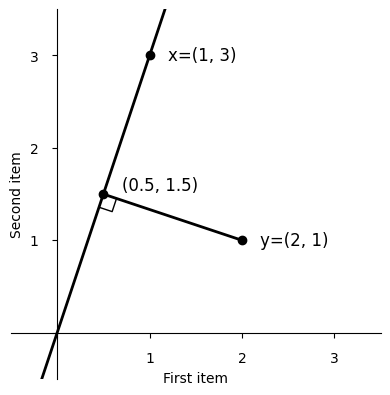
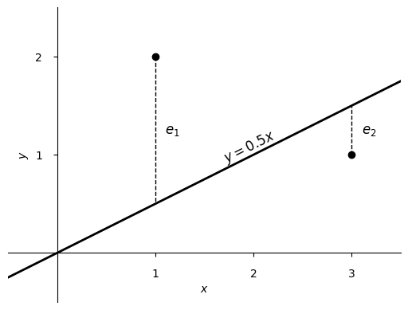

# Regression, from the mean

Starting from averaging, you get all of multiple regression by least
squares.

---

If you are given two numbers and asked to report a single number to
describe them both, it's natural to choose the number exactly in
between.

To get the number in between, you might subtract from the larger
number while at the same time adding the same amount to the smaller
number, until the numbers are equal.

You could imagine this physically as sliding along a number line from
each number to their midpoint, or moving blocks until you have stacks
of equal height.

To average four and two, you take one from four and add it to two,
producing threes. You can picture this as starting from the point (4,
2) and finding the nearest point with equal values, by decreasing the
first value while increasing the second, arriving at (3, 3).

The direction you moved is perpendicular to the line of equal values,
which means you found the projection of (4, 2) onto that line. We can
calculate that projection using any non-zero point on the line. What
multiple of (1, 1), for example, is nearest (4, 2)?

With \\( y = (4, 2) \\) and \\( x = (1, 1) \\), the projection is \\(
x \\) times a multiplier \\( b \\). Writing the calculation in the
“normal equation” style, with column vectors,

\\[
b =
(x^Tx)^{-1}x^Ty =
(1 \cdot 1 + 1 \cdot 1)^{-1} (1 \cdot 4 + 1 \cdot 2) =
3
\\]

so we can find (3, 3) as \\( 3x \\)—and with \\( x \\) as ones, \\( b
\\) also tells us the mean directly.

Our path to the line of equal values is the _shortest_ such path from
(4, 2). Calling it \\( e \\), notice that \\( e \\) is the hypotenuse
of the right triangle with sides \\( e_1 \\) and \\( e_2 \\), which
are the adjustments we made to the original numbers. By the
Pythagorean theorem, \\( e^2 = e_1^2 + e_2^2 \\), so by minimizing \\(
e \\) we have minimized the sum of the adjustments' squares. This is
often called _least squares._

Changing from item axes to dimension axes, we can plot \\( y \\)
against \\( x \\). You can see that the mean is indeed exactly between
the two numbers. The line of equal values has no presence here, except
that the \\( x \\) we chose from it controls how far to the right we
draw our points.

The line shown visualizes \\( y = bx \\). We had only been thinking of
the case when \\( x = 1 \\), but the line extends, going through the
origin.

The current view can also be where we start. We could have any \\( (x,
y) \\) points we like.

Going back to item axes, the situation is just as when we were
averaging, but now the line we're moving to isn't a line of equal
values, and so the minimizing perpendicular also has a different
slope.

We still calculate this \\( b \\) as we did before.

\\[
b =
(x^Tx)^{-1}x^Ty =
(1 \cdot 1 + 3 \cdot 3)^{-1} (1 \cdot 2 + 3 \cdot 1) =
\tfrac{1}{2}
\\]

We've fit a line through the origin that minimizes the squared errors
between our line and the original items.

You can add more items (more points) and calculate as before, but that
makes too many item axes to draw in two dimensions. (If you just
wanted to average more than two items, you can do it, now with
multiple justifications for adding up the numbers and dividing by how
many you added!)

You can add more dimensions and calculate as before (with \\( X \\) a
matrix and \\(b \\) a vector now) but the visualization of the
solution can be harder to draw, and you'll have too many dimension
axes to show in two dimensions.

Indeed, you can have most any number of items and dimensions and in
general the “averaging machine” we've developed will handle it. Pretty
great, for something that started by just shifting boxes around!
