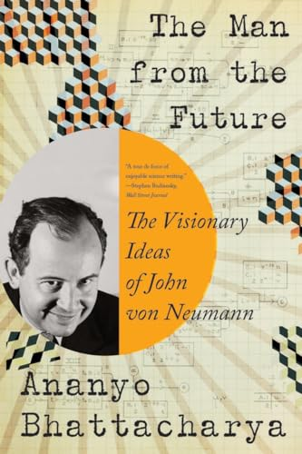

# (Audio) The Man from the Future, by Bhattacharya

It's amazing how long this [book][] can go without mentioning von
Neumann. Indeed, it seems to have been published with two different
subtitles: one has “the visionary life of John von Neumann,” while the
other has _ideas_ instead of _life._ The _ideas_ subtitle is more
representative. It is very interesting.

[book]: https://wwnorton.com/books/the-man-from-the-future

The author will stop at nothing to emphasize how smart von Neumann
was. I am convinced, of course. So why did he not do anything quite so
excellent as Einstein or Gödel? I suspect it may be to do with his
having been rather too rich, and also (possibly in connection) that he
spent too much time working on military things, often in secret. For
whatever reason, it seems he didn't stick to things quite the way
Einstein did.

I hadn't known that von Neumann was responsible for the ol'
zero-is-the-empty-set construction, or that he's responsible for the
quantification of utility based on gambling (in Theory of Games and
Economic Behavior). He also seems to have been a sort of early example
of techno-concern for the future along the lines of [More Everything
Forever][], with his reproducing probes and so on. I think there was
also a decent intro to [Hilbert spaces][] in there.

[More Everything Forever]: /20260721-more_everything_forever_by_becker/
[Hilbert Spaces]: https://www.quantamagazine.org/in-hilbert-space-all-things-are-quantumly-possible-20260826/

An interesting detail has von Neumann's second wife Klára (Klári)
writing the first code with a real subroutine, for the ENIAC just as
it was converted to run stored programs, doing Monte Carlo with
[Metropolis][]. Neat!

[Metropolis]: https://en.wikipedia.org/wiki/Nicholas_Metropolis

---

> “...mathematics is the foundation of all exact knowledge of natural
> phenomena.” (Hilbert)

I re-found this one [and found another][]. Oh Hilbert! You know he
wrote a geometry book? Hadn't been formal enough for him!

[and found another]: https://en.wikiquote.org/wiki/David_Hilbert

---

I was fascinated to learn about Emil du Bois-Reymond's “Die sieben
Welträtsel” (seven world-riddles) of which he said "Ignoramus et
ignorabimus" — "we do not know and we will not know." It was maybe
just three that were "ignorabimus," but anyway the interesting point
here is that Hilbert hated it, saying "Wir müssen wissen. Wir werden
wissen." (We must know. We will know.) In the book this is largely
setting up that Gödel was proving Hilbert wrong, but the whole thing
is interesting to me because I've had related thoughts. In my [shabby
notes][] I even (quite by coincidence) used a list of seven.

[shabby notes]: https://github.com/ajschumacher/ajschumacher.github.io/issues/264

---

Interesting stuff on Heisenberg's matrix mechanics... Apparently
Heisenberg didn't even know what matrices are and sort of invented
them in order to make his theory? He had to have Born tell him about
matrices?

So Heisenberg uncertainty is non-commutativity of position and
momentum matrices (operators)... I think Ellenberg has a nice toy
example of this in his _Shape_...

So does Hilbert’s spectral theorem actually do spectra of atoms?!
Eigenfunctions/values of Heisenberg matrices? It seems _yes,_ but I
don't have a complete handle on it yet...

---

> “If people do not believe that mathematics is simple, it is only
> because they do not realize how complicated life is.” (von Neumann)

I [re-found][] that quote, together with another one:

[re-found]: https://mathshistory.st-andrews.ac.uk/Biographies/Von_Neumann/quotations/

> “In mathematics you don't understand things. You just get used to
> them.” (von Neumann)

Surely you're [joking][], Mr. von Neumann? But I suppose he was
something of a “shut up and calculate” [quantum][] guy... And the guy
whose broken “proof” arguably set back thought on quantum foundations
for quite some time.

[joking]: https://wist.info/von-neumann-john/44309/
[quantum]: /20250601-what_is_real_by_becker/
