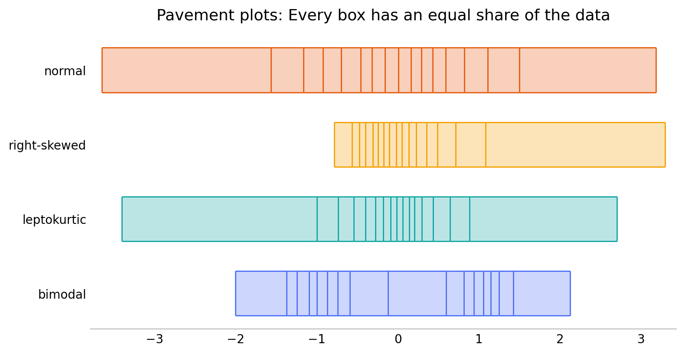

# Pavement plots

Pavement plots are univariate data visualizations that look like
strips of pavement in rectangular slabs. They extend from minimum to
maximum value, and the breaks are at evenly spaced quantiles, so that
every box contains the same fraction of the data. They're like box
plots that don't assume central tendency, or rug plots that are evenly
thinned to avoid crowding. You can install the Python [package][] with
`pip install pavement`.

[package]: https://planspace.org/pavement/

## Why pavement plots?

I was frustrated that there didn't seem to be a one-dimensional data
visualization satisfying all five of these criteria:

 * *Simple*: Explain it in one sentence
 * *One-dimensional*: Easily stackable for comparing many distributions
 * *No distributional preconceptions*: Not just central/unimodal data
 * *Minimal researcher degrees of freedom*: Shouldn't depend on choices
 * *Handle large data sets*: Elegant support for lots of data

I believe pavement plots satisfy all these criteria.

### Why not histograms?

> “The histogram is a poor method for comparing groups of univariate
> measurements.” (Cleveland, _Visualizing Data_, 1993)

[Histograms][] are two-dimensional plots, in the first place. “Simple”
is arguable, but certainly the researcher choices of bin position and
bin width mean histograms can be [misleading][].

[Histograms]: https://en.wikipedia.org/wiki/Histogram
[misleading]: https://aakinshin.net/posts/misleading-histograms/

### Why not Kernel Density Estimates (KDEs)?

[KDEs][] are two-dimensional plots, and neither [violin][] nor
[ridgeline][] variants fully overcome this. The concept is simple, but
the details aren't. The researcher choice of [bandwidth][] means that
they can be almost as misleading as histograms.

[KDEs]: https://en.wikipedia.org/wiki/Kernel_density_estimation
[violin]: https://en.wikipedia.org/wiki/Violin_plot
[ridgeline]: https://en.wikipedia.org/wiki/Ridgeline_plot
[bandwidth]: https://aakinshin.net/posts/kde-bw/

### Why not box plots?

[Box plots][] are not quite one-dimensional plots, but they're close,
which is why they can make for better comparisons between many
distributions. They're close to simple, apart from the rules about
whiskers and outliers. But box plots have a strong assumption that the
data has central tendency and is unimodal. In all the [years][] since
the box plot, this doesn't seem to have really been addressed.

[Box plots]: https://en.wikipedia.org/wiki/Box_plot
[years]: https://vita.had.co.nz/papers/boxplots.pdf "40 years of boxplots"

The core of a box plot, however, is the five-number summary: minimum,
quartiles, and maximum. This is exactly what a pavement plot with four
bins shows.

### Why not rug plots?

[Rug plots][] are pretty great, especially for small data sets with
minimal repetition of values. They fail for large data, where they get
impossible to read, and call for use of opacity and/or jittering,
neither of which are ideal.

[Rug plots]: https://en.wikipedia.org/wiki/Rug_plot

Rug plots can be basically identical to pavement plots for small data
sets with particular choices of bin count, and for large data sets a
pavement plot is equivalent to a rug plot with uniform “thinning” of
the data.

## More on pavement plots

Pavement plots still have some minimal researcher degrees of freedom,
but they don't generally leave room for major misconceptions from a
visualization.

There's the number of equal-data boxes to show, which gives
flexibility in resolution. It's a choice; generally when there's
enough data showing more bins is better.

There is also an underlying choice about how to calculate quantiles.
Often it won't matter, but by all means use your preferred quantile
[method][].

[method]: https://www.amherst.edu/media/view/129116/original/Sample+Quantiles.pdf

The material here roughly recapitulates what I presented in [Pavement
Plots: Less biased boxes][] and [Pave the Planet][]. The Python
implementation is on the [Python Package Index][], [on GitHub][], and
has a [documenting web site][].

[Pavement Plots: Less biased boxes]: https://docs.google.com/presentation/d/1vq-fGC8PvBenJo61VBIe7Xx2L1bLkTurVIERr8TpX1s/edit
[Pave the Planet]: https://docs.google.com/presentation/d/13D6hXuCRH1JdBsmSqASh5_Ww9KDEpaAV8GhXiNaQ5Ik/edit
[Python Package Index]: https://pypi.org/project/pavement/
[on GitHub]: https://github.com/ajschumacher/pavement
[documenting web site]: https://planspace.org/pavement/
