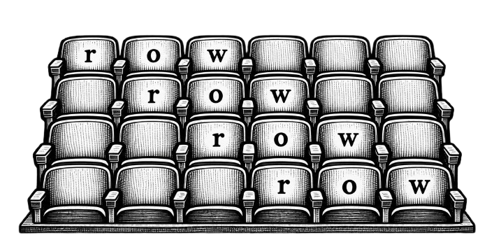
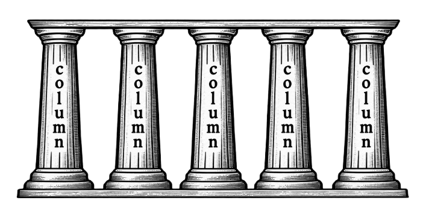

# Rows and columns

Rows go left and right, like seating in a theater.

Rows are horizontal and easy to read like lines of text.

Columns go up and down, like stone pillars holding up a building.

Columns are vertical and have things one on top of the other.

Here are three rows. How many columns?

\\[
\begin{bmatrix}
r & o & w \cr
r & o & w \cr
r & o & w \cr
\end{bmatrix}
\\]

Here are three columns. How many rows?

\\[
\begin{bmatrix}
c & c & c \cr
o & o & o \cr
l & l & l \cr
u & u & u \cr
m & m & m \cr
n & n & n \cr
\end{bmatrix}
\\]
