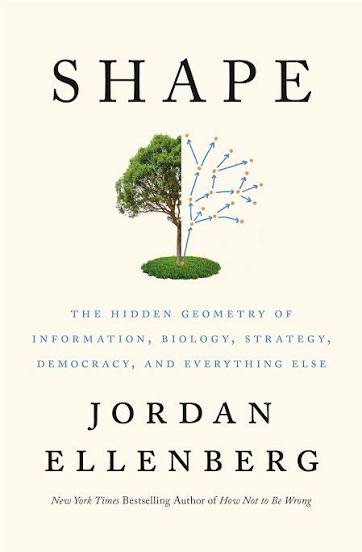

# Shape, by Ellenberg

You should absolutely have a beer with Ellenberg. His 2021 book is a
lot of fun. It doesn't feel exceptionally purposeful, and the
structure is looser than his [last book][], but it holds together
better than most books that are built from articles previously
published elsewhere, and it has some really good parts. I hadn't
realized that he has a master's in writing, but it makes sense!

[last book]: /20200925-how_not_to_be_wrong_by_ellenberg/

---

Ellenberg is talking about geometry, and also poetry, and mentions
“[Euclid alone has looked on beauty bare][]” on page 7.

[Euclid alone has looked on beauty bare]: https://www.poetryfoundation.org/poems/148566/euclid-alone-has-looked-on-beauty-bare

---

> What Lincoln took from Euclid was the idea that, if you were
> careful, you could erect a tall, rock-solid building of belief and
> agreement by rigorous deductive steps, story by story, on a
> foundation of axioms no one could doubt: or, if you like, truths one
> holds to be self-evident. Whoever _doesn't_ hold those truths to be
> self-evident is excluded from discussion. I hear the echoes of
> Euclid in Lincoln's most famous speech, the Gettysburg Address,
> where he characterizes the United States as “dedicated to the
> proposition that all men are created equal.” A “proposition” is the
> term Euclid uses for a fact that follows logically from the
> self-evident axioms, one you simply cannot rationally deny. (pages
> 12-13)

This is a little confused, since in the Declaration of Independence,
“that all men are created equal” is held to be self-evident (an axiom)
and not a proposition that follows from anything else. Either way,
it's a better example of the complexity of meaning and interpretation
than it is of logical reasoning.

---

> Looking at the weathered books, you see that every controversy in
> education has been waged before, multiple times, and everything we
> think of as new and strange—math books like _Inventional Geometry_
> that ask students to come up with proofs on their own, math books
> that make problems “relevant” by relating them to students' everyday
> lives, math books designed to advance social causes, progressive or
> otherwise—is also old, and was thought of as strange at the time,
> and no doubt will be new and strange again in the future. (page 16)

This is neat and interesting to think about, especially vs. the
present-oriented news and social media worlds...

_Inventional Geometry_ is a series of questions for discovery
learning. “It came out in 1860.”

---

> The ultimate reason for teaching kids to write a proof is not that
> the world is full of proofs. It's that the world is full of
> _non-proofs,_ and grown-ups need to know the difference. It's hard
> to settle for a non-proof once you've really familiarized yourself
> with the genuine article. (page 18)

There's a sense in which “the real world” (anything that isn't math)
really doesn't have _any_ proofs. The standards of mathematical proof
are just not attainable outside abstract reasoning with explicit
assumptions and inference rules. It isn't a question of better or
worse reasoning, it's an epistemic difference that makes proof
impossible. I think understanding this is a kind of maturity, but I
don't think this is what Ellenberg is getting at.

I think Ellenberg is alluding to things like logical fallacies: the
“bad arguments” which we so often perceive in the reasoning of people
we disagree with. In good-faith discussion with people who share our
assumptions, there is something to be said for this. But the scope is
fairly narrow.

People don't disagree with us because they misapplied an agreed-upon
inference rule and are just waiting for someone to correct their
logic. They disagree with us because they have _different_ assumptions
and inference rules. Those are choices that are outside the realm of
proof vs. non-proof. I think Ellenberg is being a little facile here.
The topic deserves more.

---

On page 21 Ellenberg mentions the [Alexander Horned Sphere][], which
took me a few minutes to understand with the help of Wikipedia.
Infinite stuff is weird!

[Alexander Horned Sphere]: https://en.wikipedia.org/wiki/Alexander_horned_sphere

---

> In geometry class we are usually not allowed to talk about picking
> up shapes and turning them over. But we ought to be. As abstract as
> we may try to make it, math is something we do with our body.
> Geometry most of all. Sometimes literally; every working
> mathematician has found themself drawing invisible figures with hand
> gestures, and at least one study has found that children asked to
> act out a geometric question with their body become more likely to
> arrive at the correct conclusion. (pages 30-31)

The study is [Actions speak louder with words][], and it's one of
those that gets less interesting the more you look at it. The
“children” were undergraduate students. The correct conclusions were
so simple that it's astonishing any undergraduate could _avoid_ the
correct conclusions.

[Actions speak louder with words]: https://alibalilab.wiscweb.wisc.edu/wp-content/uploads/sites/371/2018/02/NathanWalkingtonBoncoddoPierWilliamsAlibali2014.pdf

---

> A lot of math is figuring out what we can, temporarily or for all
> time, get away with not caring about. (page 37)

---

> Mathematicians before Poincaré, especially the Tuscan geometer and
> politician Enrico Betti, had wrestled with the question of assigning
> a shape a number of holes, but Poincaré was the first to grasp the
> issue that some holes could be combinations of others. And even
> Poincaré didn't really think about holes the way mathematicians do
> today; that would have to wait for the work of the German
> mathematician Emmy Noether in the mid-1920s. Noether introduced the
> notion of the _homology group_ into topology, and it is her notion
> of “holes” we've been using ever since.
>
> Noether expressed her ideas in the language of “chain complexes” and
> “homomorphisms,” not pants and milkshakes, but I'll stick with our
> current notation to avoid a wrenching stylistic shift. Noether's
> innovation was to see that it wasn't right to think of holes as
> discrete objects, but rather as something more like directions in
> space. (page 44)

Noether strikes again!

By the end of this chapter I'm still not entirely clear on how he's
defining n-dimensional holes.

> This might seem like a weird definition, but it makes everything
> work. (page 50)

This reminds me of the (uncharacteristic) bad introduction to matrix
multiplication where [Strang says][] “there is only one possible rule,
and I am not sure who discovered it. It makes everything work.”

[Strang says]: /20210915-flow_metaphor_for_matrix_multiplication/

Making things work is good, but it isn't a satisfying reason for
understanding.

---

> Why take rigid motions as the fundamental symmetries? One good
> reason for this choice is that (though this is not easy to prove!)
> the rigid motions are exactly those things you can do to the plane
> that keep every line segment the same length—thus, _symmetry,_ from
> the Greek for “with measure.” A better Greekism would be to use the
> phrase for “equal measure,” or _isometry,_ and that is indeed what
> we call a rigid motion in modern math. (page 52)

---

> “Perhaps too we shall have to construct an entirely new mechanics,
> which we can only just get a glimpse of, where, the inertia
> increasing with the velocity, the velocity of light would be a limit
> beyond which it would be impossible to go. The ordinary, simpler
> mechanics would remain a first approximation since it would be valid
> for velocities that are not too great, so that the old dynamics
> would be found in the new. We should have no reason to regret that
> we believed in the older principles, and indeed since the velocities
> that are too great for the old formulas will always be exceptional,
> the safest thing to do in practice would be to act as though we
> continued to believe in them. They are so useful that a place should
> be saved for them. To wish to banish them altogether would be to
> deprive oneself of a valuable weapon. I hasten to say, in closing,
> that we are not yet at that pass, and that nothing proves as yet
> that they will not come out of the fray victorious and intact.”
> (page 61, quoting Poincaré)

This was 1904, and motivated by concern about Maxwell's equations not
being properly invariant under symmetries. Einstein is so often
portrayed as if he came up with relativity in the wilderness,
surprising everyone in 1905, but it really seems like the ideas were
in the ether (sorry) around that time.

---

Page 68 is the first place Ellenberg mentions he was involved with the
2017 film _Gifted_. Later he gets into Bacon (and Erdős) numbers. His
“Erdős-Bacon” number is 3+2=5 (page 315) which is neat.

It's a bit of a stretch, but if I'm allowed to enter the cinematic
universe for doing the English subtitles for [_Scars_][] then my Bacon
number is 4, via [Jung Hee-tae][].

[_Scars_]: https://letterboxd.com/film/scars-2011/
[Jung Hee-tae]: https://www.sixdegreesofbacon.org/routes/result/356332/

---

Apparently Pearson was quite a character! On page 75 Ellenberg
mentions that he, among other things, invented the English word
“sibling.”

Ellenberg also references [one of his other books][] which has more
about Pearson.

[one of his other books]: https://planspace.org/20200925-how_not_to_be_wrong_by_ellenberg/ "https://planspace.org/20200925-how_not_to_be_wrong_by_ellenberg/"

---

> [Andrei Andreyevich Markov] wrote a lot of angry letters to the
> newspapers on social matters and was widely known as Neistovyj
> Andrei, “Andrei the Furious.” (page 85)

This is the Markov chain guy!

---

On pages 95-96, Ellenberg pokes some fun at writing coming out of
GPT-3. Oh, the innocence of 2021!

---

> Mathematics is a fundamentally imaginative enterprise, which draws
> on every cognitive and creative ability we have. (page 110)

---

> A proof is crystallized thought. It takes that brilliant buoyant
> moment of “getting it” and fixes it to the page so we can
> contemplate it at leisure. More importantly, we can share it with
> other people, in whose mind it springs to life again. A proof is
> like one of those hardy microbial spores so robust they can survive
> a trip through outer space on a meteorite and colonize a new planet
> after impact. Proof makes insight portable. We mathematicians have
> been known to describe ourselves as standing on the shoulders of
> giants, but I prefer to say we're walking up a staircase made of the
> frozen thoughts of regular-sized people. We get to the top, we
> sprinkle our own thoughts on the ice, they freeze to the mass and
> make the staircase that much higher. Not as pithy but truer. (page
> 117)

This is very similar to [_How to bake pi_][]: “I think that the key
characteristic of proof is not its infallibility, but its sturdiness
in transit.” (etc.)

[_How to bake pi_]: /20260728-how_to_bake_pi_by_cheng/

---

> I've been teaching math for more than twenty years now. When I
> started, I was driven by questions like this: What's the _right way_
> to teach a mathematical concept? Examples first, then explanation?
> Explanation followed by examples? Letting students discover
> principles by examining the examples I present, or stating
> principles at the blackboard and letting students discover examples?
> Wait, are blackboards even good?
>
> I've come to feel there's no one right way. (Though there are
> certainly some wrong ways.) Different students are different and
> there is no One True Teaching Method that will ring everyone's
> saliva bell. ... Math teachers, I think, ought to adopt every
> teaching strategy they can, and shuttle through them in quick
> succession. That's the way to maximize the chance each student at
> least sometimes feels that their teacher is finally, after so much
> boring hoo-hah, talking about things in a way that makes sense.
> (page 122)

In my notes I called this idea “intentional diffusion.” Lots of
entry-points. Maybe this is what Ellenberg's whole book is doing?

---

> This phenomenon of computations we know exactly how to do, but don't
> have time to do, is a somber minor-key motif that sounds through the
> whole history of computer-age mathematics. (page 128)

---

> The fastest computation is the one you don't do. (page 141)

---

> For instance, there's a “2-adic” geometry of whole numbers in which
> the distance between two numbers is the reciprocal of the largest
> power of two dividing their difference. Seriously, this turns out to
> be a good idea. (page 191)

Huh! So that's what this p-adic business is?

---

> The more dimensions you allow yourself, the better you can get the
> distances between points on your map to match the ones you've
> measured. Which means the data can _tell_ you which dimension it
> “wants” to be in. (page 194)

He has a fun example just above, “In three dimensions, by the way,
it's easy to make the distances between four points all the same; you
place the four points at the corners of a shape called a regular
tetrahedron.”

Anyway, this reminds me of [Local Intrinsic Dimensionality][] (LID)
which I think is a neat way to try to get dimensionality from
distribution of data.

[Local Intrinsic Dimensionality]: /20201227-estimate_manifold_dimensionality_with_lid/

Ellenberg is probably thinking of multidimensional scaling (MDS) which
cares directly about preserving distances between points. There's also
of course PCA-style “how many dimensions explain some large percentage
of variation?”

Hmm... LID probably relates with some directness to the MDS sense? In
that the quicker we're running into more points, we get more points
close to equidistant, we need more dimensions to preserve those?
There's probably a way to formalize this... Ah especially if using
geodesic distances/enforcing locality on MDS...

---

> A really important and in some ways underpublicized fact about math
> is that math is very hard. (page 200)

---

> If math class is easy, you're doing it wrong. (page 201)

---

> “[T]he thoughts of pure mathematics are true, not approximate or
> doubtful; they may not be the most interesting or important of God's
> thoughts, but they are the only ones that we know exactly.” (page
> 214, quoting [Hilda Hudson][])

[Hilda Hudson]: https://en.wikipedia.org/wiki/Hilda_Phoebe_Hudson

---

> All working mathematicians experience mathematics as a kind of play,
> but Conway was singular in his insistence that play could be a kind
> of mathematics. (page 223)

---

> If we know the ball's upward speed now, its upward speed a second
> later will be 16 meters per second less. For downward speed it's the
> opposite; the downward speed a second from now is 16 m/s _more_ than
> it is right now. (page 238)

I [think][] that's a typo? Or I'm missing something?

[think]: https://x.com/planarrowspace/status/2100589380280709183

---

The section starting page 292, “The notes in the chord,” is a neat
explainer on eigenvalues and Heisenberg uncertainty, different from
others I've seen.

The example has infinite geometric sequences as state (he says Hilbert
space in a footnote) and introduces a “shift” operator, which is the
same as multiplying by the factor, hence it has that eigenvalue. He
also has a “pitch” operator, multiplying each element by its
zero-based position index. The only eigenvector then has zeros except
for one position.

Then no non-zero vector is an eigenvector of both operators, and
further if you shift then pitch, it's different from pitching then
shifting. He shows the commutator shift-pitch minus pitch-shift,
without calling it that.

Then it's an easy switch into position and momentum operators, and the
commutator coming to the state multiplied by the reduced Planck
constant. The positions and momenta you can measure are the
eigenvalues of their operators.

> The operators representing momentum and position do not commute. And
> the difference between the positionmomentum and momentumposition of
> a particle's state is just—well, not quite the state itself, but the
> state multiplied by a number called Planck's constant, and denoted
> ℏ. In particular, that means the difference can't be zero, which in
> turn implies, just as with the sequences, that a particle's state
> can never be an eigenstate for both the position and momentum
> operators. In other words, a particle can't have both a well-defined
> position and a well-defined momentum. In quantum mechanics we call
> this the Heisenberg uncertainty principle, and it walks around in a
> cloak of mystery and intrigue. But it's just eigenvalues. (page 297)

Ellenberg uses notes (C, D) as eigenvalues for the music example,
which is kind of a neat way of talking about frequencies without using
numbers... I've recently seen Heisenberg explanations talking about
Fourier transforms, and Ellenberg mentions them toward the end of his
piece here too. But Ellenberg's explanation seems to stand just fine
without going into Fourier transforms. Certainly the ideas feel
related... but Ellenberg's approach seems better, compared to just
gesturing at Fourier transforms?

Can it be made even simpler?

A particle's state is two numbers (a, b). It is in the left position
when (a, b) is a multiple of (1, 2) and it's in the right position
when it's a multiple of (2, 1). It's moving up when (a, b) is a
multiple of (2, 3) and it's moving down when it's a multiple of (3,
2). States like (3, 3) are not exact multiples; that one is equal
share left and right, for example. No state is perfectly a position
multiple and also a momentum multiple.

I think that isn't bad... It doesn't touch the commutator or the
operators as things that modify state, but maybe that's okay... I feel
like it's at least as good as the “wave in the general direction of
Fourier transforms” explanation.

---

> And if you want to learn about what I've left out, Sean Carroll's
> book _Something Deeply Hidden_ is a great nontechnical primer in the
> mathematics underlying quantum physics. (page 297)

Possibly a good rec?

---

Around pages 335-336 he's talking about (sort of) the [Flajolet–Martin
algorithm][], which is friends with LogLog and HyperLogLog, so it
turns out I've used this thing a lot, and frequently been frustrated
that the lazy machine wouldn't just do a real `COUNT DISTINCT` for
goodness' sake.

[Flajolet–Martin algorithm]: https://en.wikipedia.org/wiki/Flajolet%E2%80%93Martin_algorithm

---

> The abstractions of geometry step in when our ability to draw gives
> out. (page 339)

---

> Democratic governments are founded on the principle that every
> citizen's views are to be represented in the decision-making of the
> state. Like all good principles, this is easy to state, difficult to
> make precise, and almost impossible to implement in a fully
> satisfying way. (page 348)

---

> “We are not trying to meet some abstract quota of definitions,
> theorems and proofs. The measure of our success is whether what we
> do enables _people_ to understand and think more clearly and
> effectively about mathematics.” (quoting Bill Thurston, page 419)

> “Basically, I'm not interested in doing research and I never have
> been,” [David Blackwell] said. “I'm interested in understanding,
> which is quite a different thing.” (page 419)

This was back in 2021, well before the recent AI math. Ellenberg holds
up here.
