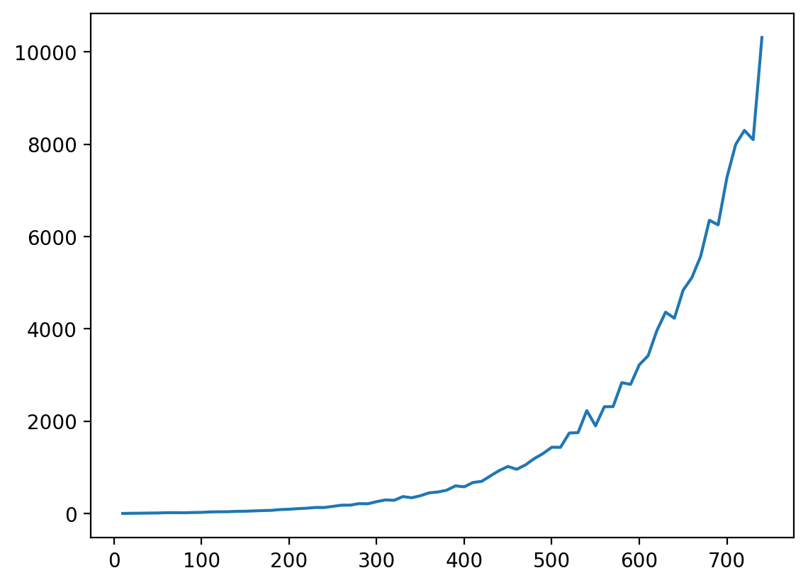

# Quasi-orthogonal representations

I am basically satisfied that we understand how neural nets represent
things internally. First, in high dimensions there are exponentially
many nearly orthogonal directions to use, meaning a very large number
of things can be represented, and many of them at once (in
superposition). Second, attention mechanisms allow for encoding
structured representations.

---

### Not enough neurons

Modern neural nets are big, but it's hard to compete with the number
of possible concepts. If we have to use a separate neuron for
everything, we need a huge number. An extreme version of this idea is
the unit/value hypothesis as in Feldman and Ballard's [1982 paper][].

[1982 paper]: https://onlinelibrary.wiley.com/doi/epdf/10.1207/s15516709cog0603_1

People have sometimes found single neurons that seem to correspond to
a single interpretable concept, as in the 2012 [cat neuron][] or the
2017 [sentiment neuron][].

[cat neuron]: https://blog.google/technology/ai/using-large-scale-brain-simulations-for/
[sentiment neuron]: https://openai.com/index/unsupervised-sentiment-neuron/

But the numbers just don't work out. GPT-3 had a vocabulary of around
50,000 tokens, and that immediately went to a layer of 12,000 nodes.
It isn't enough to give every concept a node.

### Distributed representations

You can represent many more concepts if you use combinatorial
approaches, for example like Hinton's “coarse coding” ([1986][]).

[1986]: https://www.cs.toronto.edu/~fritz/absps/pdp3.pdf "Hinton, G. E., McClelland, J., & Rumelhart, D. (1986). Distributed representations. In D. Rumelhart & J. McClelland (Eds.), Parallel Distributed Processing (Vol. 1, pp. 77-109). Cambridge, MA: MIT Press."

But because these representations are _not_ orthogonal, it can be hard
or impossible to disentangle them if you have more than one active at
the same time.

### Quasi-orthogonal dimensions

There are a lot of ways that things are strange in many dimensions,
and one of them is that as you get into lots of dimensions there are
exponentially many _nearly_ perpendicular directions.

This is usually presented as coming from the [Johnson–Lindenstrauss
lemma][], but the most directly applicable paper I've seen is the 1993
[Quasiorthogonal dimension of Euclidean spaces][].

[Johnson–Lindenstrauss lemma]: https://en.wikipedia.org/wiki/Johnson%E2%80%93Lindenstrauss_lemma
[Quasiorthogonal dimension of euclidean spaces]: https://www.sciencedirect.com/science/article/pii/089396599390023G

---

My little experiment: The horizontal axis is the actual number of
dimensions. The vertical axis is the number of quasi-orthogonal
dimensions (within 10 degrees of perpendicular to all the others)
based on drawing random (Gaussian) unit vectors. By 700 real
dimensions, there are easily 7,000 nearly orthogonal directions.

---

This gives us a truly mind-blowing number of axes, and the ability to
compose and decompose reasonable numbers of them when activated
simultaneously (“superposition”).

### The structure of language

If quasi-orthogonal dimensions provide the capacity, a model still
needs to be able to relate things and build complex concepts from
simpler ones. A version of this is the “binding problem” ([1986][]):
what goes with what?

One conceptual solution was “treelets” ([2003][]), which looks just
like [X-bar theory][] or the sentence diagrams that elementary schools
used to teach.

[2003]: https://mitpress.mit.edu/9780262632683/the-algebraic-mind/ "The Algebraic Mind: Integrating Connectionism and Cognitive Science"
[X-bar theory]: https://en.wikipedia.org/wiki/X-bar_theory

What we have now is attention, which, together with positional
encodings ([2017][]), provides a mechanism for the hierarchical
processing these suggest.

[2017]: https://arxiv.org/abs/1706.03762 "Attention Is All You Need"

### And it works

Anthropic has shown that things like this happen in practice, and has
used these ideas, for example to successfully [extract][]
interpretable features from their models.

[extract]: https://transformer-circuits.pub/2024/scaling-monosemanticity/index.html

---

This post is based largely on work from Anthropic's [Transformer
Circuits Thread][]. I [presented][] a lightning talk on this topic in
2025.

[Transformer Circuits Thread]: https://transformer-circuits.pub/
[presented]: https://docs.google.com/presentation/d/1wyLk9j0X9QxaiO2af4cTlMZr8hckyUmTThjBNKTrTwY/edit
