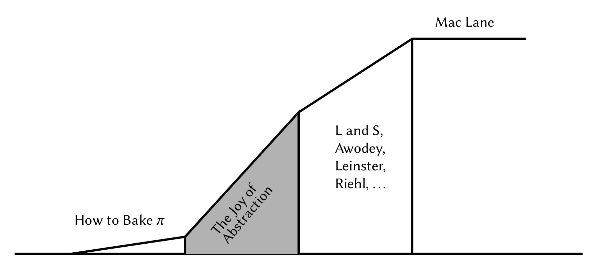
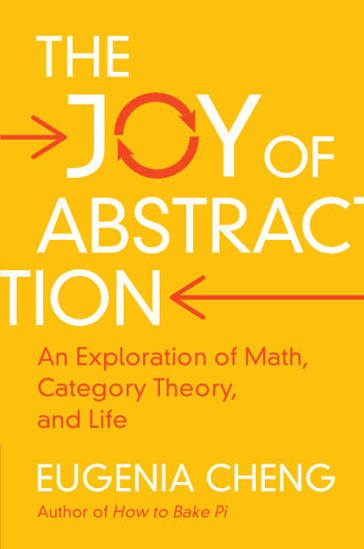
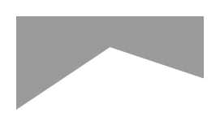

# The Joy of Abstraction, by Cheng

> Most math textbooks focus on the formality and have less focus on
> the spirit, with face-to-face teachers often being the ones to
> convey the spirit that the text couldn’t, or didn’t. (page 396)

I finished [How to Bake Pi][] wanting more Category Theory; what luck
that Cheng had already written the book I wanted! Here's how she
illustrates (with typical great clarity) the goal of the book. (The
names on the right are authors of more difficult Category Theory
books.)

[How to Bake Pi]: /20260728-how_to_bake_pi_by_cheng/

I think she absolutely delivers, and she delivers with spirit and
understanding and humanity. It's a math textbook, starting very gently
and getting a little difficult by the end, all written in a confident
and kind first-person voice.

I like the “Things to Think About” that she intersperses. They're a
little like exercises, but they're nearly always followed immediately
by explained solutions, in a way that doesn't interrupt the flow of
the book. You can stop and work things out yourself first or not. It's
a great technique, I think.

Cheng has explanations I haven't seen elsewhere. For example, a monoid
is usually defined as a set of things with an associative binary
operation and an identity. That doesn't seem very “mon” at all. Cheng
explains that a monoid is a simple one-object category, with all its
morphisms starting and ending on that anonymous object, so they all
compose. So those arrows _are_ “the things in the set” and composition
_is_ the “binary operation.” Suddenly it makes sense to call this
thing a monoid! And composition is a generalization of binary
operations in general. So cool!

I almost wish Cheng went further into monads and so on, but the book
is already 400 pages. Maybe I'll try some of the other books she
recommends as follow-ons.

---

> mathematics involves the twin disciplines of logic and abstraction.
> (page 24)

---

> Thus truth is not absolute but is contextual, and so we should
> always be clear about the context we’re considering. This idea is
> central to category theory. (page 44)

---

> It turns out that a world in which everything is equally valid is
> not very interesting, and is more or less the same as a world in
> which nothing is possible. (page 51)

---

> Technically an Euler diagram. This will be the case every time I
> refer to a Venn∗ diagram. (page 58)

This is a footnote, and then for most of the book any time she says
“Venn diagram” it has that asterisk.

Apparently the distinction is that a Venn diagram always shows every
possible overlap, even those that are empty? [Who knew?][]

[Who knew?]: https://en.wikipedia.org/wiki/Euler_diagram

---

> See, math isn’t just about equations: sometimes it’s about
> inequations. (page 74)

---

> the main thing to take away now is that composition of arrows is a
> generalization of the concept of binary operation. (page 99)

This is cool!

---

> Turning the arrows around is called taking the dual in category
> theory, and we’ll look into that more in Chapter 17. (page 114)

---

> Later we will talk more about the idea of turning all the arrows
> around in a category. If we turn all the arrows around but leave
> everything else the same it’s called the dual category. It hasn’t
> really changed the structure of the category, it’s just presented it
> differently. The first version and the dual version above
> encapsulate the same information. This small and apparently
> irrelevant flip in perspective actually turns out to be rather
> profound and often useful; we’ll come back to it in Chapter 17.
> (page 116)

---

> For emphasis, the previous, more rigid version [than partially
> ordered set] is called a totally ordered set. And these are
> sometimes abbreviated to “toset” and “poset” because mathematicians
> are so lazy. (page 121)

---

> We have now seen these three ways of putting a category structure on
> the natural numbers, and each one gives us a very different shape of
> category.
>
> 1. Using factors.
>
> 2. Using size.
>
> 3. Using addition.
>
> In the first two cases, the objects of the category were the natural
> numbers, but they used different arrows. The third case is a bit
> different as it now takes the arrows to be natural numbers, and
> there was just one object which was a sort of dummy object. This is
> a form of “dimension shift” that can feel a little destabilizing but
> which is very powerful. We’ll come back to it. Categories with only
> one object are quite special so they deserve a name.
>
> Definition 11.2 A category with only one object is called a monoid.
> (page 126)

---

> Possibly the most striking consequence of having only one object is
> that all arrows are composable. We mentioned this in Chapter 8, when
> we were talking about the fact that composition is a generalization
> of a binary operation. When there is only one object, composition
> actually is a binary operation on the arrows. (page 126)

---

> A group is a monoid in which every element has an inverse. (page
> 130)

---

> For example, equations can have symmetry: if we switch the x and y
> in the equation \\( x^2 + 2xy + y^2 = 0 \\) then the equation stays
> the same (assuming that addition and multiplication are
> commutative). This is the beginning of the idea behind Galois
> theory, which connects equations with groups via some “abstract
> symmetry” involving their solutions. Group theory is a classic
> research field of pure mathematics with a vast body of knowledge and
> techniques. For this reason many advances in other areas of math
> have come from finding a way to make a link with group theory. This
> is often indicated by putting the word “algebraic” before a field of
> research, because group theory is a form of algebra. (Algebra in
> high school means something completely different and rather mundane,
> usually to do with manipulating equations and solving for x. I’m
> sorry that the word “algebra” has been taken over in this way in
> high school.) (page 132)

---

> This has helped me understand why some poor white men are
> particularly angry about the theory of privilege, as they are told
> they are very privileged, but they see people with technically less
> privilege doing better than them in society. So they think the
> theory of privilege is nonsense, because they don’t feel the
> manifestation of any privilege. I think it is much more productive
> to understand the source of this anger rather than simply get angry
> in return. This poset and the map that doesn’t preserve order are
> how I found clarity around this issue, and I have found that the
> abstraction helps to keep emotional reactions out of the way and
> enable a less divisive discussion. I currently consider this to be
> the most important “application” of category theory I have found,
> even though it’s really an application of categorical thinking
> rather than of a piece of category theory itself. (page 156)

---

> It is worth looking out for any non-order-preserving functions in
> life. Whenever you have two hierarchies on the same set of people
> and those hierarchies don’t agree it is a potential cause of
> antagonism. (page 156)

---

> These morphisms between categories are so important that they have
> an actual name rather than just “morphisms of categories”: they are
> called functors. The property of preserving identities and
> composition is called functoriality. (page 159)

---

> Sometimes I like to say “all equations are lies” but really I mean
> that all equations involve some things that are in some sense not
> the same, apart from the equation x = x, which is useless. The point
> of an equation is to use the sense in which two sides are the same
> to pivot between the senses in which they aren’t. Category theory
> says that the “sense in which they’re the same” can be more relaxed
> than equality as long as it still gives us a way to pivot between
> two sides. (page 166)

---

> Categories have one extra dimension over sets. That extra dimension
> is where we express relationships between objects, and we are now
> going to use that dimension to express this particularly strong form
> of relationship, that is, categorical sameness. (page 167)

---

> One theme of category theory is that we take definitions that refer
> to elements of sets, express them using only morphisms in a
> category, and can then immediately apply them in any category we
> like, not just Set. (page 176)

---

> Let’s start with monoids. Intuitively two monoids should count as
> “the same” if there’s a way of perfectly matching up their elements
> in a way that also makes the structure match up, so that all we’ve
> really done is re-label the elements. We’ll now see that this is
> indeed what the formal definitions give us. (page 177)

It's sometimes confusing when she talks about “elements” of monoids;
she has to mean the morphisms, in the categorical view, which are
elements, but “elements” still tends to make me think of objects. Or
maybe she's just flipping easily to the view of monoids as “having”
elements that combine via a binary operation other than composition.

---

> Incidentally, isomorphism is sort of the “wrong” notion of sameness
> for topological space. When it’s defined directly in topology
> (rather than via categories) it gets the name homeomorphism (not to
> be confused with homomorphism) but often the type of sameness we’re
> interested in is the kind we talked about earlier where you
> continuously deform things, and this is called homotopy equivalence.
> This doesn’t mean our notion of isomorphism is wrong, it means that
> the basic category structure we’ve put on topological spaces is not
> sensitive enough to detect the more nuanced type of sameness. But
> it’s still a decent starting point. (And homeomorphisms aren’t
> completely useless.) (page 183)

---

> Thus any time we invoke an equality between objects in a category we
> have done something not very categorical, or not really in the
> spirit of category theory. When you get used to categorical thinking
> I hope you will feel a sort of shudder of distaste any time you see
> an equality between objects, and at least a slight ringing of alarm
> bells any time you see an equality at all, just in case.
> Incidentally this distaste for equalities makes me feel particularly
> put out by the assumption that mathematics is all about numbers and
> equations. Not only do I not do equations in my research, but I am
> actively horrified by them. (page 184)

---

> That process we just went through of replacing an equality with an
> isomorphism is a typical part of a process known as
> “categorification”. This usually refers to a process of putting an
> extra dimension into something to give it more nuance via some
> morphisms. But we don’t just give it some morphisms—we then take
> every part of the old definition, find all the equalities between
> objects, and turn those into isomorphisms instead. Then, just as
> with categorical uniqueness, we may need the isomorphisms to satisfy
> some conditions of their own. (page 185)

---

> It’s like the classic research seminar where the speaker tells you
> that something you’ve never heard of before is just an example of
> this other thing you’ve never heard of before. (page 186)

Like: A monad is just a monoid in the category of endofunctors.

---

> Surjectivity is like injectivity but the other way round. The formal
> set-based (non-categorical) definitions don’t look so much like
> “other way round” versions of each other, but with the categorical
> version we can see a very precise sense in which they are the other
> way round from each other: they are duals, which means that in the
> categorical definitions all we need to do is turn all the morphisms
> to point the other way. If we do this to the definition of monic we
> get the definition of epic, which is a categorical version of
> surjectivity. (page 197)

---

> Sometimes (in worlds without commutativity) things are cancelable on
> one side but they don’t have both sides of an inverse, and this is
> what happens with monics and epics. Given f s = f t then f being
> monic says we can “cancel” it to conclude s = t. If f is epic we can
> cancel it from the other side, so that if s f = t f we can deduce s
> = t. (page 200)

I like my matrix diagrams for thinking about this kind of thing...

Here's a 2-by-1 matrix, rank one, and it's intuitive that moving right
to left “expands information” in a way that we should be able to undo
on the left with a 1-by-2 matrix. But you couldn't do that on the
right, because it “squished away” some information from the left.

And note, being injective from right to left is equivalent to being
surjective left to right.

Now here's a 3-by-2 matrix, still rank one. Can I reason about this
the same way? Going right to left it isn't injective any more, because
we're squishing away a dimension of the input. So there's no left
inverse. Still a pseudoinverse. And the squish means it can't be
surjective left to right, so same deal on the right.

Pretty nice diagrams, I think!

---

> The Axiom of Choice says that it is possible, and this axiom is
> logically equivalent to saying that all epics split. (page 202)

Axiom of Choice strikes again!

---

> We know that 2 = 1+1 in N, and by the definition of monoid
> homomorphism we must have f (1 + 1) = f (1) + f (1) so we have no
> choice about where 2 goes: it has to go to f (1) + f (1). (page 203)

---

> Mac Lane (in)famously wrote “All concepts are Kan extensions”. I
> would say that all concepts are universal properties—the question is
> just in what context? Furthermore, all universal properties are
> initial objects somewhere. So all concepts are initial objects.
> (page 224)

Initial objects are dual to terminal objects, so you could say it the
other way too...

---

> Sometimes the initial objects are to do with freely generated
> structures, such as with monoids where the initial object, N, was
> necessarily the monoid freely generated by a single element 1.
> Freely generated algebraic structures are related to the use of
> functors to move between categories. A freely generated structure is
> typically produced by a particular type of functor, a “free
> functor”, which in turn has a universal property expressed via a
> relationship with a “forgetful functor”. Those relationships are
> called adjunctions; we will not get to those in this book but I
> thought I’d mention the term in case you want to look them up. (page
> 225)

---

> Category theory puts so much structure in place in advance that
> often a large part of a construction or proof is just a question of
> type-checking. (page 229)

The use of “type-checking” is interesting; it reminds me of
Curry-Howard isomorphism stuff.

---

> Anyway, this is what we mean by saying that terminal objects are the
> dual of initial objects. Indeed some people call them final objects
> and cofinal objects. (page 234)

---

I think there might be a typo on page 236, where in the first diagram
it seems like \\( C_1 \\) and \\( C_0 \\) are switched. (But it's
possible I'm misunderstanding something here.)

...

Ah! I went and looked it up, and there are [errata][]! I was right!
And I missed so many more that others have found! ❤️

[errata]: https://eugeniacheng.com/joy-of-abstraction-errata/

---

> The abstract explanation for this approach involves limits in
> categories of algebras for monads. (page 254)

---

> I strongly believe that after a certain point in this proof it’s
> much easier to write your own proof than try and decipher the
> symbols involved. I think many (or most or all) mathematicians read
> research papers this way—reading just enough to try and work out the
> proof for themselves. (page 260)

Hmm! I am too lazy a reader, maybe...

---

> When we first introduce addition to small children we might give
> them a number of objects, and then some more, and see how many there
> are altogether. So to do 3 + 2 we give them 3 objects and then 2
> more objects and then take the disjoint union of those two sets; we
> just don’t say it like that, typically. (page 265)

Another good candidate for Math Made Complicated...

---

> Multiplication is defined by taking categorical products. This shows
> that addition and multiplication are dual to each other, which is a
> curious point of view given that multiplication is also repeated
> addition. (page 265)

I'm not sure now how much the addition and multiplication
interpretations are forced...

---

> A general principle is that universal properties involving cocones
> (rather than cones) are much harder to construct for “sets with
> algebraic structure”. [Footnote: In case you’re interested in
> looking it up: this statement can be made precise in terms of
> algebras for monads.] (page 266)

---

> There are some unhelpful issues of terminology around universal
> properties. One is that coproducts of groups are typically called
> “free products” in group theory, and products are called “direct
> products” (there is something else called a “semi-direct product”).
> It took me ages to work out that the free product of groups was
> actually the coproduct and I wish someone had told me. Some people
> think it’s pedagogically better if you work these things out for
> yourself, but I was the kind of student who was convinced that I
> must be confused and doing something wrong if I thought of something
> that hadn’t been told to us, so I was afraid to ask, for fear of
> being thought stupid. One solution to this is to encourage all
> students to be more arrogant and believe in their own brilliance;
> another is to explain more things and make sure you never make
> anyone feel stupid if they ask a question. (pages 267-268)

Yes!

---

> Do we have something like unique factorization into primes? If so
> what are the “primes”? The last one is quite well studied for groups
> and is particularly straightforward for Abelian groups, where there
> is a “fundamental theorem of Abelian groups” rather like the
> fundamental theorem of arithmetic (which says that every natural
> number can be uniquely expressed as a product of primes). (page 269)

Okay, an Abelian group is a commutative group...

Wikipedia [says][] this fundamental theorem is that “every finitely
generated abelian group G is isomorphic to a direct sum of primary
cyclic groups and infinite cyclic groups. A primary cyclic group is
one whose order is a power of a prime.” So it is like the fundamental
theorem of arithmetic.

[says]: https://en.wikipedia.org/wiki/Finitely_generated_abelian_group#Primary_decomposition

---

> The idea is that if we didn’t have the morphisms to C, the canonical
> thing to do would be to take the product A × B, which is the set of
> all ordered pairs. However, to make sure the diagram commutes we
> take the “fibered” product, which means we restrict to those ordered
> pairs (a, b) such that a and b are mapped to the same place in C.
> (page 273)

This “fibered” thing is one of those words I feel like I've seen and
not understood, in the past.

---

> Believing that something is true before proving it can be dangerous
> as it can result in leaps of faith rather than rigor, but if the
> belief comes from deep structural understanding it can guide us
> towards rigor. (page 284)

Love this.

---

> If you can’t remember what the definition was at this point, I hope
> you might feel you could start making it up for yourself using the
> idea of preserving structure. I think this is the best way to get
> math into your brain: understand the principles so that you can
> create it for yourself. This is why I think that structural math
> shouldn’t involve memorization, though some people do a
> bait-and-switch and claim that by memorization they mean “put into
> your memory”. I think that’s not what memorization typically means,
> and that we should keep separate the idea of rote memorization
> (without meaning) and the sort of process I’m calling structural,
> where you deeply understand a structural principle so that it
> becomes part of your consciousness. (page 290)

Love this too, and it's an interesting distinction...

---

> The sorts of categories I’m calling “quintessential” are sometimes
> called “walking” (as coined by Baez and Dolan), like a man with a
> mustache that is so big it looks like the man exists only to support
> the mustache: he’s a walking mustache. (page 296)

---

> The fact that an isomorphism is still an isomorphism after applying
> a functor is called preservation (page 297)

---

> So we can start with any set A and produce the monoid of (finite)
> words in the elements of A. This is called the free monoid on A.
> (page 301)

---

> Structure that is preserved by all functors is generally called
> absolute. (page 304)

---

> Functors between large categories of mathematical structures are
> sometimes how entire branches of mathematics get started. (page 306)

---

> Algebraic topology also uses other functors to groups, and to more
> complicated categories. Homology and cohomology are different ways
> of having a functor to groups (in fact, to Abelian groups) and to
> chain complexes, which are a series of Abelian groups, one for each
> dimension, and some “chain maps”, special group homomorphisms
> relating the different dimensions. (page 307)

---

> Another example of a branch of mathematics based on a functor
> between large categories is linear algebra, which importantly
> relates the category of finite-dimensional vector spaces to the
> category of matrices. (page 307)

---

> This notion of “sensible” is not rigorous at all, but it’s a feeling
> about the situation that we can have as humans, and developing those
> feelings is an important part of developing as a mathematician.
> (page 311)

---

> At the top we have a category of “data equipped with a particular
> kind of structure”, together with structure-preserving maps. In good
> situations the free and forgetful functors are in a special
> relationship called an adjunction, which can be expressed via
> universal properties in various ways that are beyond our scope here.
> The composite UF is then a functor from the category of underlying
> data to itself, and has many excellent properties. It is a prototype
> example of what is called a monad. Monads are then an abstract way
> to study “sets with structure”, and more generally the category of
> data at the bottom could be something other than Set, in which case
> monads give us a very general way to study algebraic structure. In
> fact, at an abstract level this is a definition of algebra:
> something that can be studied via monads. (page 313)

---

> This is an abstract explanation of the disagreement that happens
> when some people complain about the prevalence of men sexually
> harassing women, and some other people retort “Women do it to men
> too”. Women do do it to men too, but there is a structural
> difference when it’s a group that holds structural power in society
> harassing a group that does not hold structural power in society, as
> opposed to the other way round. Those who refuse to acknowledge this
> difference are looking at an isomorphism of sets as in the bijection
> above, and those who acknowledge the difference are looking at the
> impossibility of the isomorphism of categories based on that
> bijection, even if most people don’t express it in quite that way.
> (page 320)

---

> We say that F and G have to be parallel, which means they have the
> same endpoints. The shape of α is then called globular. (page 331)

---

Page 333 talks about presheaves, which are related to sheaves, which
are another math thing I've seen around and not really understood.

---

> This is often the point of having two equivalent characterizations
> in abstract math. One is a concrete set of conditions to check to
> ensure that some abstract principle holds, and the abstract
> principle is then the thing that enables us to do things. The key is
> to know how the two are related. This is often generally referred to
> as coherence conditions. (page 338)

---

> Note that the prefix “pseudo” is often used in category theory when
> something holds up to isomorphism. Here F and G are like “inverses
> up to isomorphism”. (page 338)

---

Cheng recommends: Emily Riehl, [Category Theory in Context][], Dover,
2017.

[Category Theory in Context]: https://math.jhu.edu/~eriehl/context/

Also (page 416) Steve Awodey's [Category Theory][], which she says is
even more accessible.

[Category Theory]: http://files.farka.eu/pub/Awodey_S._Category_Theory(en)(305s).pdf

---

> A category is called indiscrete (or chaotic) if it is equivalent to
> the terminal category. (page 342)

---

> Indiscrete categories are used in the theory of cliques; I’m saying
> that in case you want to look them up. (page 342)

---

> Discrete and indiscrete categories have opposite universal
> properties. They are analogous (ideologically and formally) to
> discrete and indiscrete spaces in topology: in a discrete space all
> points are considered to be far apart, and in an indiscrete space
> all points are considered to be close together. (page 342)

---

> This is why category theorists are happy saying “a monoid is a
> one-object category” where others might get upset about the level
> shift. Those who get upset might accuse category theorists of not
> being rigorous, but I reckon we are being rigorous, we’re just
> comfortable using “is” to refer to an equivalence of categories, not
> just an isomorphism. (page 344)

---

> As a friend of mine put it: anyone can complicate things, but it
> takes real intelligence to simplify them. And I will note that
> simplifying something is not the same as what I’ll call
> “simplisticating” them; that is, there is a difference between
> making something simple and making it simplistic. (page 351)

---

> It looks complicated when you write everything out but I hope to
> have conveyed a sense that all it really means is that everything
> you could possibly hope to be true is true—as long as you hope for
> the right things. This is one of the reasons I love category theory:
> it’s a place where all my dreams come true. (page 367)

---

> We then found that we had to go up a dimension to 2-categories to
> deal with natural transformations, and although we haven’t done it,
> this is also what enables us to express general limits and colimits
> formally, as well as opening up the way to adjunctions and monads.
> (page 367)

---

> The pentagon and the triangle are the axioms we need for a weak
> monoidal category, to ensure that we can manipulate structure
> isomorphisms as if they were equalities. In fact, as this is a
> one-object 2-category, those are the axioms we need for a weak
> 2-category, also called a bicategory. The structure isomorphisms are
> also called coherence constraints, and the question of how
> constraints in general interact is one of the big questions of
> higher-dimensional category theory. It is the question of coherence.
> (page 383)

---

> The small set of generating axioms can seem a little arbitrary
> sometimes, and I personally think this is one of the reasons
> abstract math can seem baffling. By contrast, the global
> presentation makes sense in some fundamental way. (page 384)

---

> The periodic table of n-categories was proposed by Baez and Dolan as
> a table showing the sorts of structures that arise with different
> levels of degeneracy in weak n-categories. (page 388)

[Neat!](https://ncatlab.org/nlab/show/periodic+table)

---

> Higher-dimensional categories are difficult, and get more and more
> difficult as the dimensions increase. They are already difficult
> when n = 3 and are not very well understood beyond that. (page 388)

---

> These generalized operations are often expressed by means of monads.
> We have not really talked about monads but they are special functors
> which are particularly good for generating algebraic structures
> “freely”, as we did for the free monoid construction. Once we have
> generated the structure freely we then say “right, now we want this
> structure actually to have a value in our underlying data”. So for a
> monoid we would start with an underlying set A, generate the free
> monoid on it (all the words) and then say: given any word abc, say,
> I want this actually to have a value in my original underlying set.
> For example in the natural numbers we would say “2 × 4 × 3 is a
> valid possible multiplication, now what does it actually equal?”
> Abstractly this amounts to giving a function free monoid on A A.
> (page 392)

I think she's getting at how mu maps from a product space down a
layer? So it might map 2 × 4 × 3 to 8 × 3 to 24. But maybe this isn't
quite what she's talking about? Hmm.

---

> This is something that we can do using algebras for monads. (page 392)

---

> For me there is one final, even more abstract attraction of
> infinite-dimensional category theory: I think of it as a fixed-point
> of abstraction. If science is the theory of life, and mathematics is
> the theory of science, and category theory is the theory of
> mathematics, I think that 2-category theory is the theory of
> category theory, and 3-category theory is the theory of 2-category
> theory, and so on. Finally, however, higher-dimensional category
> theory is the theory of higher-dimensional category theory. We have
> reached a pinnacle of abstraction. Or perhaps the heart of
> abstraction, or its deepest roots.
>
> Perhaps the pinnacle and the heart and the deepest roots are the
> same, and that, to me, is the joy of abstraction. (page 395)

---

> Mathematics is founded on rigor and precision. (page 396)

---

> Most math textbooks focus on the formality and have less focus on
> the spirit, with face-to-face teachers often being the ones to
> convey the spirit that the text couldn’t, or didn’t. (page 396)

---

> Morphisms are higher-dimensional than objects and give us more
> nuance. More generally, every higher dimension we involve gives us
> even more nuance, along with more complications. But the aim is to
> learn how to deal with the complications in order to benefit from
> the added nuance. I think this is important in life as well.
> Arguments in life have become too black-and-white. I wish we could
> all become more higher-dimensionally nuanced in our arguments in
> math and in every part of life. (page 400)

