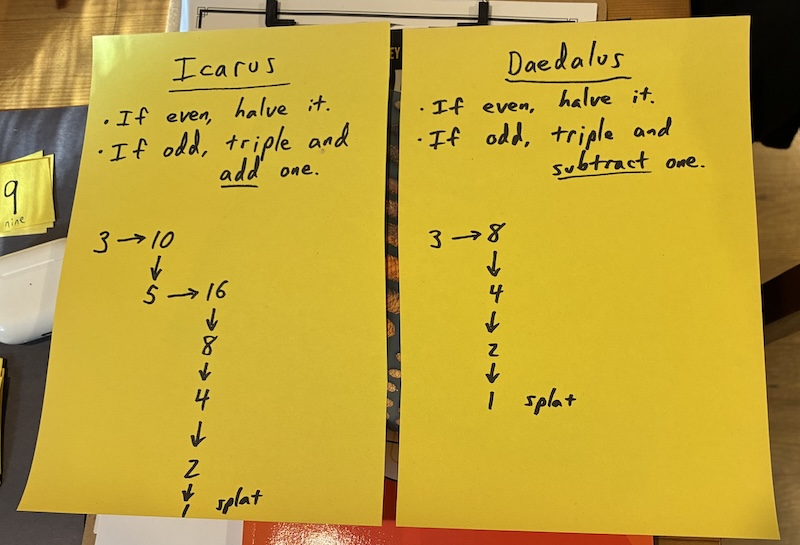

# 3rd-grade math club

We hosted a little hour-long after-school “math club” on Monday, three
eight-year-olds around the kitchen table.

After homework was done, each kid worked a sheet of five third-grade
[sample problems][] from the [Noetic Learning Math Contest][], which I
had heard about from a friend. (I also had fourth and fifth-grade
papers for them, which they were interested in tackling as well, but
we didn't spend much time on them in person on Monday.)

[sample problems]: https://www.noetic-learning.com/mathcontest/get_nlmc_samples.jsp
[Noetic Learning Math Contest]: https://www.noetic-learning.com/mathcontest/

Every kid missed at least one problem one way or another, and it was
interesting to hear them share their solution methods and correct
themselves based on what they heard from their friends (and occasional
adult re-framing).

Then they did a problem as a group, which was the grade four problem
from Gordon Hamilton's [Unsolved K-12][], which I happened to learn of
because I have a copy of his book [Socks Are Like Pants, Cats Are Like
Dogs][]. It's a fun presentation of the [Collatz Conjecture][].

[Unsolved K-12]: https://mathpickle.com/wp-content/uploads/2016/01/Unsolved-K-12-winners.pdf
[Socks Are Like Pants, Cats Are Like Dogs]: https://naturalmath.com/socksarelikepants/
[Collatz Conjecture]: https://en.wikipedia.org/wiki/Collatz_conjecture

I feel a little corny doing a bunch of patter for a problem, but the
kids seemed to really enjoy it, especially the “splat.”

It also makes it a lot more engaging that one problem is beatable. Our
group quickly found a family of solutions and then was uninterested in
finding more for that case. But they spent considerable time looking
for counter-examples to the Collatz Conjecture, which was a fun way to
practice arithmetic as well.

When I eventually explained that nobody had yet found a
counter-example, their reaction was not at all to give up; one kiddo
instead suggested trying 100. It seemed that, as intended, having them
tackle an open problem was interesting and motivating.
