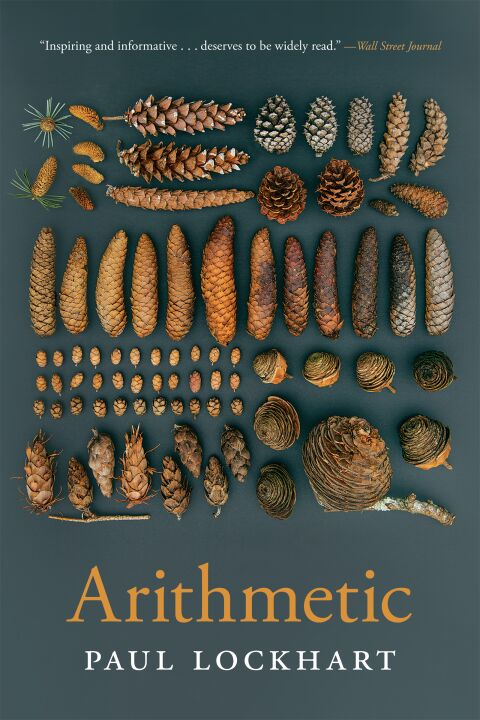

# Arithmetic, by Lockhart

I finally read the [arithmetic book][] from Lockhart, that great
[lamenter][]. He extends his argument that we should do math for fun
by presenting a motivated history of numbers and going right through
multiplication, division, fractions, negative numbers, and some
counting problems. It's nice; it's charming; I mostly agree.

[arithmetic book]: https://www.hup.harvard.edu/books/9780674237513
[lamenter]: /20200909-mathematicians_lament_by_lockhart/ "A Mathematician's Lament, by Lockhart"

I identify with one of his major points, which he frames as arithmetic
being about comparison. I have usually thought of this like “numbers
as data visualizations.” So we have to work out 8 times 6 in base 10
(rather than base 8, say) in order to compare it to other values in
base 10. Fractions with common denominators, units your audience is
familiar with, etc.

---

Lockhart says you shouldn't drill math facts, or force people to use
standard algorithms, and certainly you shouldn't write the one you're
carrying at the top of the next column. I have some hesitation here.

For one thing, I think of a well-worked calculation as a kind of
proof: using the known single-digit facts and properties of the
base-ten system, you demonstrate that the product really is what you
say it is (for example). It's hard to say this would be lost, since it
typically isn't taught this way in the first place, but I'd like for
it to be found.

Second, I think if we don't ensure people are competent calculators
themselves, and we also don't teach the effective use of some
electronic calculator, there's a gap. When I was a kid, using the
standard algorithm to divide was like reaching for a calculator: I set
it up, and then could basically do the calculation without expending
real mental energy, then move on with the result. My fear here is that
a student is trying to do something interesting, then gets to a
calculation and is basically stuck because they both aren't proficient
calculating by hand and don't have a convenient calculator to reach
for. Even for me, my use of calculators is so ad hoc: my phone, or a
Python REPL, or a Jupyter notebook, all feeling clumsy and not well
integrated into a workflow. In my thinking about Linear Algebra, I
think a big part of why the teaching of it is so strained is that the
calculations are annoying by hand, _and_ there's no great convenient,
commonly available calculator for things like SVD.

But certainly I like the emphasis on enjoyable math. Before the
current AI scare, math was thrashing about calculators and calculation
for years. Lockhart is ahead of the curve, in a sense.

---

I disagree with Lockhart's philosophy in his “Machines” chapter, I
think. (Or is he joking?) He makes an interesting comparison among the
mechanical “carry pin” (move the tens digit once for every turn of the
ones digit) and the transistor and the neuron. And then he suggests
that a tally counter is in a sense conscious. This is some [Daniel
Dennett daftness][], in my opinion.

[Daniel Dennett daftness]: /20220918-consciousness_explained_by_dennett/ "Consciousness Explained, by Dennett"

It's a very nice book though. I think on page 168 is says 12/35
instead of 12/30, but I otherwise didn't notice typos. Very nicely
printed and bound. Some question about who the audience is. I guess
me?

---

> Arithmetic is the skillful arrangement of numerical information for
> ease of communication and comparison. (page vii)

---

> Mathematics, in particular, is an explanatory art form, and
> ultimately all of its structures arise as "informa-tion carriers"
> for the purpose of explaining a pattern or idea. (page 7)

---

Nearly throughout, Lockhart uses “leftovers” instead of the common
“ones.” I like this; “ones” is a little weird as a plural, and you
could say that 20 has 20 ones, after all, but this is not what is
usually meant.

---

> I guess my real point here (and with this book in general) is that
> there are many good strategies for encoding and manipulating
> numerical information, and you can use them in any way you see fit.
> (page 73)

---

> Changing ells and fathoms to meters is one thing, ... (page 77)

Huh! [Ell][] like “elbow,” or like “cubit!”

[Ell]: https://en.wikipedia.org/wiki/Ell

---

> Notice that there is a subtle yet important difference in status
> between the two numbers here. When one writes 5 x 8, the 8 is the
> actual quantity we are adding—the price of a single muffin, say. The
> 5 is a _counter_; it indicates the number of copies we want. In a
> sense, the 5 is "operating" on the 8, and not the other way around.
>
> So there is an asymmetry to multiplication: 5 x 8 does not mean the
> same thing as 8 × 5. Surprisingly, however, the two totals happen to
> be the same. (page 88)

---

> This is what I mean when I say that arithmetic is the art of
> rearranging quantities—noticing and taking advantage of specific
> features of your counting problem to make your life easier and to
> have a bit of amusement while you're at it. (page 91)

---

> First of all, let's understand that 7 × 8 is not a question and 56
> is not an answer. Seven times eight is a _number_, and it is capable
> of being represented in a great many ways. At the moment it is held
> as seven groups of eight, and a user of an octal system would be
> quite pleased and would not feel the need to "do" anything to it.
> When we ask, "What is seven times eight?" what we are really asking
> is, "How can seven groups of eight be rearranged into groups of ten
> for ease of comparison with other numbers similarly grouped?"
> Numbers couldn't care less what grouping size you happen to use and
> neither do mathematicians. Numbers are what they are, and they do
> what they do; your desire to _compare_ is the issue, and your
> culturally determined choice of representation system is quite
> secondary. (page 93)

---

> Arithmetic can be a gateway drug for mathematics. (page 97)

---

> In every practical, real-world scenario (including even particle
> physics and cosmology), there is always going to be some threshold
> of accuracy beyond which things become pointless. For one thing,
> your original data is always approximate anyway. So scientists and
> engineers, carpenters and seamstresses, bakers and farmers all use
> arithmetic frequently, but the most important skill is knowing what
> degree of accuracy is appropriate—in particular, when remainders can
> safely be discarded. If there is such a thing as an accepted
> convention, it would be this: _don't bother being more accurate than
> your data_. If the situation calls for you to divide 125.26 by 3.8,
> it would be absurd to work hard to produce a figure like 32.9631579,
> when the original numbers are only given to one or two places after
> the decimal point. I would probably just go with 33, seeing as it's
> so close.
>
> Generally, when someone writes a number like 3.8, what they mean is
> that all they can guarantee is that it's around 3.8, somewhere
> between 3.75 and 3.85, say. If more were known (or cared about),
> then maybe we would have a more accurate estimate like 3.83, which
> would again only tell us the number up to a certain tolerance—the
> final digit always being a bit iffy. The decision of how accurate
> one's measurements should be, and thus how many so-called
> significant figures to provide, is a very basic one. It really just
> depends on what you are doing and why.
>
> _You are in the laboratory measuring the amount of liquid contained
> in three test tubes. The volumes (in milliliters) are found to be:
> 30.25, 27.12, and 32.62. After combining them, you find the total
> volume to be just a hair over 90 milliliters. Should you be
> surprised?__

I keep thinking I should go make the estimation calculator I've
thought of making...

---

> This is pretty much what scientists and engineers spend their time
> doing. They construct simplified mathematical models of their
> problems and then work on them using the precise and elegant
> patterns that mathematical objects obey. Then they translate back to
> reality, making any necessary approximations as they see fit. In
> this way, mathematics can be viewed as a "model shop"—a source of
> convenient simplified models of reality.
>
> For mathematicians, however, the correspondence works the other way.
> The objects of interest _are_ the abstract imaginary patterns, and
> reality serves merely as a source of modeling material. If I want to
> think about perfect imaginary rectangles, I can use a desktop or a
> piece of paper as a crude, admittedly inaccurate physical model. Of
> course, we understand that such a clumsy prosaic object could never
> contain any actual mathematical truths (in particular, it cannot
> have exact measurements), but it can still give me ideas and lead me
> to observations and understanding nonetheless. So for mathematicians
> like myself, reality is the model shop. This was more or less
> Plato's view: real things are merely the shadows of the true,
> idealized mathematical forms. (page 181)

Fun!

---

> Mathematics is the study of _pattern_. And of course I mean pattern
> in the abstract—the patterns of Mathematical Reality. (page 182)
