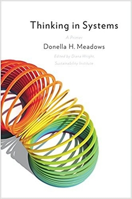

# (Audio) Thinking in Systems, by Meadows

I was disappointed at first that [the book][] isn't more technical,
but I guess the technical content is mostly about making computer
models. It may not be quite full [system dynamics][], but what-if
games in Excel are not so different. The book gets more interesting
toward the end, as it becomes philosophical, resigned, a memoir of a
Cassandra.

[the book]: https://en.wikipedia.org/wiki/Thinking_In_Systems:_A_Primer
[system dynamics]: https://en.wikipedia.org/wiki/System_dynamics

Meadows relates a familiar experience: identifying a problem and a
solution, but being powerless to enact change. Not that she made _no_
change; just not as much as she hoped. She was a technocrat in spite
of herself, an environmentalist with a computer model, a metrician who
understood [The Tyranny of Metrics][].

[The Tyranny of Metrics]: /20200425-tyranny_of_metrics_by_muller/ "The Tyranny of Metrics, by Muller"

Meadows wrote [The Limits to Growth][], which said that you can't make
infinite tin cans from finite tin. People keep saying this, as in
[More Everything Forever][], as in [Survival of the Richest][]. Surely
it's right, as far as it goes. In what must be a huge coincidence,
estimates for when society will collapse are close to estimates for
The Singularity.

[The Limits to Growth]: https://en.wikipedia.org/wiki/The_Limits_to_Growth
[More Everything Forever]: /20260721-more_everything_forever_by_becker/ "More Everything Forever, by Becker"
[Survival of the Richest]: /20240519-survival_of_the_richest_by_rushkoff/ "Survival of the Richest, by Rushkoff"

There are interesting bits in the book about how oscillations result
from delays in information and responses, overcorrecting needing to be
corrected.

I enjoyed how she had no patience for “the invisible hand of the
market” somehow producing optimal outcomes as a result of greed. I
don't think I'd heard the term she used, “the invisible foot,” to
refer to the cause of the negative outcomes that come. (Bounded
rationality was also mentioned.)

A version of Meadows' [leverage points][] is included. The point of
modeling systems might be to change them, after all. It reminded me
somewhat of [Nudge][]. The “Nudge Unit” idea has faded considerably
these days, I think. Meadows was more forthright in offering that
modeling systems hadn't let her change them as much as she had hoped
to.

[leverage points]: https://en.wikipedia.org/wiki/Twelve_leverage_points
[Nudge]: https://en.wikipedia.org/wiki/Nudge_(book)

Her number one leverage point feels philosophical. It is about
“transcending paradigms.” I was amazed. I had already agreed with her
largely on philosophy of models (“Everything we think we know about
the world is a model,” etc.) But here she was offering what I think is
very nearly my personal philosophy on relativistic foundations. The
most confusing bit is that she offers it as the highest-leverage
point. She must mean changing the foundations that others adopt?
Maybe? Otherwise it sounds like the “leverage” here is the first part
of the Serenity Prayer: “accept the things I cannot change.”

---

### Mindsets and Models

 * Everything we think we know about the world is a model.
 * Our models do have a strong congruence with the world.
 * Our models fall far short of representing the real world fully.

---

### Guidelines for Living in a World of Systems

1. Get the beat of the system. _(This means learn about it, with data,
   etc. - Aaron)_
2. Expose your mental models to the light of day.
3. Honor, respect, and distribute information.
4. Use language with care and enrich it with systems concepts.
5. Pay attention to what is important, not just what is quantifiable.
6. Make feedback policies for feedback systems.
7. Go for the good of the whole.
8. Listen to the wisdom of the system.
9. Locate responsibility within the system.
10. Stay humble—stay a learner.
11. Celebrate complexity.
12. Expand time horizons.
13. Defy the disciplines.
14. Expand the boundary of caring.
15. Don't erode the goal of goodness.
