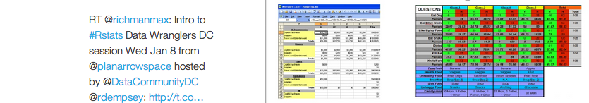
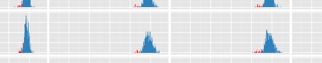
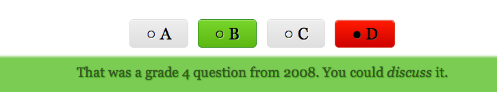
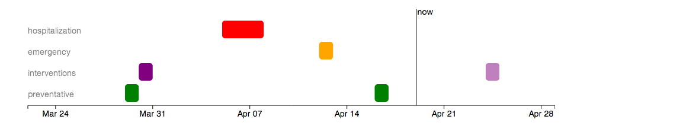
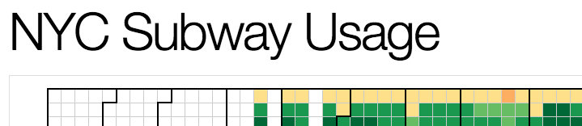
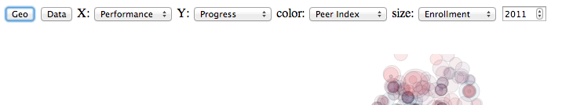

# Projects

These are things that I've made!

blank

<a href="http://popular.herokuapp.com/">Popularity Contest</a>: A little hack on the twitter API. Likely to break. [<a href="http://planspace.org/2014/03/02/popularity-contest/">note</a>]

blank

<a href="http://planspace.org/2014/01/07/clean-data-with-r/">Clean data with R</a>: Presentation for Data Wranglers DC

blank

<a href="http://planspace.org/2014/01/10/nyc-test-data/">NYCtests</a>: some analysis/visualization of available NYC public school test data

blank

<a href="http://www.skribi.es/">skribi.es</a>: simple experimental micro-survey or sign-up interface.

blank

 <a href="http://mcasta.net/">mcasta.net</a>: interface for Massachusetts Comprehensive Assessment System (MCAS) mathematics questions

blank

<a href="http://www.naldaramjui.com/">naldaramjui.com</a>: interface for questions from the Test Of Proficiency In Korean.

blank

<a href="https://twitter.com/NYCattends">@NYCattends</a>: automated system to&#160;<a href="http://bit.ly/NYCattdarch">archive</a>&#160;and tweet NYC public school attendance

blank

<a href="http://bit.ly/theograph">theograph</a>: prototype of an interactive patient health timeline for the UK's NHS at the <a href="http://thegovlab.org/">GovLab</a>&#160;Experiment

blank

<a href="http://bit.ly/NYCsubway">subway usage</a>: data munging and visualization component of winning <a href="http://ipk.nyu.edu/initiatives/datathons">datathon</a> team entry

blank

<a href="http://bit.ly/NYCd3schools">school data explorer</a>: my first d3 project, loaded with data animation messiness.

blank

<strong>A&#8594;A</strong>

*This post was originally hosted elsewhere.*
